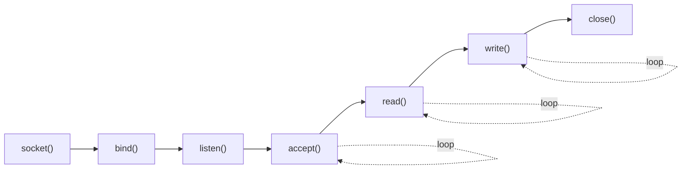
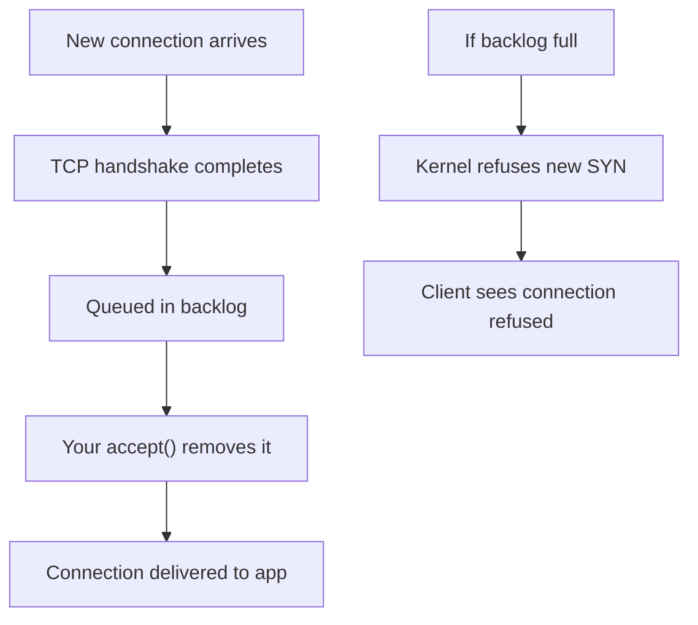
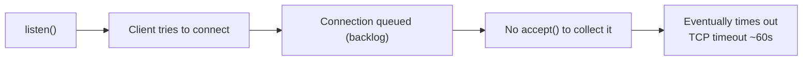
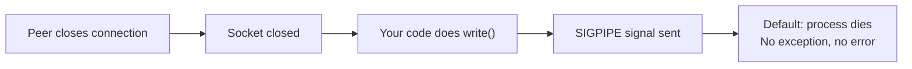
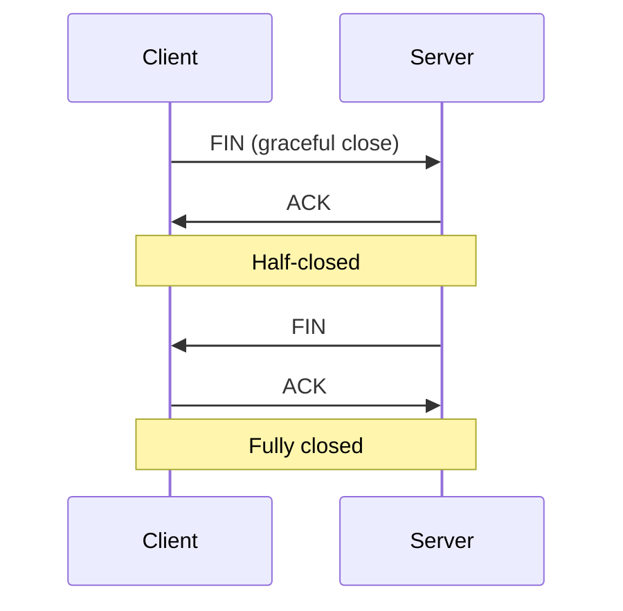
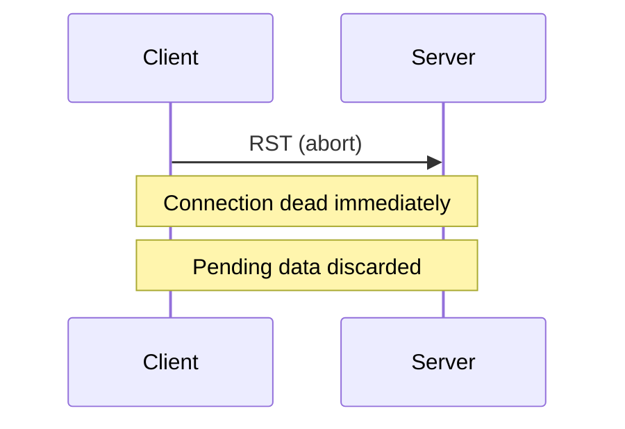

# CN Part 1: The TCP Server - Seven System Calls

> Every TCP server follows exactly seven system calls.  
> Every framework wraps these.

---

## 1.1 The Flow: socket → bind → listen → accept → read → write → close



| Call | Purpose | Key Parameter |
|------|---------|----------------|
| **socket()** | Create socket/fd | AF_INET, SOCK_STREAM |
| **bind()** | Assign IP + port | address, port, INADDR_ANY |
| **listen()** | Enter listening mode | backlog size |
| **accept()** | Accept connection | None (returns client_fd) |
| **read()** | Receive bytes | Returns byte count or 0/−1 |
| **write()** | Send bytes | Returns bytes written |
| **close()** | Close socket | Cleans up resources |

---

## 1.2 socket() - Create a Socket

```c
int server_fd = socket(AF_INET, SOCK_STREAM, 0);
```

**Parameters**:
| Parameter | Value | Meaning |
|-----------|-------|---------|
| Domain | AF_INET | IPv4 (AF_INET6 = IPv6) |
| Type | SOCK_STREAM | TCP (SOCK_DGRAM = UDP) |
| Protocol | 0 | Default for the type |

**Returns**: File descriptor (integer ≥ 0) or −1 on error

**Key**: Socket is just a file descriptor. Kernel treats it like any file.

---

## 1.3 bind() - Assign Address and Port

```c
struct sockaddr_in addr = {0};
addr.sin_family = AF_INET;
addr.sin_addr.s_addr = INADDR_ANY;
addr.sin_port = htons(2026);
bind(server_fd, (struct sockaddr*)&addr, sizeof(addr));
```

**Key Constants**:

| Constant | Meaning | Example |
|----------|---------|---------|
| **INADDR_ANY** | Listen on all interfaces | Binds to 0.0.0.0 |
| **htons()** | Host → Network byte order | Converts port number |
| **Port < 1024** | Privileged | 80, 443 (need root) |
| **Port ≥ 1024** | Unprivileged | 8080, 3000, 2026 |

**Why unprivileged ports matter**:
- Ports < 1024 require root
- Running as root = any bug in request handler = root compromise
- Production: Bind 8080 as unprivileged user, use front proxy for 80/443

---

## 1.4 listen() - Enter Listening Mode

```c
listen(server_fd, 1);
```

**The Backlog Argument**: How many connections can queue while you're in accept()?



**Implications**:
- `backlog=1` → Only 1 connection waiting
- If 2nd connection arrives while accept() not ready → dropped
- Linux caps at `net.core.somaxconn` (usually 128)
- Real servers pass 256 or higher

---

## 1.5 accept() - Accept a Connection

```c
int client_fd = accept(server_fd, NULL, NULL);
```

**What happens**:
- Blocks until a connection arrives (or is already queued)
- Returns new file descriptor for **this specific client**
- Parent socket (server_fd) stays open, ready for next accept()
- By this point, TCP 3-way handshake is complete

**Key**: Two different file descriptors:
- `server_fd` → listening socket (never used for read/write)
- `client_fd` → connected client (used for read/write)

---

## 1.6 read() - Receive Data

```c
char buf[4096];
int n = read(client_fd, buf, sizeof(buf));
```

**Return Values**:

| Return | Meaning |
|--------|---------|
| `> 0` | Bytes received (could be 1 byte, could be 4096) |
| `0` | Peer closed connection cleanly (FIN received) |
| `−1` | Error (check errno) |

**Critical**: TCP is a **byte stream**, not message protocol.
- One read() might get 100 bytes
- Next read() might get 1 byte
- Next read() might get 4096 bytes
- **You need framing to know where messages end**

---

## 1.7 write() - Send Data

```c
write(client_fd, buf, n);
```

**Returns**: Number of bytes written (could be less than requested).

**Never assume write() writes everything**. Check return value.

---

## 1.8 close() - Close Socket

```c
close(client_fd);
```

**What it does**:
- Sends FIN to peer (graceful close)
- Cleans up kernel resources
- Socket becomes invalid

---

## 1.9 Echo Server - Complete Code

```c
#include <string.h>
#include <unistd.h>
#include <arpa/inet.h>

int main() {
    // 1. Create socket
    int server_fd = socket(AF_INET, SOCK_STREAM, 0);
    
    // 2. Bind to port 2026
    struct sockaddr_in addr = {0};
    addr.sin_family = AF_INET;
    addr.sin_addr.s_addr = INADDR_ANY;
    addr.sin_port = htons(2026);
    bind(server_fd, (struct sockaddr*)&addr, sizeof(addr));
    
    // 3. Listen for connections
    listen(server_fd, 1);
    
    // 4. Accept & echo loop
    while (1) {
        int client_fd = accept(server_fd, NULL, NULL);
        
        char buf[4096];
        int n = read(client_fd, buf, sizeof(buf));
        write(client_fd, buf, n);  // Echo back
        
        close(client_fd);
    }
    return 0;
}
```

**Usage**:
```bash
gcc -o echo_server echo_server.c
./echo_server

# In another terminal:
nc localhost 2026
# Type "hello" → echoes "hello"
```

---

## 1.10 What Happens if You Skip a Call?

### Missing bind()


### Missing listen()


### Missing accept()



---

## 1.11 Signals That Kill Your Server

### SIGPIPE - Write to Closed Socket



**Problem**: One write to closed peer = entire server dies.

**Solution**: Handle SIGPIPE or check write() return value.

### Other Important Signals

| Signal | Trigger | Default |
|--------|---------|---------|
| **SIGINT** | Ctrl-C | Caught → exit |
| **SIGTERM** | Kill signal | Caught → exit |
| **SIGKILL** | Force kill | Cannot be caught |
| **SIGHUP** | Terminal disconnect | Kills process |
| **SIGPIPE** | Write to closed peer | **Kills process** |

---

## 1.12 Normal Close vs Reset (FIN vs RST)



**vs Abortive Close**:



**SO_LINGER with {1, 0}**: Sends RST instead of FIN (abortive close).

---

## Summary

✅ **socket()** → Create fd  
✅ **bind()** → Assign address + port  
✅ **listen()** → Queue incoming connections  
✅ **accept()** → Get client fd  
✅ **read/write** → Communicate  
✅ **close()** → Clean up  

**Every framework (Express, Nginx, Flask) is a wrapper around these seven calls.**

---

## Next: What happens when multiple clients arrive?
