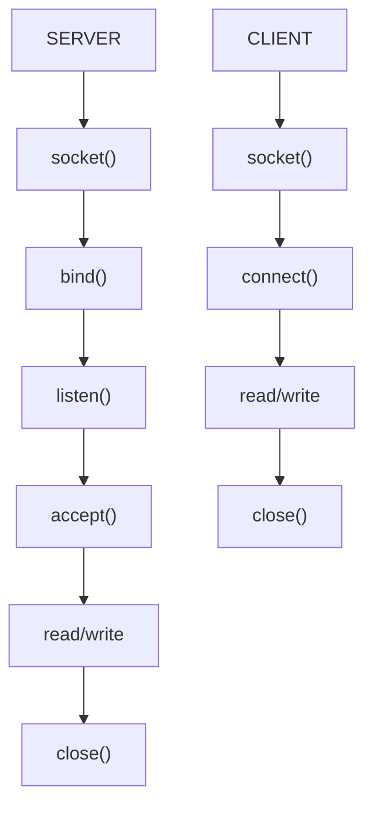
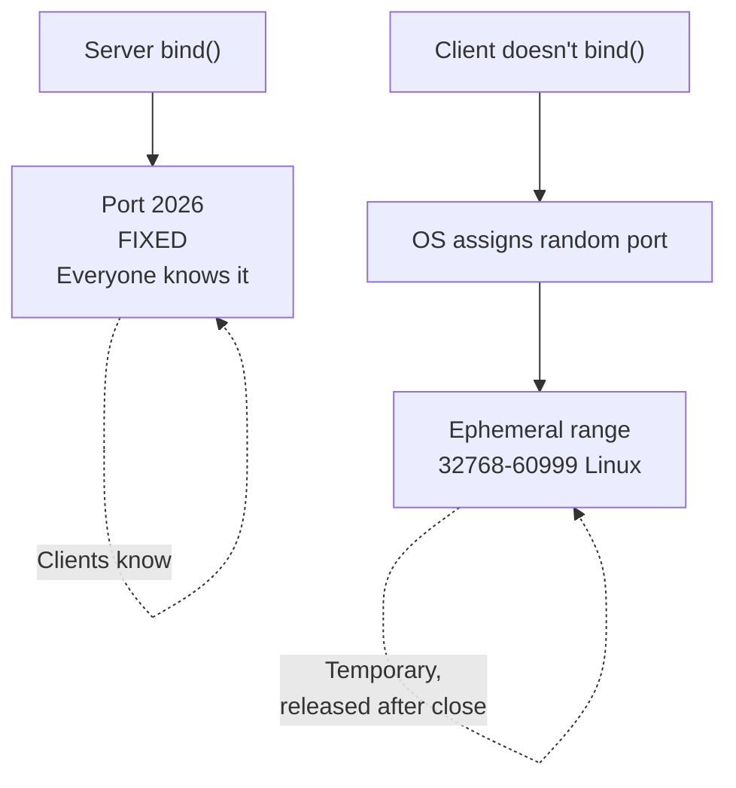
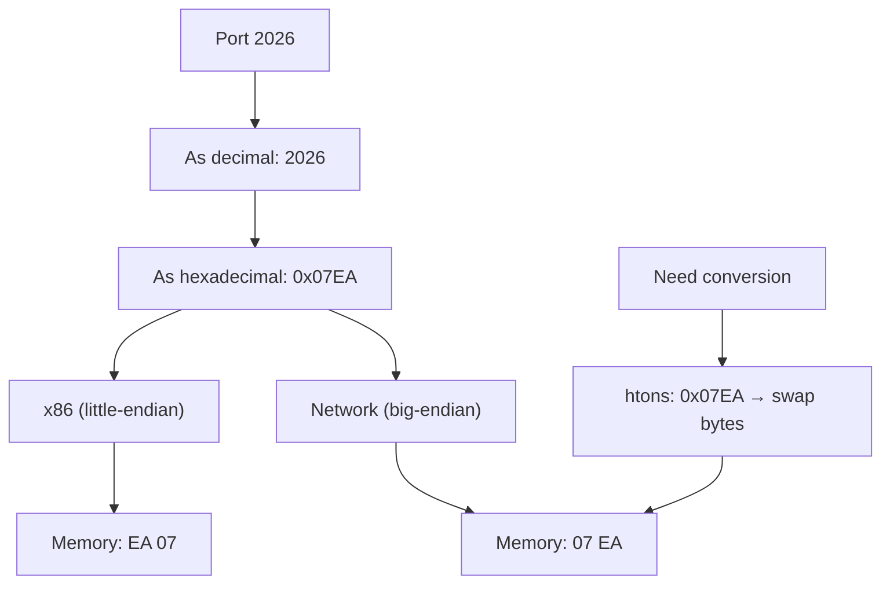
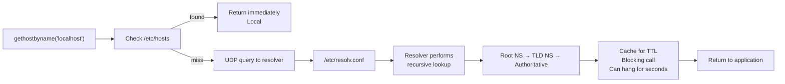

# CN Part 2: The TCP Client

[← Previous](CN_Part_01-TCP_Server.md) | [Next →](CN_Part_03-Many_Clients.md)


> Clients skip bind() and listen(). They just connect().

---

## 2.1 Client Flow vs Server Flow



**Key difference**: Clients don't bind() or listen(). The OS assigns an ephemeral port automatically.

---

## 2.2 Client Code

```c
#include <string.h>
#include <unistd.h>
#include <arpa/inet.h>
#include <netdb.h>

int main() {
    // 1. DNS lookup (hidden in gethostbyname)
    struct hostent *he = gethostbyname("localhost");
    
    // 2. Create socket
    int fd = socket(AF_INET, SOCK_STREAM, 0);
    
    // 3. Prepare address
    struct sockaddr_in addr = {0};
    addr.sin_family = AF_INET;
    memcpy(&addr.sin_addr, he->h_addr_list[0], he->h_length);
    addr.sin_port = htons(8080);
    
    // 4. Connect
    connect(fd, (struct sockaddr*)&addr, sizeof(addr));
    
    // 5. Send & receive
    write(fd, "hello", 5);
    char buf[4096];
    int n = read(fd, buf, sizeof(buf));
    printf("Received: %.*s\n", n, buf);
    
    // 6. Close
    close(fd);
    return 0;
}
```

---

## 2.3 connect() - Establish Connection

```c
connect(fd, (struct sockaddr*)&addr, sizeof(addr));
```

**What happens**:
- Performs TCP 3-way handshake (SYN, SYN-ACK, ACK)
- Blocks until connection established or timeout (~60s)
- Returns 0 on success, −1 on error

**Returns**:
| Value | Meaning |
|-------|---------|
| `0` | Connection established |
| `−1` | Failed (server refused, network unreachable, etc.) |

---

## 2.4 Ephemeral Ports



**Why it matters**:
- Server port is well-known (2026, 80, 443)
- Client port is temporary, chosen by OS
- When client closes → port enters TIME_WAIT (~60s)
- Busy clients can run out of ephemeral ports

**TIME_WAIT state**:
- Port held for ~60 seconds after close
- Prevents confusion if packets from old connection arrive
- Can exhaust ports if creating 1000s of connections/minute

---

## 2.5 Byte Order: htons(), ntohl(), etc.

**The Problem**: Different machines store multi-byte integers differently.



**Functions**:

| Function | Full Name | What it does |
|----------|-----------|--------------|
| **htons()** | Host to Network Short | Converts 16-bit (port) |
| **htonl()** | Host to Network Long | Converts 32-bit (IP) |
| **ntohs()** | Network to Host Short | Reverse htons() |
| **ntohl()** | Network to Host Long | Reverse htonl() |

**Usage**:
```c
addr.sin_port = htons(2026);        // Port to network format
addr.sin_addr.s_addr = htonl(0);    // IP to network format

uint16_t port_host = ntohs(addr.sin_port);   // Back to host
uint32_t ip_host = ntohl(addr.sin_addr.s_addr);
```

**Why it matters**:
- Network always uses big-endian (network byte order)
- Your machine might be little-endian
- Kernel doesn't auto-convert; you must call these functions
- Wrong byte order = connection to wrong port or wrong IP

---

## 2.6 DNS: gethostbyname()



**Key Issues**:

| Issue | Impact |
|-------|--------|
| **Cold DNS** | Can block for 1-5 seconds |
| **Timeout** | Can't control — entire getaddrinfo() times out at OS level |
| **Thread-safe** | gethostbyname() is NOT thread-safe (use getaddrinfo()) |
| **/etc/hosts first** | Checked before DNS (stale entries hard to debug) |
| **TTL caching** | Resolver respects TTL (usually 300s) |

**Modern approach**:
```c
struct addrinfo hints = {0};
hints.ai_family = AF_INET;
hints.ai_socktype = SOCK_STREAM;

struct addrinfo *result;
getaddrinfo("example.com", "80", &hints, &result);
// Use result->ai_addr, result->ai_addrlen
freeaddrinfo(result);
```

---

## 2.7 Telnet - Manual TCP Client

Telnet is just a TCP client that echoes what you type.

```bash
telnet localhost 2026
telnet google.com 80
```

**For text protocols**, telnet is perfect for testing:

```bash
$ telnet google.com 80
GET / HTTP/1.1
Host: google.com
[blank line — MANDATORY]
```

**Returns**:
```
HTTP/1.1 301 Moved Permanently
Location: http://www.google.com/
...
```

---

## 2.8 netcat (nc) - Universal TCP/UDP Tool

```bash
nc localhost 2026           # Connect to server
nc -l 9000                  # Listen on port (acts as server)
nc -l 9000 < file.txt       # Send file
echo "hello" | nc localhost 2026
```

**Why it's useful**:
- No need to write code to test a server
- Bidirectional pipe (keyboard ↔ socket)
- Works with any protocol

---

## 2.9 openssl s_client - TLS Client

For HTTPS/TLS connections:

```bash
openssl s_client -connect www.example.com:443
```

**Shows**:
- Server certificate
- TLS version
- Cipher suite
- Let you send raw HTTPS requests

**Why telnet doesn't work**: Telnet is plain text; TLS needs cryptographic handshake.

---

## Summary

✅ **Clients** = socket() → connect() → read/write → close()  
✅ **No bind()** - OS assigns ephemeral port  
✅ **htons()** converts port to network byte order  
✅ **DNS blocks** - can hang for seconds  
✅ **telnet works** for text protocols  
✅ **Use getaddrinfo()** over gethostbyname()  

---

## Next: What if one client crashes? One server?

[← Previous](CN_Part_01-TCP_Server.md) | [Next →](CN_Part_03-Many_Clients.md)
