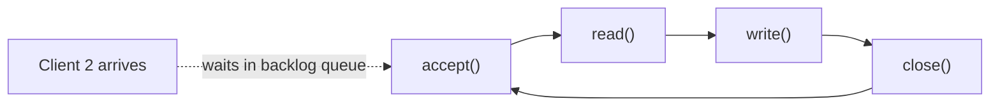
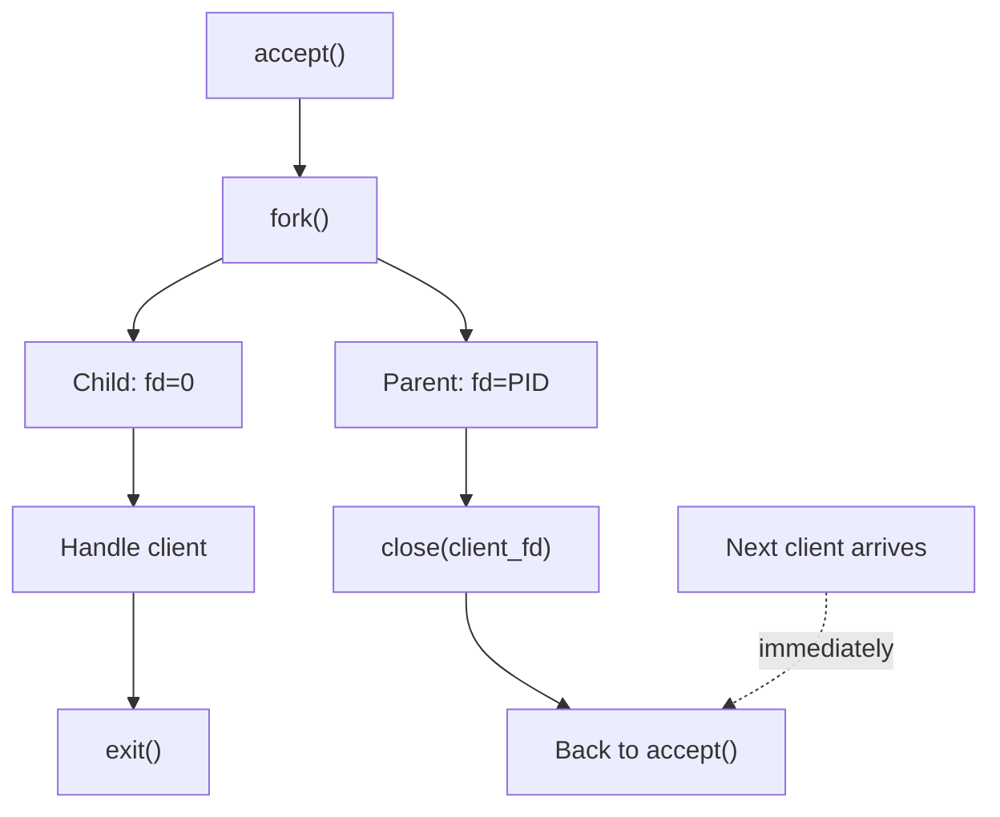
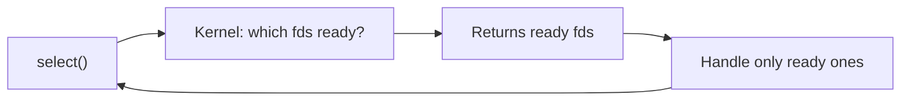
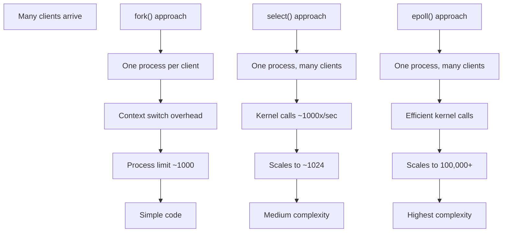
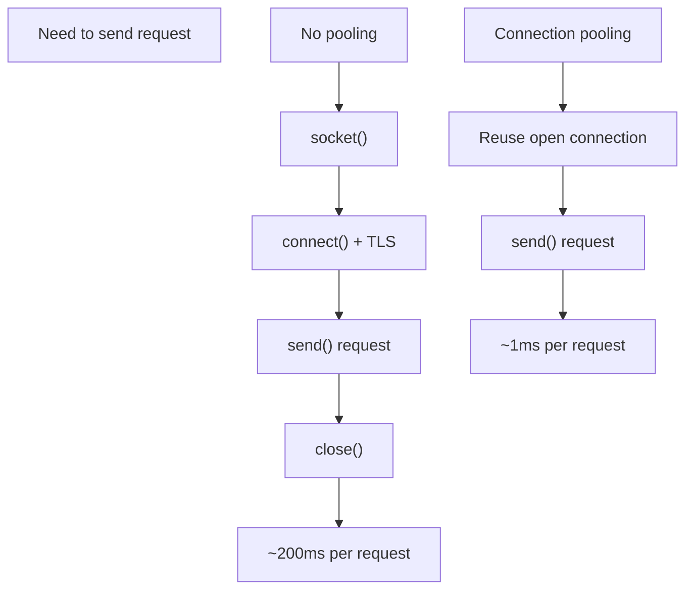
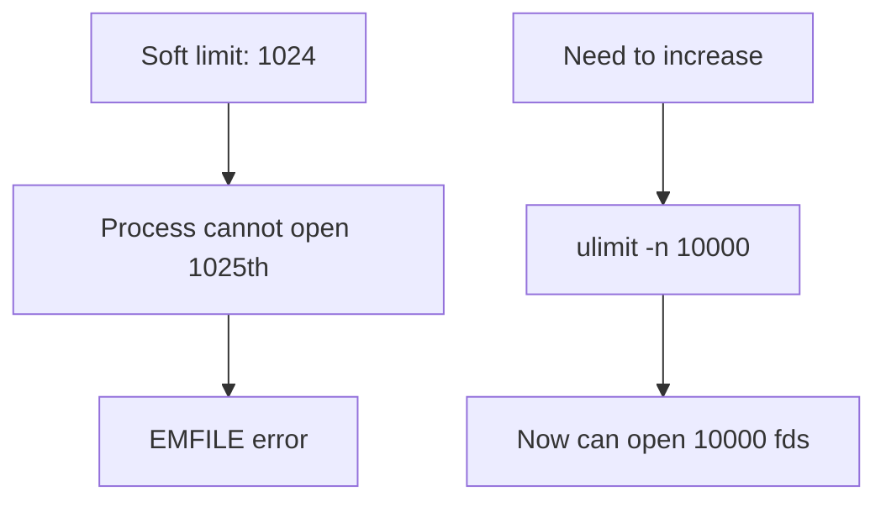

# CN Part 3: Many Clients at Once

> Sequential echo server handles one client at a time.  
> Real servers need to handle hundreds/thousands.

---

## 3.1 The Problem: One at a Time



**Issue**: While handling client 1, client 2 waits in backlog. If processing takes 5 seconds, client 2 waits 5 seconds just to get accepted.

---

## 3.2 Solution 1: fork() - One Process Per Client

```c
while (1) {
    int client_fd = accept(server_fd, NULL, NULL);
    
    if (fork() == 0) {
        // Child process: handle this client
        close(server_fd);        // Don't need copy of listening socket
        char buf[4096];
        int n = read(client_fd, buf, sizeof(buf));
        write(client_fd, buf, n);
        close(client_fd);
        exit(0);                 // Child exits
    } else {
        // Parent process: back to accept()
        close(client_fd);         // Parent's copy of client_fd
    }
}
```

**fork() return values**:

| Return | Process | Meaning |
|--------|---------|---------|
| `0` | Child | You are the child process |
| `> 0` | Parent | You are parent; value is child PID |
| `−1` | Both failed | No memory/processes to fork |

`fork()` creates a child process with a copy of the parent's file-descriptor table. That is why the child can use the `client_fd` returned by `accept()` even though it did not call `accept()` itself: both processes' descriptor entries refer to the same underlying open socket description in the kernel.

This also explains the two `close()` calls in the example:
- The child closes its inherited copy of `server_fd`; it only serves this accepted client.
- The parent closes its inherited copy of `client_fd`; it only accepts future clients.

If either process accidentally keeps an extra copy open, TCP may not see end-of-file when expected because the kernel still has another reference to that socket.



**Advantages**:
- Simple
- Each client isolated (crash doesn't crash server)
- Can use blocking I/O

**Disadvantages**:
- One process per client
- Context switch overhead
- Limited to ~1000 processes on typical server
- Fine for 100 clients, hopeless at 10,000

---

## 3.3 Solution 2: select() - Watch Multiple Sockets

```c
fd_set readfds;
FD_ZERO(&readfds);
FD_SET(server_fd, &readfds);
// Add all client fds to readfds...

select(max_fd + 1, &readfds, NULL, NULL, NULL);

if (FD_ISSET(server_fd, &readfds)) {
    accept();
}
for (int i = 0; i < num_clients; i++) {
    if (FD_ISSET(client_fd[i], &readfds)) {
        read(client_fd[i], ...);
    }
}
```

**Flow**:



**Advantages**:
- One process, many clients
- Portable (Unix, Linux, macOS, Windows)
- No context switch per client

**Disadvantages**:
- O(n) - kernel checks every fd each call
- Max ~1024 fds (FD_SETSIZE limit)
- Manual fd management
- More complex than fork()

---

## 3.4 Solution 3: epoll() - Efficient Scalability

```c
int epfd = epoll_create1(0);
struct epoll_event ev;
ev.events = EPOLLIN;
ev.data.fd = server_fd;
epoll_ctl(epfd, EPOLL_CTL_ADD, server_fd, &ev);

while (1) {
    struct epoll_event events[100];
    int nfds = epoll_wait(epfd, events, 100, -1);
    
    for (int i = 0; i < nfds; i++) {
        int fd = events[i].data.fd;
        // Handle fd
    }
}
```

**Flow**:


**Advantages**:
- O(ready) - scales to 100,000s of connections
- Linux-only
- Most efficient
- Nginx, Apache use this

**Disadvantages**:
- Linux-only
- More complex API

---

## 3.5 Other Multiplexing Methods

| Method | Platform | Complexity | Scalability |
|--------|----------|------------|-------------|
| **select()** | Unix/Linux/Win | Low | ~1000 fds |
| **epoll()** | Linux only | Medium | 100,000+ |
| **kqueue()** | BSD/macOS | Medium | 100,000+ |
| **IOCP** | Windows | High | 100,000+ |

---

## 3.6 Comparison: fork() vs select()/epoll()



| Scenario | Best Choice |
|----------|-------------|
| < 100 concurrent | fork() |
| 100-1000 concurrent | select() |
| 1000+ concurrent | epoll() (Linux) or kqueue() (BSD) |
| Portable code | select() |
| Maximum performance | epoll() / kqueue() |

---

## 3.7 Connection Pooling

Connecting is expensive: TCP handshake + TLS handshake.



**How**: Keep socket open, reuse for multiple requests.

**Trade-off**: Server must handle pipelined requests.

---

## 3.8 File Descriptor Limits

```bash
ulimit -n       # Show fd limit
ulimit -n 10000 # Increase fd limit
```

**Limits**:
- Soft limit: Current process
- Hard limit: Maximum allowed

**Each socket = one fd**. Hit fd limit = cannot accept more connections.



---

## Summary

✅ **fork()** = simple, one process per client, limited scalability  
✅ **select()** = portable, medium scalability  
✅ **epoll()** = efficient, Linux-only, scales to 100k+  
✅ **Connection pooling** = skip handshakes, reuse sockets  
✅ **ulimit -n** = check and raise fd limit  

---

## Next: How HTTP works on top of TCP
