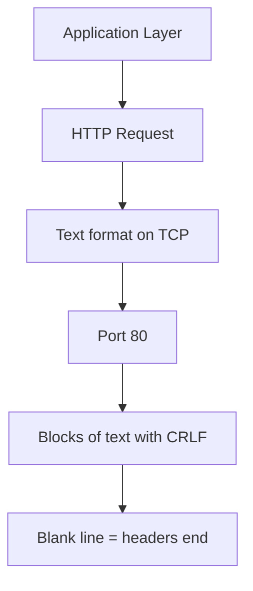
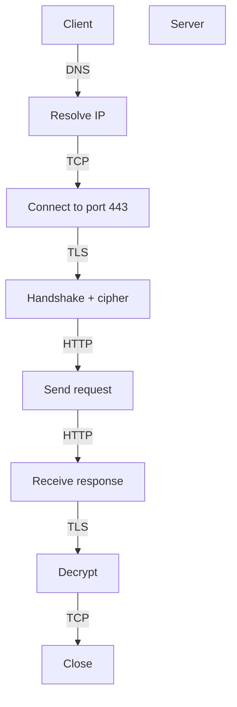
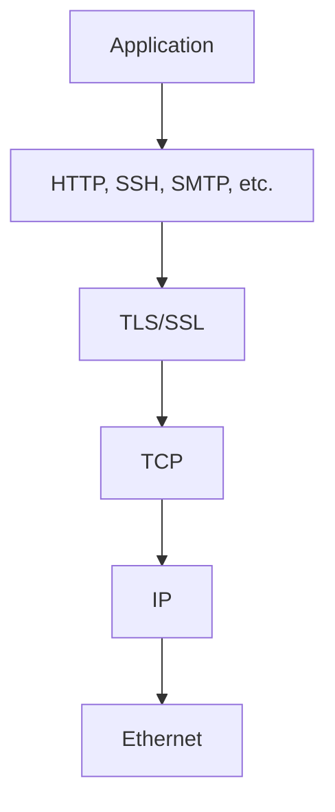
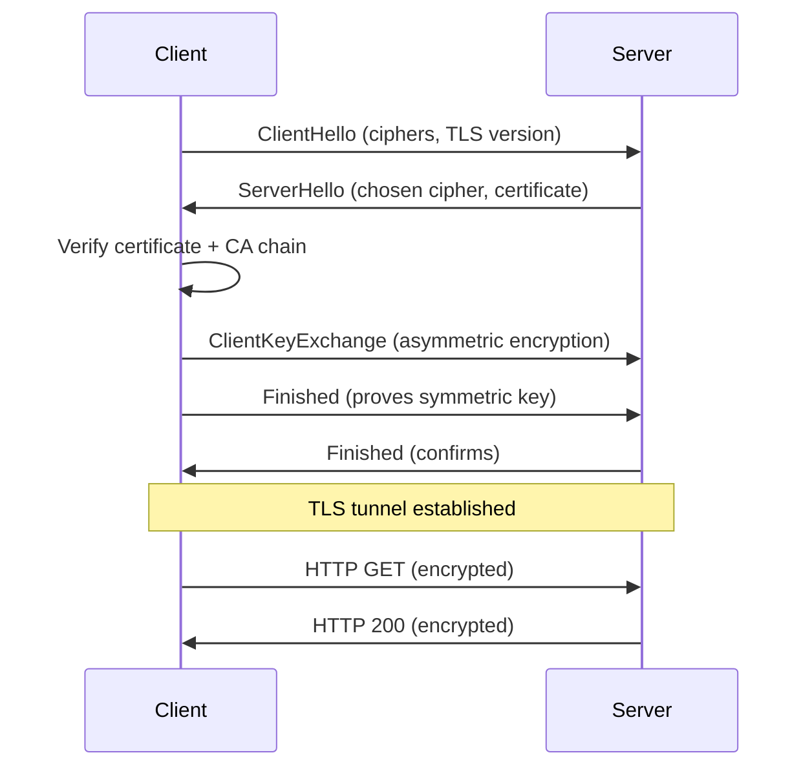
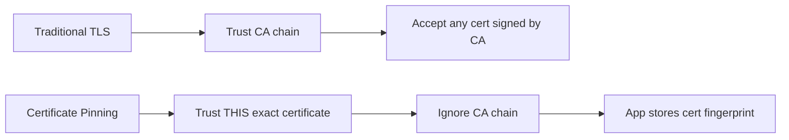
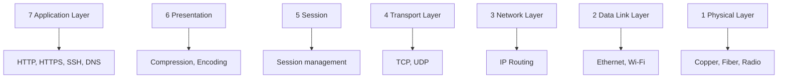

# CN Part 4: HTTP, TLS, and Application Protocols

> HTTP is just TCP with text format.  
> TLS sits under HTTP.

---

## 4.1 HTTP - The Application Layer



**HTTP is built on TCP. That's it.**

---

## 4.2 Minimal HTTP Request

```
GET / HTTP/1.1
Host: google.com
[blank line]
```

**Structure**:
| Part | Example | Purpose |
|------|---------|---------|
| **Method** | GET | What to do |
| **Path** | / | Which resource |
| **Version** | HTTP/1.1 | Protocol version |
| **Headers** | Host: ... | Metadata |
| **Blank line** | (empty) | Signals end of headers |
| **Body** | (optional) | Request data (POST) |

---

## 4.3 HTTP Response

```
HTTP/1.1 301 Moved Permanently
Location: http://www.google.com/
Content-Type: text/html
Content-Length: 219
[blank line]
<html><head><title>301 Moved</title></head>...
```

**Structure**:
| Part | Example |
|------|---------|
| **Status line** | HTTP/1.1 301 Moved Permanently |
| **Headers** | Content-Type, Content-Length, etc. |
| **Blank line** | Signals headers end |
| **Body** | Actual content |

### HTTP message framing: headers are delimited; bodies are not simply "length prefixed"

TCP is a byte stream, so HTTP needs rules for deciding where one message ends. HTTP/1.x uses more than one framing technique:

| Part | How the receiver finds the boundary |
|------|--------------------------------------|
| Start line and headers | `CRLF` ends each line; a blank line (`CRLF CRLF`) ends the header section |
| A body with `Content-Length: N` | Read exactly `N` body bytes |
| A chunked body | Each chunk begins with its own hexadecimal length, ending with a zero-length chunk |
| Some close-delimited responses | Connection closing marks the body end (older/limited cases) |

```text
HTTP/1.1 200 OK\r\n
Content-Length: 5\r\n
\r\n
hello
```

The blank line is a **delimiter** for headers. `Content-Length` is a textual length declaration for the body, not a fixed binary prefix placed before the whole HTTP/1.1 message. HTTP/2 and HTTP/3 move to a binary framing layer: each frame has a length field, type, flags, and stream identifier. This is why "HTTP uses a length prefix" is only partly true—the version and message part matter.

---

## 4.4 Testing HTTP with telnet

```bash
$ telnet google.com 80
GET / HTTP/1.1
Host: google.com
[press Enter twice for blank line]
```

**Returns**: HTTP response as text.

**Why it works**: HTTP is plain text on TCP. Your keyboard is a valid HTTP client.

---

## 4.5 curl - HTTP Client

```bash
curl google.com              # Simple GET
curl -i google.com           # Include response headers
curl -vv https://google.com  # Verbose: show all details
curl -X POST -d "data" https://example.com
```

**With enough -v flags, curl shows**:
- DNS resolution
- TCP connection
- TLS handshake
- HTTP headers
- Response body

---

## 4.6 HTTPS - HTTP over TLS



**Port 443** = default for HTTPS.

---

## 4.7 TLS - Transport Layer Security

TLS sits **under** the application protocol.



**Why**: Protects any protocol from snooping/tampering.

---

## 4.8 TLS Handshake



**Two phases**:
1. **Asymmetric** - exchange keys (slow but secure)
2. **Symmetric** - encrypt data (fast)

**Certificates**: Prove server is who it claims (CA chain = trust).

---

## 4.9 Certificate Pinning



**Use case**: Mobile apps, avoiding CA compromise.

---

## 4.10 openssl s_client - TLS Testing

```bash
openssl s_client -connect www.example.com:443
```

**Shows**:
- Server certificate
- Certificate chain
- TLS version & cipher
- Certificate validity

**Why telnet doesn't work**: TLS requires cryptographic handshake; telnet is raw bytes.

---

## 4.11 The OSI Model - Where We Are



**We've touched**:
- Layer 7 (HTTP)
- Layer 5-6 (TLS - somewhere between)
- Layer 4 (TCP)
- Layer 3 (IP addressing)

---

## 4.12 HTTP Versions

| Version | Year | Features | Status |
|---------|------|----------|--------|
| **HTTP/1.0** | 1996 | Text, one request per connection | Obsolete |
| **HTTP/1.1** | 1997 | Keep-Alive, pipelining, text | Common |
| **HTTP/2** | 2015 | Binary, multiplexed, one connection | Standard |
| **HTTP/3** | 2022 | QUIC transport, UDP-based | Emerging |

**Key insight**: HTTP/1.1 is text (human-readable), HTTP/2+ are binary (machine-readable, more efficient).

---

## 4.13 HTTP Methods

| Method | Use | Idempotent |
|--------|-----|------------|
| **GET** | Fetch resource | Yes (safe) |
| **POST** | Create/submit | No |
| **PUT** | Update resource | Yes |
| **DELETE** | Remove resource | Yes |
| **HEAD** | Like GET but no body | Yes |
| **PATCH** | Partial update | No |
| **OPTIONS** | Describe resource | Yes |

---

## 4.14 HTTP Status Codes

| Code | Category | Example |
|------|----------|---------|
| **1xx** | Informational | 100 Continue |
| **2xx** | Success | 200 OK, 201 Created |
| **3xx** | Redirect | 301 Moved, 304 Not Modified |
| **4xx** | Client error | 404 Not Found, 403 Forbidden |
| **5xx** | Server error | 500 Internal, 503 Unavailable |

---

## Summary

✅ **HTTP** = text on TCP (port 80)  
✅ **HTTPS** = HTTP + TLS (port 443)  
✅ **TLS** = asymmetric handshake + symmetric data transfer  
✅ **Certificates** prove server identity via CA chain  
✅ **HTTP/1.1** is text, **HTTP/2** is binary  
✅ **telnet works** for HTTP testing  

---

## Next: How do we frame messages in TCP?
