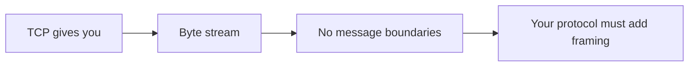
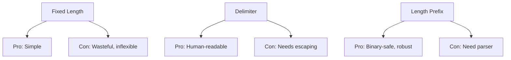
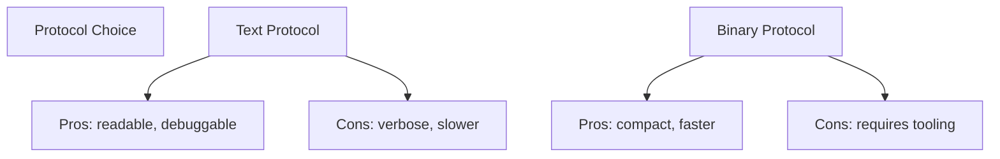
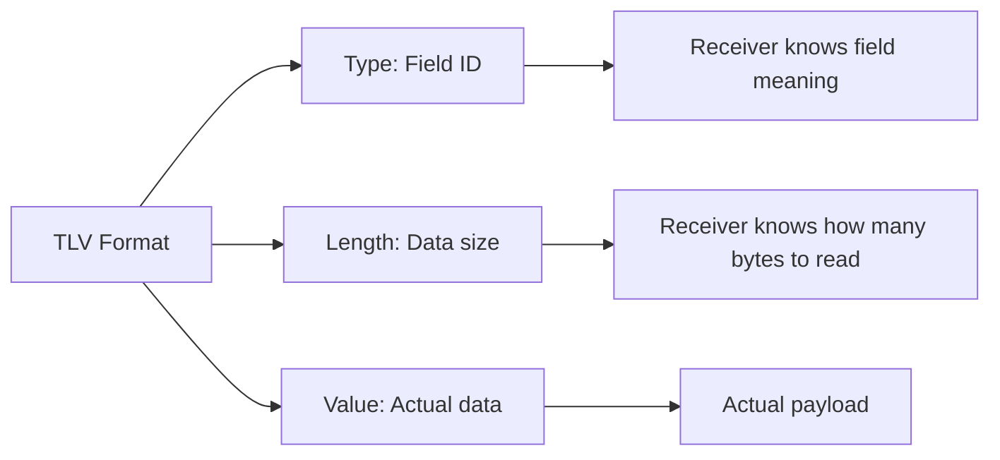
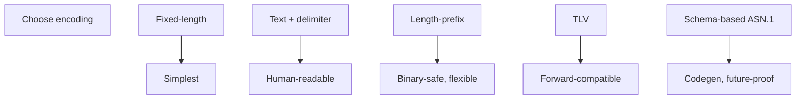

# CN Part 5: Protocol Design - Framing & Encoding

> TCP is a byte stream. Your protocol must define where messages end.

---

## 5.1 The Framing Problem

TCP gives you bytes. Where does one message end and the next begin?



**Without framing**, receiver doesn't know when to stop reading:

```
Client sends: "hello world"
read(buf, 1024) returns: "he"
read(buf, 1024) returns: "llo world"
read(buf, 1024) returns: "???"
```

---

## 5.2 Three Framing Approaches

### Approach 1: Fixed Length

```
Message = always 10 bytes
Message = always 512 bytes
```

**Example**:
```c
#define MSG_SIZE 256
char msg[MSG_SIZE];
read(client_fd, msg, MSG_SIZE);  // Always 256 bytes
```

**Advantages**:
- Trivial to parse
- Zero ambiguity
- Known where message ends

**Disadvantages**:
- Wasteful (padding)
- Cannot change size later (protocol inflexible)

---

### Approach 2: Delimiter

```
Message ends at newline
Message = "hello\n"
```

**HTTP headers use this**:
```
GET / HTTP/1.1\r\n
Host: google.com\r\n
\r\n
```

**Advantages**:
- Human-readable
- Simple format

**Disadvantages**:
- Delimiter can appear in data (needs escaping)
- Risk of confusion if delimiter not found

---

### Approach 3: Length Prefix

```
[LENGTH][DATA]
[4 bytes: length][N bytes: data]
```

**Example**: Send 11-byte message "hello world"

```
Bytes 0-3:  0x0000000B        (11 in big-endian)
Bytes 4-14: "hello world"
```

**Advantages**:
- Binary-safe (no special characters)
- Robust (know exact length)
- Most common in modern protocols

**Disadvantages**:
- Needs parsing

---

## 5.3 Comparison



**Modern protocols**: Most use length-prefix (Redis, gRPC, Protobuf).

---

## 5.4 Text vs Binary Protocols



| Aspect | Text | Binary |
|--------|------|--------|
| **Readable** | Yes | No |
| **Debuggable** | Easy (telnet works) | Hard (need tcpdump) |
| **Size** | Larger | Compact |
| **Speed** | Slower to parse | Fast |
| **Example** | HTTP/1.1 | HTTP/2, Protobuf |

---

## 5.5 BCD - Binary Coded Decimal

Represents decimal digits using 4 bits (nibbles).

```
Decimal: 9 8 7 6 5
Nibbles: 1001 1000 0111 0110 0101
Hex:     9    8    7    6    5
```

**Advantages**:
- Half the size of ASCII
- No conversion step (hex = decimal digits)
- Exact decimal arithmetic
- Preserves significant figures

**Uses**:
- SIM cards
- SMS messages
- Card transactions (ISO 8583)

**Example**: Store price $123.45

```
ASCII:  '1' '2' '3' '.' '4' '5'  (6 bytes)
BCD:    0x12 0x34 0x5F           (3 bytes, F = decimal point)
```

---

## 5.6 ASN.1 - Abstract Syntax Notation

Schema-first encoding. Define structure once, codegen handles it.

```asn1
PersonRecord ::= SEQUENCE {
    name     UTF8String,
    age      INTEGER,
    employed BOOLEAN
}
```

**Codegen produces**:
- Encoder (your object → bytes)
- Decoder (bytes → your object)

**You never hand-write parsing.**

**Advantages**:
- Schema is source of truth
- Encoder/decoder guaranteed consistent
- Forward/backward compatibility

**Used by**:
- X.509 (certificates)
- LDAP
- SNMP
- Telecom protocols
- SMTP

---

## 5.7 TLV - Tag-Length-Value

Self-describing format. Each field is: [Type][Length][Value].

```
[Tag: 0x01][Length: 3][Value: 0xABCDEF]
[Tag: 0x02][Length: 2][Value: 0x1234]
```

**Advantages**:
- Self-describing (receiver knows what each field is)
- Unknown fields can be skipped (forward compatible)
- Flexible structure

**Used by**:
- TLS extensions
- ISO 8583 (financial)
- Protobuf
- Many proprietary protocols



---

## 5.8 Hex and Base64

### Hex - For Reading Binary

Two characters per byte. Human-readable for debugging.

```
4D 5A 90 00     = "MZ\x90\x00"  (Windows .exe)
7F 45 4C 46     = ELF           (Linux binary)
89 50 4E 47     = PNG           (Image)
```

**Fluency**: Recognize patterns by eye (port numbers, lengths, repeating bytes).

**tcpdump -X shows hex**:
```
0x0000:  4500 003d 1234 4000 4006 5c7c  E.=.4@.@.\|
0x0010:  7f00 0001 7f00 0001 800a 07d2  ............
```

### Base64 - For Text Transport

Encode binary data in text (survives email, JSON, data URIs).

```
Raw:     3 bytes → 4 characters
Bytes:   0xFF 0xFE 0xFD
Base64:  //79            (4 chars)
```

**Overhead**: 33% (3 bytes → 4 characters).

**Uses**:
- Email attachments
- JSON with binary data
- Data URIs (``)
- HTTP Basic Authentication

---

## 5.9 Redis RESP - Example Real Protocol

Redis Serialization Protocol. Mix of text and length-prefix.

```
Inline command: GET mykey\r\n
Response:       $3\r\nhello\r\n

$ = bulk string
3 = length
hello = 3 bytes
```

**Hybrid approach**: Text headers + length-prefix for data.

---

## 5.10 Summary: Encoding Strategies



| Use Case | Choose |
|----------|--------|
| Quick prototype | Fixed-length or delimiter |
| Text protocol (HTTP) | Delimiter + headers |
| Binary protocol | Length-prefix |
| Extensible protocol | TLV |
| Complex system | ASN.1 / Protobuf |

---

## Summary

✅ **TCP is a byte stream** — you must add framing  
✅ **Three approaches**: fixed-length, delimiter, length-prefix  
✅ **Text readable**, binary efficient  
✅ **BCD** for decimal-only (SIM, cards)  
✅ **ASN.1** for schema-driven protocols  
✅ **TLV** for self-describing messages  
✅ **Hex** for debugging, **Base64** for transport  

---

## Next: RPC - Making network calls look like function calls
