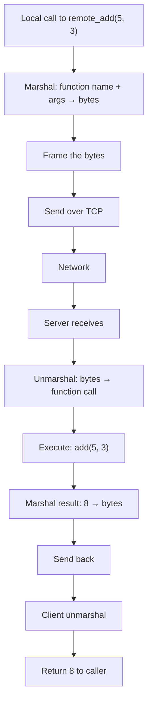
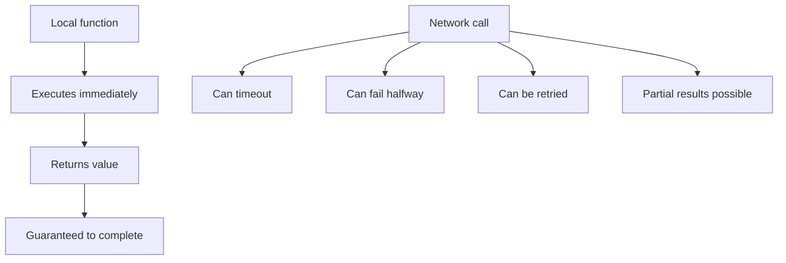
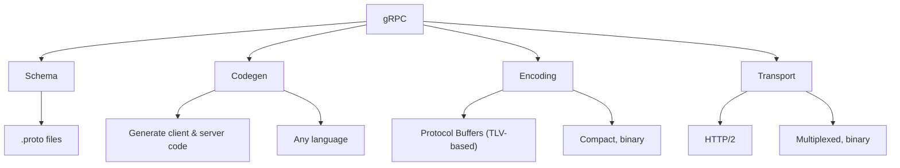
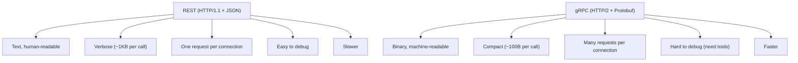
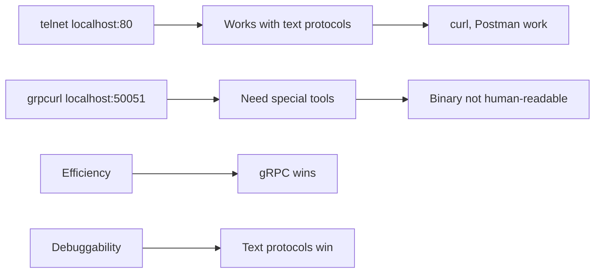

# CN Part 6: RPC and gRPC

[← Previous](CN_Part_05-Protocol_Design.md) | [Next →](CN_Part_07-Debugging.md)


> Making network calls look like function calls.  
> But they're not.

---

## 6.1 RPC - Remote Procedure Call

**Goal**: Make calling a remote function look like calling a local one.

```c
// Local function call
int result = add(5, 3);  // Returns 8 immediately

// RPC call (looks the same)
int result = remote_add(5, 3);  // Network underneath
```

**How it works**:



---

## 6.2 The Lie: Network is NOT a Function

A network call is fundamentally different:



**Problems**:
1. **Failure**: Network down, server down, connection reset
2. **Timeout**: Call takes 60 seconds, your timeout is 5s
3. **Partial completion**: Server starts work but dies before sending result
4. **Retry**: Did it already execute? If we retry, will it execute twice?

**Every RPC framework rediscovers these problems.**

---

## 6.3 Marshalling and Unmarshalling

**Marshalling**: Your objects → bytes

```c
struct Person {
    char name[256];
    int age;
};

// Marshal to bytes
Person p = {"Alice", 30};
byte[] data = marshal(p);
// data = [65 6C 69 63 65 ... 1E ...]
```

**Unmarshalling**: Bytes → objects

```c
byte[] data = receive_from_network();
Person p = unmarshal(data);
// p.name = "Alice", p.age = 30
```

---

## 6.4 RPC Flow

```mermaid
graph LR
    A["Client"]
    B["Server"]
    
    A -->|1. Call func()| A
    A -->|2. Marshal args| A
    A -->|3. Send bytes| B
    
    B -->|4. Receive bytes| B
    B -->|5. Unmarshal args| B
    B -->|6. Execute func| B
    B -->|7. Marshal result| B
    B -->|8. Send bytes| A
    
    A -->|9. Receive bytes| A
    A -->|10. Unmarshal result| A
    A -->|11. Return to caller| A
```

---

## 6.5 Framing Still Required

RPC still needs framing (length-prefix):

```c
// Client sends
[4 bytes: length=50][50 bytes: marshalled args]

// Server sends back
[4 bytes: length=8][8 bytes: marshalled result]
```

---

## 6.6 Common RPC Problems

### Idempotency: What if it retries?

```c
// Request: transfer $100 from A to B
// Sent, but response times out

// Retry the request
// Did we transfer twice?
```

**Solution**: Server tracks request ID, checks if already processed.

### Partial Completion

```c
// Server executes the function
// Starts sending result
// Network dies halfway through
// Client never gets full result
```

**Solution**: Client timeout + retry, or accept partial result.

### Different Versions

```c
// Old client calls new server (new parameters)
// Or old server calls new client (old parameters)
```

**Solution**: Version numbers, optional fields.

---

## 6.7 gRPC - Modern RPC Framework



---

## 6.8 Protocol Buffers (.proto)

Define your message structure:

```protobuf
syntax = "proto3";

message Person {
    string name = 1;
    int32 age = 2;
    repeated string emails = 3;
}

service PersonService {
    rpc GetPerson(PersonId) returns (Person);
    rpc AddPerson(Person) returns (Status);
}
```

**Codegen produces**:
- `Person` class with getters/setters
- `PersonServiceStub` (client)
- `PersonServiceImplBase` (server)
- Serialization/deserialization

**You write the server logic. Codegen handles everything else.**

---

## 6.9 gRPC Features

| Feature | Benefit |
|---------|---------|
| **HTTP/2** | Multiplexed (many calls on one connection) |
| **Binary** | Compact, fast to parse |
| **Typed** | Schema enforces types |
| **Async** | Non-blocking calls |
| **Streaming** | Client→Server or Server→Client or both |
| **Compression** | Built-in gzip |

---

## 6.10 gRPC vs REST



| Scenario | Choose |
|----------|--------|
| Public API | REST (easier for browsers) |
| Internal services | gRPC (faster, simpler) |
| Mobile | gRPC (smaller payloads) |
| High throughput | gRPC |
| Debugging ease | REST |

---

## 6.11 Trade-off: Efficiency vs Debuggability



---

## 6.12 When to Use gRPC

**Use gRPC**:
- Service-to-service communication (internal)
- High throughput, low latency
- Microservices architecture
- Streaming data
- Multiple languages

**Use REST**:
- Public API (web, mobile)
- Simple CRUD operations
- Easy debugging needed
- Browser-based clients
- One-off requests

---

## Summary

✅ **RPC** = make network look like local calls (it's a lie)  
✅ **Marshal/Unmarshal** = objects ↔ bytes  
✅ **Framing required** even for RPC  
✅ **Network is not local** — failures, timeouts, retries  
✅ **gRPC** = Protocol Buffers + HTTP/2 + codegen  
✅ **Efficient but less debuggable** than text protocols  

---

## Next: Debugging tools (tcpdump, curl, strace)

[← Previous](CN_Part_05-Protocol_Design.md) | [Next →](CN_Part_07-Debugging.md)
