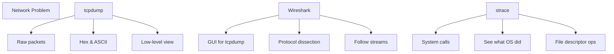
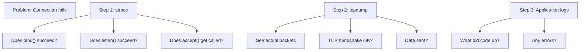

# CN Part 7: Debugging Network Issues

[← Previous](CN_Part_06-RPC_gRPC.md) | [Next →](CN_Summary.md)


> Don't guess. See what's actually on the wire.

---

## 7.1 Three Debugging Tools



---

## 7.2 tcpdump - Packet Capture

Capture raw network packets.

```bash
# Capture on any interface, port 2026
sudo tcpdump -ni any port 2026

# Save to file
sudo tcpdump -ni any port 2026 -w capture.pcap

# Read capture file
tcpdump -r capture.pcap

# View in ASCII (text data visible)
tcpdump -r capture.pcap -A

# View in hex
tcpdump -r capture.pcap -X

# Verbose (show headers)
tcpdump -r capture.pcap -vv
```

**Output example**:
```
08:30:45.123456 IP 127.0.0.1.54321 > 127.0.0.1.2026: Flags [S], seq 0
08:30:45.123457 IP 127.0.0.1.2026 > 127.0.0.1.54321: Flags [S.], seq 0, ack 1
08:30:45.123458 IP 127.0.0.1.54321 > 127.0.0.1.2026: Flags [.], ack 1
```

**Reading tcpdump output**:
| Symbol | Meaning |
|--------|---------|
| **[S]** | SYN (connection start) |
| **[S.]** | SYN-ACK (server accepting) |
| **[.]** | ACK (acknowledgement) |
| **[F]** | FIN (connection close) |
| **[R]** | RST (connection reset) |
| **[P]** | PSH (push data) |

---

## 7.3 tcpdump for HTTP

```bash
sudo tcpdump -ni any port 80 -A

# Output shows:
# 08:30:45.123456 IP 192.168.1.100.54321 > 93.184.216.34.80: ...
# E..A..@.@.!....^.......P....P...
# GET / HTTP/1.1
# Host: example.com
# ...
```

**The '-A' flag shows both hex and ASCII.** Text protocols appear as readable strings.

---

## 7.4 Wireshark - Visual Packet Inspector

GUI wrapper around tcpdump.

```bash
wireshark &
```

**Workflow**:
1. Click "Capture" on an interface
2. Filter traffic (e.g., `tcp port 2026`)
3. See packets in tree view
4. Expand packet to see headers
5. "Follow TCP Stream" to see conversation

**Why it's better than tcpdump**:
- Packet tree (navigate protocol layers)
- Automatic protocol dissection
- Follow entire conversation
- Color-coded by protocol
- Filter bar for complex queries

---

## 7.5 strace - System Call Tracing

See every system call a process makes.

```bash
strace ./echo_server
strace -e trace=socket,connect,bind,listen,accept -f ./echo_server
```

**Output example**:
```
socket(AF_INET, SOCK_STREAM, IPPROTO_TCP) = 3
bind(3, {sin_family=AF_INET, sin_port=htons(2026), sin_addr=inet_addr("0.0.0.0")}, 16) = 0
listen(3, 1) = 0
accept(3, NULL, NULL) = 4
read(4, "hello\n", 4096) = 6
write(4, "hello\n", 6) = 6
close(4) = 0
```

**Useful filters**:
```bash
strace -e trace=network ./program      # Network calls only
strace -e trace=open,read,write ./prog # File I/O only
strace -e trace=signal ./program       # Signals only
strace -p <PID>                        # Attach to running process
```

---

## 7.6 Debugging Workflow



---

## 7.7 Common Issues & How to Debug

### Issue: Client connects but no data

```bash
# strace server
# See: accept() succeeds but no read()
# → Application not calling read()

# tcpdump
# See: TCP handshake OK, but no data packets
# → Client not sending
```

### Issue: "Connection refused"

```bash
# strace
# See: socket() OK, connect() returns -1
# → Server not listening

# tcpdump
# See: [R] (RST) on first packet
# → Server rejected connection (not listening)
```

### Issue: Slow response

```bash
# tcpdump with timestamps
sudo tcpdump -ni any port 2026 -tttt

# See: Long gap between request and response
# → Server taking time, or network delay

# strace
# See: read() takes 5 seconds
# → Application bottleneck
```

---

## 7.8 curl - Application-Level Debugging

```bash
curl -vv https://example.com
curl -vv --trace-ascii=trace.txt https://example.com
```

**Shows**:
- DNS resolution
- TCP connection
- TLS handshake
- HTTP request headers
- HTTP response headers
- Response body

**With enough -v, curl is a packet analyzer.**

---

## 7.9 Debugging Byte Order Issues

Symptom: Connection to wrong port or wrong behavior.

```bash
# Check what the code sends
strace -e write ./client 2>&1 | grep write
# Shows actual bytes sent

# Or tcpdump
tcpdump -r capture.pcap -X
# Shows port in hex
```

**Looking for**: Port 2026 = 0x07EA

```
If code sends: 2026 (without htons)
  → Bytes: 0x0A 0x07 (little-endian)
  → Connects to port 2570 (0x0A07)

If code sends: htons(2026)
  → Bytes: 0x07 0xEA (big-endian)
  → Connects to port 2026 (correct)
```

---

## 7.10 Debugging DNS Issues

DNS blocks and can take seconds.

```bash
# See DNS query
sudo tcpdump -ni any port 53

# Or strace
strace -e trace=network ./program 2>&1 | grep -E 'gethostbyname|getaddrinfo'
```

**Symptoms**:
- Application hangs for 5-30 seconds
- Only on first connection
- DNS caching helps

**Fix**: Use connection pooling or async DNS.

---

## 7.11 Debugging SIGPIPE

Server dies when writing to closed socket.

```bash
strace -e trace=signal ./server
# Look for: --- SIGPIPE (Broken pipe) ---
# Shows when it happens

# Fix in code: Install signal handler or check write() return value
```

---

## 7.12 Debugging select()/epoll()

strace shows which fd_set was watched:

```bash
strace -e trace=select ./server
# select(5, [3, 4], [], [], NULL) = 2 (in [3, 4])
# Shows select() returned 2 fds ready
```

---

## Summary

✅ **tcpdump** = see actual bytes on wire  
✅ **Wireshark** = GUI for tcpdump, easier to navigate  
✅ **strace** = see system calls, what OS did  
✅ **curl -vv** = application-level debugging  
✅ **Don't guess** — capture and inspect  

---

## Debugging Checklist

- [ ] socket() successful?
- [ ] bind() successful?
- [ ] listen() successful?
- [ ] accept() being called?
- [ ] read() getting data?
- [ ] write() returning success?
- [ ] TCP handshake complete? (tcpdump)
- [ ] Data actually sent? (tcpdump -A)
- [ ] Response received? (tcpdump)
- [ ] Byte order correct? (tcpdump -X)
- [ ] No SIGPIPE? (strace)

---

## Next: Summary - Everything Together

[← Previous](CN_Part_06-RPC_gRPC.md) | [Next →](CN_Summary.md)
