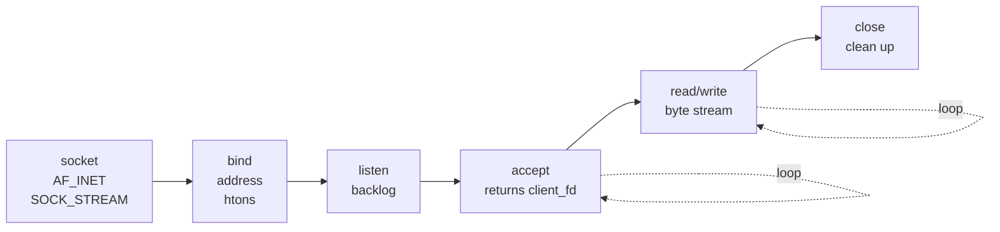
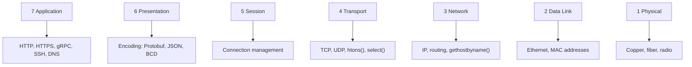
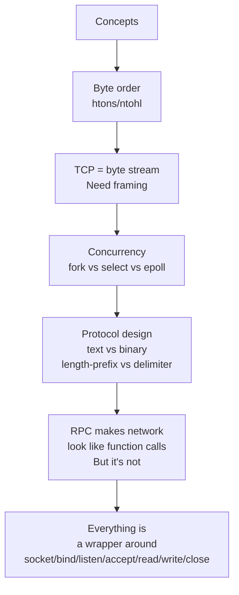
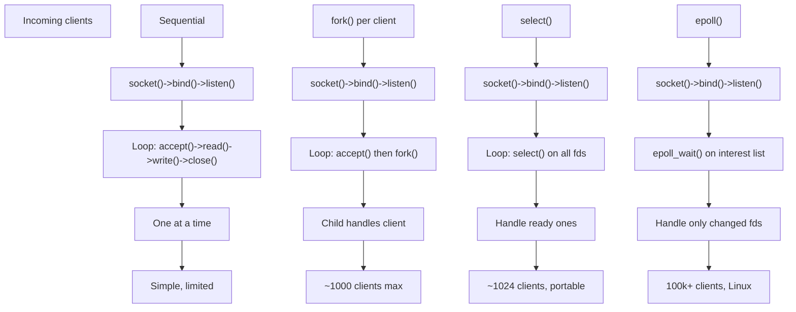
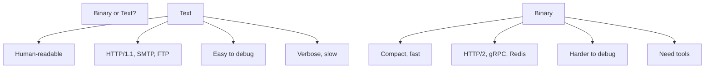
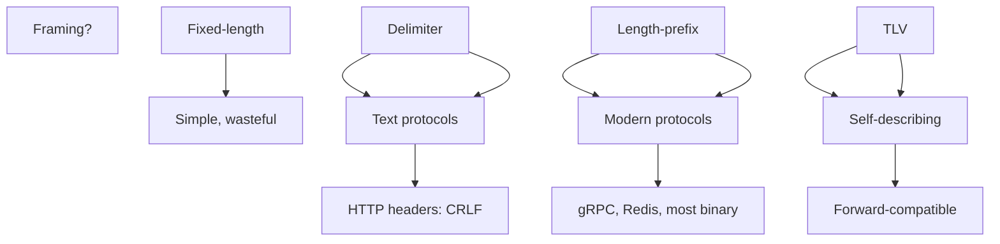
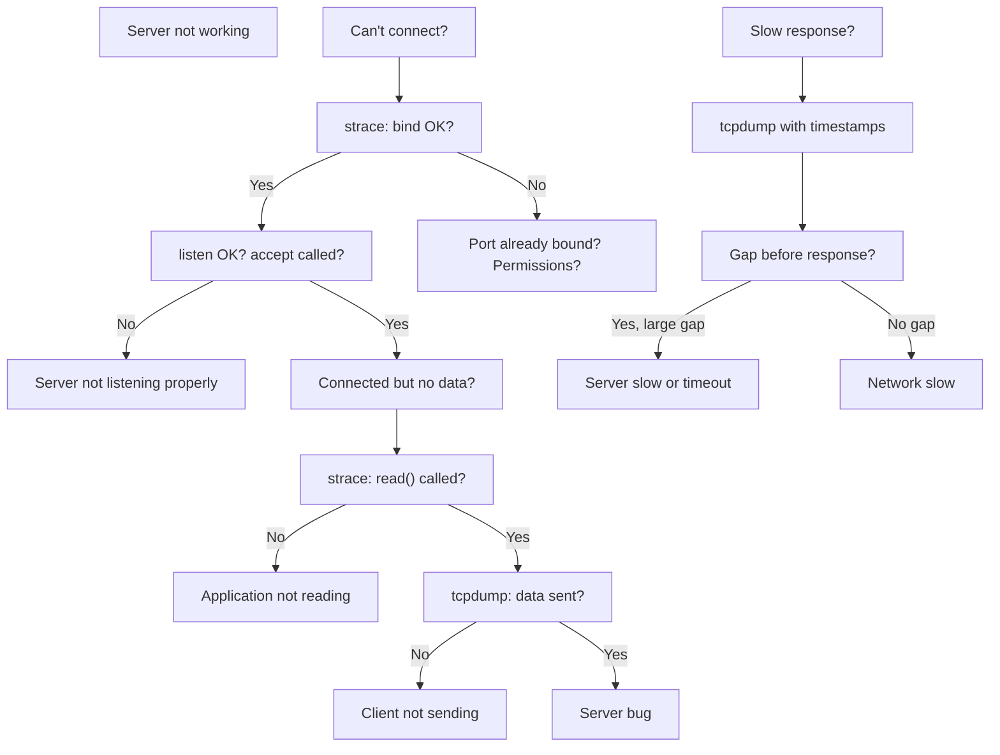
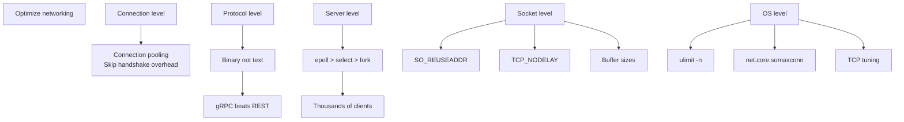
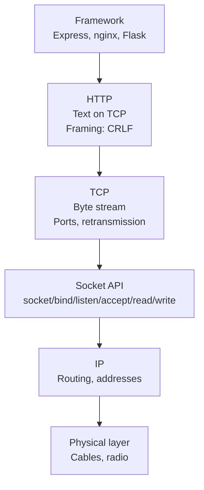

# CN Summary: The Complete Picture

[← Previous](CN_Part_07-Debugging.md)

> Everything is a wrapper around seven system calls.

---

## 7.1 The Seven Calls Again

**These seven calls underlie everything**:
- Express.js
- nginx
- Apache
- Golang net package
- Python socket module
- Every RPC framework
- Every HTTP server

---

## 7.2 The OSI Stack We Touched

---

## 7.3 Key Concepts Pyramid

---

## 7.4 Server Patterns

---

## 7.5 Protocol Choices

---

## 7.6 Debugging Decision Tree

---

## 7.7 Performance Checklist

---

## 7.8 Quick Reference: System Calls

| Call | Purpose | Server? | Client? | Returns |
|------|---------|---------|---------|---------|
| **socket()** | Create fd | Yes | Yes | fd or -1 |
| **bind()** | Assign port | Yes | No | 0 or -1 |
| **listen()** | Queue conns | Yes | No | 0 or -1 |
| **accept()** | Get client | Yes | No | client_fd or -1 |
| **connect()** | Join server | No | Yes | 0 or -1 |
| **read()** | Receive | Yes | Yes | bytes or 0 or -1 |
| **write()** | Send | Yes | Yes | bytes sent or -1 |
| **close()** | Cleanup | Yes | Yes | 0 or -1 |

---

## 7.9 Key Takeaways

✅ **TCP = byte stream.** Framing is your job.

✅ **Byte order matters.** Use htons()/ntohl().

✅ **DNS blocks.** Can hang for seconds.

✅ **SIGPIPE kills.** Writing to closed peer terminates process.

✅ **Network ≠ function call.** RPC failures, timeouts, retries.

✅ **Concurrency options**: fork() (simple), select() (portable), epoll() (scalable).

✅ **Text protocols** are debuggable, **binary protocols** are fast.

✅ **Framing: three approaches** - fixed-length, delimiter, length-prefix.

✅ **gRPC = Protobuf + HTTP/2.** Codegen + binary = fast & typed.

✅ **Don't guess.** Use tcpdump, strace, curl to see what's really happening.

---

## 7.10 Reading for Each Context

**For interviews**:
- Know the seven calls by name
- Understand fork() vs select() trade-offs
- Explain TCP framing problem
- Describe at least one real protocol (HTTP, DNS, gRPC)

**For system design**:
- Estimate connections per server (fork ~ 1000, epoll ~ 100,000)
- Choose protocol (text = debug, binary = speed)
- Think about timeouts and retries
- Connection pooling for RPC

**For debugging**:
- tcpdump to see packets
- strace to see calls
- curl to see HTTP details
- Never guess; always inspect

---

## 7.11 The Pyramid, One More Time

**Every framework sits on TCP. TCP sits on seven calls. Seven calls sit on IP. IP sits on wires.**

---

## Summary

**Everything you touched in this lesson**:

| Part | Focus | Key Concept |
|------|-------|------------|
| 1 | Server | 7 system calls |
| 2 | Client | socket() → connect() → read/write |
| 3 | Concurrency | fork vs select vs epoll |
| 4 | HTTP & TLS | Text protocol, asymmetric then symmetric crypto |
| 5 | Protocol design | 3 framing approaches + encodings |
| 6 | RPC/gRPC | Marshal/unmarshal, Protobuf, HTTP/2 |
| 7 | Debugging | tcpdump, strace, curl |

---

**Go build something. Break it. Fix it with tcpdump.**

[← Previous](CN_Part_07-Debugging.md)
