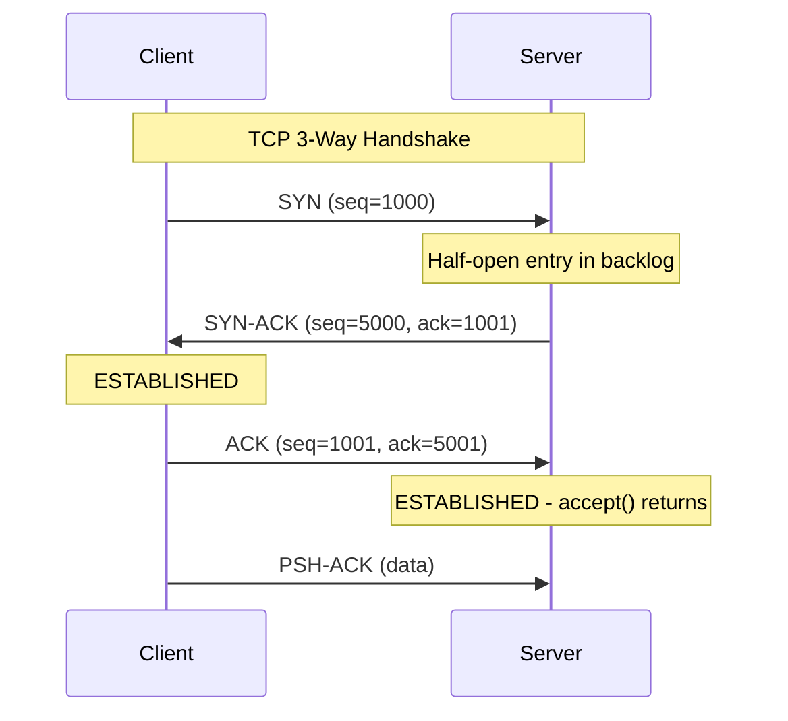
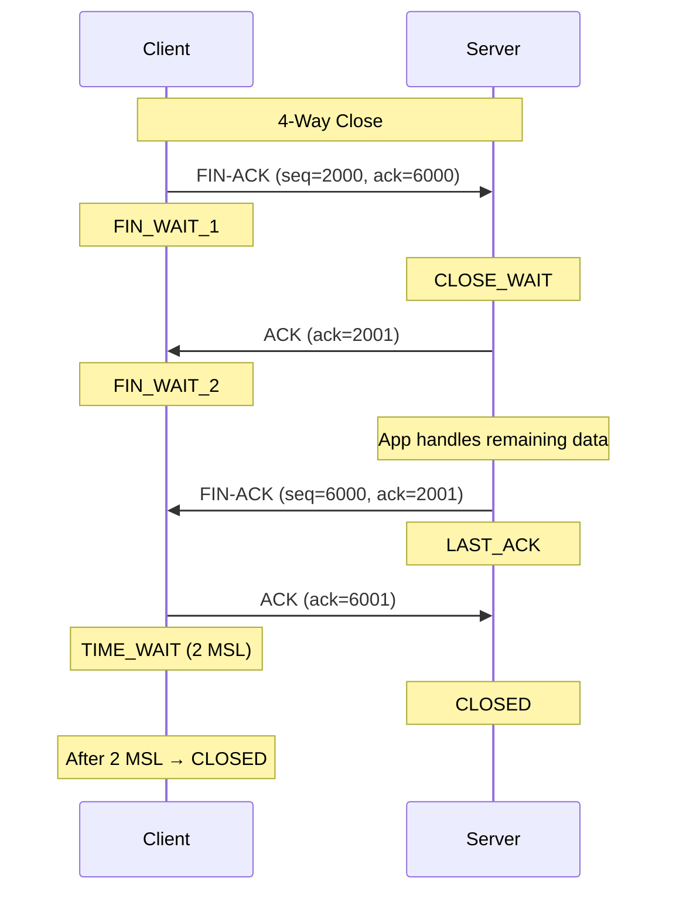

# 4. TCP, UDP, AND QUIC

## TCP: The 3-Way Handshake

### Why Three Messages?

Each direction needs its own **Initial Sequence Number (ISN)** confirmed. The handshake ensures both sides know the other's ISN.

```
Client                              Server
  │                                   │
  ├─ SYN (seq=1000)                  │
  │  └─ Announces client's ISN       │
  │                                   │
  │                              (Server sends SYN-ACK)
  │                                   │
  │◄─ SYN-ACK (seq=5000, ack=1001)   │
  │  └─ Acknowledges client's ISN    │
  │  └─ Announces server's ISN       │
  │                                   │
  ├─ ACK (seq=1001, ack=5001)        │
  │  └─ Acknowledges server's ISN    │
  │                                   │
```

### Sequence Number Details

| Field | Details |
|-------|---------|
| **SYN seq=1000** | Client's starting sequence number |
| **SYN-ACK ack=1001** | Server acknowledges (client's ISN + 1) |
| **SYN-ACK seq=5000** | Server's starting sequence number |
| **ACK ack=5001** | Client acknowledges (server's ISN + 1) |

### Why Acknowledge the ISN?

**SYN and FIN each consume a sequence number**, even though they carry no payload.

- A bare SYN with seq=1000 is **different from a retransmission** of seq=1000
- Without ACKing the ISN, you couldn't distinguish them
- So `ack=1001` answers `seq=1000` even with zero payload

### Random ISN: Preventing the Mitnick Attack

**Problem (early stacks):** ISNs counted predictably (0, 1, 2, 3, ...)

**Attack:** Guess the next ISN and inject forged segments **blind** (without seeing responses)
- Attacker doesn't need to intercept traffic
- Just injects segments with correct ISN and sequence numbers
- Server accepts them as valid

**Defense (RFC 6528):** ISN is now a **keyed hash** of:
- 4-tuple (source IP, source port, dest IP, dest port)
- Coarse timestamp
- Not predictable without the hash key

**Result:** Mitnick attack is infeasible

---

## TCP Connection Termination (4-Way Close)

### Why Four Messages?

Both sides must close independently. The side that closes first goes through more states.

```
Client (Active Close)                Server (Passive Close)
  │                                    │
  ├─ FIN-ACK (seq=2000, ack=6000)     │
  │  └─ Client says "I'm done sending"│
  │                                    │
  │                          (Server sends ACK)
  │                                    │
  │◄─ ACK (ack=2001)                  │
  │                                    │
  │               (Server sends remaining data, if any)
  │                                    │
  │◄─ FIN-ACK (seq=6000, ack=2001)    │
  │  └─ Server says "I'm done too"    │
  │                                    │
  ├─ ACK (ack=6001)                   │
  │                                    │
  └─ TIME_WAIT (2 MSL)                └─ CLOSED
     (waits before fully closing)
```

### Connection States

| State | Meaning |
|-------|---------|
| **CLOSED** | No connection |
| **LISTEN** | Server waiting for connections |
| **SYN_SENT** | Client sent SYN, waiting for SYN-ACK |
| **SYN_RECEIVED** | Server received SYN, sent SYN-ACK |
| **ESTABLISHED** | Both sides ready to send/receive |
| **FIN_WAIT_1** | Sent FIN, waiting for ACK |
| **FIN_WAIT_2** | ACKed, waiting for peer's FIN |
| **CLOSE_WAIT** | Received FIN, not yet closed locally |
| **CLOSING** | Rare: both sides sent FIN |
| **TIME_WAIT** | Waiting 2 MSL before fully closing |
| **LAST_ACK** | Sent FIN, waiting for ACK |

### Half-Close

**Not an error—a real state.**

After the first FIN and its ACK:
- Connection is **one-directional**
- Client sends no more data
- Server can still send remaining data
- Server eventually sends its own FIN

**Important:** SYN+ACK can be combined (in the handshake), but FIN+ACK **cannot** be optimized the same way.

### TIME_WAIT: Why 2 MSL?

**2 MSL** = 2 × Maximum Segment Lifetime (typically ~30 seconds)

**Why needed:**
1. Server's FIN-ACK might be lost, client's ACK might be lost
2. If client closes immediately, server retransmits FIN
3. If old connection closes, kernel might reuse the (src IP, src port, dst IP, dst port) tuple
4. Delayed packet from old connection arrives and confuses new connection
5. **2 MSL ensures old packets have died** before tuple is reused

**Side effect:** `bind()` on same port after close gives "address already in use"

**Solution:** `SO_REUSEADDR` socket option allows reuse before TIME_WAIT expires

`SO_REUSEADDR` is normally set **before** `bind()` so a restarted server can bind its familiar local address/port while older connections may still be in `TIME_WAIT`. It does not mean "two arbitrary servers may listen on the same address and port" and it does not make a busy, actively listening port available. Exact reuse behavior has OS-specific details; it is a restart convenience, not a general sharing mechanism.

### CLOSE_WAIT: Application Bug

**"Sockets stuck in CLOSE_WAIT"**

This happens when:
```
Server receives FIN from client → sends ACK (enters CLOSE_WAIT)
Server forgets to call close() on its side
```

**Not a network problem—an application bug.**

The server is supposed to close the socket after handling the client's FIN. If it doesn't, the connection hangs in CLOSE_WAIT forever.

---

## TCP: The RTT Tax

**Every round trip before your first byte is a tax, and everything modern is an attack on it.**

```
TCP only:
├─ RTT 1: SYN → SYN-ACK → ACK (3-way handshake)
│
└─ RTT 2+: Send application data

Total before first byte: 1 RTT

TCP + TLS 1.2:
├─ RTT 1: TCP handshake (3-way)
├─ RTT 2: ClientHello
├─ RTT 3: ServerHello + key exchange
│
└─ RTT 4+: Encrypted data

Total before first byte: 3 RTTs

TCP + TLS 1.3:
├─ RTT 1: TCP handshake
├─ RTT 2: ClientHello + Server crypto materials

Total before first byte: 2 RTTs

TCP Fast Open (TFO):
├─ RTT 1: Returning client puts data in SYN itself

Total before first byte: 1 RTT (after first connection)

QUIC + HTTP/3:
├─ RTT 1: Transport + crypto setup combined, plus data

Total before first byte: 1 RTT (even first connection!)
```

### The Insight

- **Bandwidth** is something you can buy (pay more for faster internet)
- **Round trips** are limited by physics (speed of light)
- Mumbai to Virginia ≈ **190 ms** and **no amount of money changes the speed of light**

Every optimization tries to **reduce RTTs**, not bandwidth.

---

## MTU, MSS, and TCP payload: do not mix them up

These names describe limits at different layers. They are related, but they are not interchangeable.

| Term | Layer / unit | What it limits | Common Ethernet/IPv4/TCP value |
|------|--------------|----------------|--------------------------------|
| **MTU** | Link layer frame payload | Largest IP packet a link can carry without fragmentation | `1500` bytes |
| **IP total length** | IP packet | IP header + TCP header + TCP payload | Up to the MTU on a normal Ethernet path |
| **MSS** | TCP payload | Largest TCP data chunk advertised for a connection | `1460` bytes = `1500 - 20 - 20` |

For a plain IPv4 TCP connection with no options:

```
Ethernet MTU: 1500 bytes available for the IP packet
  - IPv4 header: 20 bytes
  - TCP header:  20 bytes
  --------------------------------
TCP MSS:        1460 bytes of application payload
```

The older TCP default MSS used when no MSS option is received is **536 bytes** for IPv4. That is a fallback compatibility value—not the usual Ethernet MTU and not the normal modern payload size. Headers/options, IPv6, VPNs, and the smallest link MTU on the path can all lower the usable MSS. Path MTU Discovery helps endpoints avoid IP fragmentation.

---

## UDP: TCP Without Promises

```
UDP is TCP with every promise removed.
```

### UDP Header (8 bytes total)

```
Src Port (2B) | Dst Port (2B) | Length (2B) | Checksum (2B) | Payload (up to 65,507B)
```

**vs TCP Header (20 bytes minimum):**
```
Src Port (2B) | Dst Port (2B) | Seq (4B) | Ack (4B) | Flags (2B) | Window (2B) | 
Checksum (2B) | Urgent (2B) | Options (0-40B) | Payload (≤MSS)
```

### UDP Characteristics

| Feature | UDP |
|---------|-----|
| Connection-oriented | ✗ No |
| Reliable | ✗ No |
| Ordered | ✗ No |
| Checksum | ✓ Yes |
| Handshake | ✗ No |
| Retransmission | ✗ No |
| Flow control | ✗ No |
| Congestion control | ✗ No |

### Who Actually Uses UDP?

- **Zoom, WebRTC:** Real-time video/audio
- **Game servers:** Low latency more important than reliability
- **DNS:** Simple query-response, can retry if needed
- **Streaming protocols:** Real-time media

**Why not TCP for these?**

A **retransmitted audio frame** arrives too late to play. **Dropping it is the correct behavior.**

TCP's guarantees (reliability, ordering) add **latency**, which is worse than loss for real-time apps.

### UDP Broadcast Promise

UDP is great for **broadcast/multicast discovery:**
- Send query on local network
- Any device with that service responds
- No registry, no config needed

**In practice:** Widely implemented, but people often hard-coded IPs instead. Broadcast discovery never became the universal solution hoped for.

---

## QUIC: TCP in Userspace over UDP

### The Problem

HTTP/2 multiplexes streams over one TCP connection, but:
- TCP still delivers one **ordered byte stream**
- Single lost packet stalls **all streams** (Head-of-Line Blocking)

Example:
```
Stream 1: Data 1 → Data 2 → [LOST] → Data 4 → Data 5
Stream 2: Data A → Data B → [waits] → Data D → Data E
Stream 3: Data X → Data Y → [waits] → Data Z → Data W

Lost packet in Stream 1 stalls everything!
```

### The Solution: QUIC

**QUIC gives each stream its own sequence space.**

```
Stream 1: Seq 1 → Seq 2 → [LOST] → Seq 4 → Seq 5
Stream 2: Seq 1 → Seq 2 → Seq 3 → Seq 4 → Seq 5  (proceeds normally)
Stream 3: Seq 1 → Seq 2 → Seq 3 → Seq 4 → Seq 5  (proceeds normally)

Only Stream 1 waits for retransmission, others continue!
```

### QUIC Architecture

```
HTTP/3 (Streams)
    ↓ (independent streams)
QUIC (Independent sequencing + TLS 1.3)
    ↓ (single crypto handshake)
UDP (8-byte header, kernel leaves it alone)
    ↓
IP
```

### Why Userspace Matters

**TCP lives in the kernel.**
- Changing TCP means shipping an OS update to the entire planet
- Hoping no middlebox breaks (NAT, firewalls rewrite TCP headers)
- Takes years to deploy a congestion control change

**QUIC ships in the browser.**
- Google deployed a congestion control change on **Tuesday**
- No OS update needed
- Browser downloads new code automatically

**This is revolutionary for fast deployment.**

### HTTP/1.1 vs HTTP/2 vs HTTP/3

| Aspect | HTTP/1.1 | HTTP/2 | HTTP/3 |
|--------|----------|--------|--------|
| Protocol | Text | Binary | Binary |
| Transport | TCP | TCP | QUIC over UDP |
| Multiplexing | No | Yes (but HoL blocked) | Yes (independent streams) |
| Push | No | Yes | Yes |
| Header compression | No | HPACK | QPACK |
| TLS integration | Separate | Separate | Integrated (1 RTT) |
| Performance | Slowest | Better | Best (1 RTT from start) |
| Adoption | Most sites | Growing | Not yet universal |

### Current State

- **HTTP/2:** Most browsers support, many servers have it, adoption is slow
- **HTTP/3:** Not yet fully HTTP/3-everywhere
- **My read:** Media over QUIC becomes widespread in next **2-5 years**

---

## TCP Connection Setup Diagram



---

## TCP Connection Termination Diagram



---

## SYN Flood Attack and Defense

### The Attack

**Goal:** Fill server's accept queue, reject legitimate connections

```
Attacker sends many SYN packets with spoofed source IPs
└─ Each SYN takes up one entry in the backlog
└─ Attacker never sends ACK (3rd packet)
└─ Server holds half-open entries until timeout (30+ seconds)
└─ Fill the queue and legitimate connections are dropped
```

**Cost to attacker:** One SYN packet per half-open entry

**Cost to server:** One entry in finite backlog per SYN

**Remember:** `listen(fd, 1)` means backlog of 1. With 100 Mbps attacker:
- Can create thousands of half-open connections per second
- Server can't accept legitimate clients

### The Defense: SYN Cookies (1996)

**Principle:** Don't store anything. Encode connection state in the ISN itself.

```
Step 1: Server receives SYN (seq=1000) from client
Step 2: Server creates a keyed hash of:
        ├─ 4-tuple (src IP, src port, dst IP, dst port)
        ├─ Coarse timestamp
        └─ MSS value
Step 3: Uses this hash as the SYN-ACK sequence number
Step 4: Sends SYN-ACK with no backlog entry

Step 5: Client (legitimate) sends ACK with:
        └─ Acknowledgment number = server's seq + 1

Step 6: Server receives ACK:
        ├─ Recomputes the hash from the ACK
        ├─ Validates it matches
        ├─ Reconstructs the entire connection
        └─ Accepts the connection
```

**No backlog entry was ever created!**

### The Cost of SYN Cookies

Most TCP options don't survive:
- Only 32 bits of ISN to encode the hash
- Window scale, SACK, timestamps are **lost** for that connection
- Which is why **cookies switch on under pressure**, not always

---

## TCP vs UDP Summary Table

| Aspect | TCP | UDP |
|--------|-----|-----|
| Connection | 3-way handshake | No connection |
| Reliability | Guaranteed delivery | Best effort |
| Ordering | In-order delivery | No ordering |
| Flow control | Sliding window | None |
| Congestion control | Yes (Reno, CUBIC, BBR) | None |
| Header size | 20B minimum | 8B always |
| Max payload | ~1460B (MSS) | ~65,507B |
| Latency | Higher (handshake) | Lower |
| Overhead | Higher | Lower |
| Use when | Correctness matters | Speed matters |

---

## Summary: RTT Reduction Timeline

```
1983: TCP Handshake → 1 RTT overhead

1990s: TCP + TLS 1.0 → 3 RTT overhead

2013: TLS 1.3 → 2 RTT overhead

2015: TCP Fast Open → 1 RTT overhead (for repeat connections)

2019: QUIC (HTTP/3) → 1 RTT overhead (even first connection!)
      └─ Transport + crypto + data all in 1 RTT
```

The entire evolution of modern networking is **attacking the RTT tax**.
