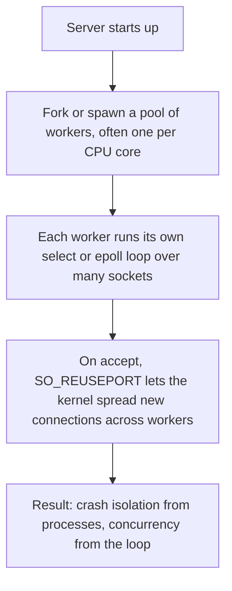

# Part 1 — Scaling Servers & Concurrency

[Next →](02-select-epoll.md)


---

## What This Part Covers

- The central question of the session: how one box serves thousands of clients
- Three ways to serve many clients: fork-per-request, thread-per-request, one event loop/many sockets
- Code walkthrough of the `fork()` server
- What production servers actually do (pre-fork/pre-thread pool + event loop per worker)
- The cost of `fork()`
- Timeouts as "the client's half of the contract"

## Learning Objectives

By the end of this part you should be able to:
- Explain why a thread-per-client model does not scale to ten thousand clients
- Describe fork-per-request, thread-per-request, and event-loop models, and state which one "survives contact with scale"
- Read and explain the sample `fork()` server code
- Explain what real production servers do differently from all three "pure" models
- Explain why `select()`/`epoll()` timeouts matter

---

## The One Question

> **How does one box hold ten thousand clients at the same time?**

This is the question the entire session (and much of the CN & Scaler course) circles back to. Every mechanism you'll learn — `select`, `epoll`, FastCGI, thread pools, Little's Law — is a partial answer to this one question.

---

## Concept: Three Ways to Serve Many Clients

### Simple Explanation

Imagine a restaurant. You could hire one full waiter (a whole new staff member) for every single customer, hire one waiter-in-training (cheaper, but still a person) per customer, or you could have **one experienced waiter watch every table at once**, and only walk over to a table when it actually needs something. The session argues that only the third approach survives once you have thousands of "tables."

### Technical Explanation

There are three canonical architectures for handling multiple simultaneous clients:

| Model | What happens per client | Cost | Scales to 10K? |
|---|---|---|---|
| **Fork per request** | A whole process is copied (`fork()`) for every client | Highest — full process image, page tables, fds, scheduler entry, all duplicated | No |
| **Thread per request** | A new thread is created per client | Cheaper than fork, latency drops, but **does not disappear** — every thread still costs a stack before doing any work | Not reliably ("A thread per client is a bet you lose at ten thousand") |
| **One loop, many sockets** | A single thread uses `select`/`epoll` to watch every socket, and wakes only for ready ones | Lowest — this is "the one that scales" | Yes |

### How It Works

**Fork per request** — the server calls `accept()`, then `fork()`s a brand-new child process to handle just that one client. The child does the work (e.g., echoing bytes) and exits; the parent goes back to `accept()`-ing the next client.

**Thread per request** — same idea, but instead of a whole new process, a new thread is spawned inside the same process. Threads share memory (unlike processes), so it's cheaper, but each thread still needs its own stack and scheduler entry.

**One loop, many sockets** — a single thread registers *every* client socket with the OS (via `select()` or `epoll()`), then blocks on a single call that only returns when one or more sockets are actually ready to be read/written. No thread or process is created per client at all.

### Example (from the PDF)

The `fork()` server example:

```c
#include <string.h>
#include <unistd.h>
#include <arpa/inet.h>

int main() {
    int server_fd = socket(AF_INET, SOCK_STREAM, 0);
    struct sockaddr_in addr = {0};
    addr.sin_family = AF_INET;
    addr.sin_addr.s_addr = INADDR_ANY;
    addr.sin_port = htons(2026);
    bind(server_fd, (struct sockaddr*)&addr, sizeof(addr));
    listen(server_fd, 1);
    while (1) {
        int client_fd = accept(server_fd, NULL, NULL);
        if (fork() == 0) {
            char buf[4096];
            int n;
            while ((n = read(client_fd, buf, sizeof(buf))) > 0) {
                write(client_fd, buf, n);
            }
            close(client_fd);
            return 0;
        }
        close(client_fd);
    }
}
```

**Reading the code (as the PDF frames it):**
- `listen(server_fd, 1)` — a backlog of just **one** pending connection.
- Inside the `if (fork() == 0)` block, we are the **child**: it echoes whatever it reads back to the client, then closes the socket and exits.
- After the `fork()` call, the **parent** closes its own copy of `client_fd` and loops back to `accept()` the next connection.

**What it costs (per the PDF):**
- A full process image per connection.
- Page tables, file descriptors, and a scheduler entry — all duplicated.
- Critically: **you pay this cost while the user waits** (i.e., it adds to request latency).

### Key Points

- Only the event-loop model ("one loop, many sockets") is described as the one that **scales**.
- Fork-per-request is the *most isolated* (a crash in one client's process can't take others down) but the *most expensive*.
- Thread-per-request is a middle ground: cheaper than fork, but the cost does not vanish — it's still one stack per client, paid up front.

### Common MCQ Trap

- **Trap:** Thinking thread-per-request is "free" because threads are lighter than processes. The PDF is explicit: *"It does not go away. Every thread still costs a stack before it does any work."*
- **Trap:** Assuming fork-per-request is always bad. It gives you **isolation** — this is exactly why it's still used (e.g., Apache's prefork MPM, covered in Part 7).

---

## Concept: What Actually Ships in Production

### Simple Explanation

In practice, nobody picks purely one of the three models. Real servers **combine** them: spin up a small number of worker processes/threads (for isolation and to use multiple CPU cores), and inside *each* worker, run an event loop that handles many client sockets at once.

### Technical Explanation

> "Most of the time we do neither purely — we pre-fork or pre-thread a pool, and each worker runs its own select or epoll loop. Isolation from the processes, concurrency from the loop."

This hybrid gives you two benefits at once:
- **Isolation** from having multiple OS processes (a crash in one worker doesn't take down the whole server).
- **Concurrency/scale** from the event loop inside each worker (each worker can still serve thousands of sockets).

### How It Works



**Explanation:** This is a four-stage pipeline read top to bottom: workers are created once at startup (amortising the cost of process creation), each worker then independently multiplexes many sockets via its own loop, and the kernel — via `SO_REUSEPORT` — load-balances new incoming connections across those workers automatically.

### Example (from the PDF)

The PDF states this pattern is **not theoretical** — it is:
- Apache's **event MPM** (Multi-Processing Module) — see [Part 7](07-real-world-server-architectures.md)
- nginx's **master-and-workers** architecture — see [Part 7](07-real-world-server-architectures.md)
- What the **Go runtime** does invisibly: goroutines are multiplexed onto OS threads by a scheduler sitting on top of `epoll` (see [Part 6](06-scaling-limits.md) for goroutines vs OS threads)

### Key Points

- This "worker pool + event loop per worker" pattern reappears constantly in Parts 6 and 7 — memorize it now.
- `SO_REUSEPORT` is the kernel mechanism that spreads new connections across multiple worker processes/threads.

### Common MCQ Trap

- Don't confuse "pre-fork" (creating workers at startup) with "fork-per-request" (creating a process for every single client) — pre-forking is exactly the technique used to **avoid** paying fork's cost on the request path.

---

## Concept: Timeouts Are the Client's Half of the Contract

### Simple Explanation

If a server waits forever for one slow or broken client, and that server is only running a single loop, then that ONE bad client can freeze the server for **everyone else**. Timeouts prevent this.

### Technical Explanation

In a `select()` loop, the server is simultaneously waiting on three different categories of readiness, each represented by its own `fd_set`:

| Set | What it watches for |
|---|---|
| `readfds` | Some new content has arrived to be read |
| `writefds` | Some socket now allows us to write to it |
| `exceptfds` | Sockets being connected and closed (exceptional conditions) |

Each of these comes with a default timeout behavior controlled by the **last argument** to `select()`.

### How It Works

```c
select(maxfd + 1, &readfds, NULL, NULL, NULL);
/* readfds, writefds, exceptfds, timeout */
```

In the session's own example code, that last argument (**timeout**) was passed as `NULL`.

> **NULL timeout = block forever.** One wedged client and the whole loop — every other connection on it — stops.

The PDF also notes the symmetric rule applies on the **client side**: set a deadline, then retry with backoff.

### Key Points

- The timeout argument to `select()` is the **5th parameter**.
- `NULL` timeout means "wait indefinitely" — dangerous in a single-threaded event loop.
- This single-threaded fragility (one bad client blocks everyone) is a recurring theme and one of the motivations for careful timeout handling in real servers (e.g., Apache's `mod_cgi` sets a timeout on each pipe — see [Part 3](03-cgi.md)).

### Common MCQ Trap

- Remembering *which* argument is the timeout, and that `NULL` = "block forever," not "no timeout enforced by default in a safe way." A `NULL` timeout is the **least safe** choice, not a neutral default.

---

## Quick Revision

- Three models: **fork-per-request** (isolated, expensive), **thread-per-request** (cheaper, cost doesn't vanish), **one loop/many sockets** (scales — the winner).
- Production reality: **pre-fork/pre-thread pool + event loop per worker** — isolation from processes, concurrency from the loop.
- `SO_REUSEPORT` lets the kernel spread new connections across worker processes.
- `select()`'s last argument is the **timeout**; `NULL` means block forever, and can freeze the whole loop for one wedged client.
- This pattern (worker pool + loop) = Apache event MPM = nginx master/workers = the Go runtime's goroutine scheduler.

---

[Next →](02-select-epoll.md)
