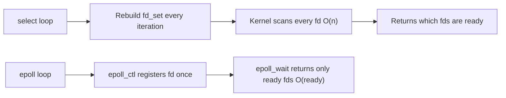
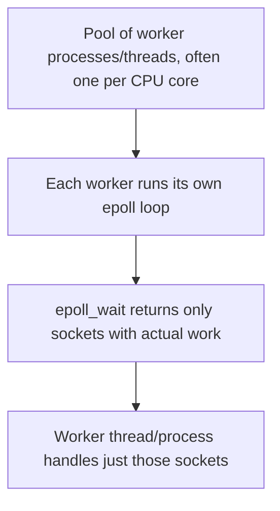

# Part 2 — select() and epoll()

[← Previous](01-scaling-servers.md) | [Next →](03-cgi.md)


---

## What This Part Covers

- `select()` in detail: `fd_set`, `readfds`/`writefds`/`exceptfds`, `maxfd + 1`, blocking behavior, timeout
- `FD_SETSIZE` / the 1024 limit
- Why `select()` is O(n)
- `epoll()`: `epoll_ctl()`, `epoll_wait()`, why it's O(ready)
- Other platforms' equivalents: kqueue, IOCP, io_uring
- select vs epoll comparison
- The production event-loop architecture (recap)

## Learning Objectives

- Trace through the sample `select()` server line by line
- Explain why `FD_SETSIZE = 1024` is a hard, compiled-in limit
- Explain the O(n) vs O(ready) distinction between `select` and `epoll`
- Name the equivalent mechanisms on other operating systems
- Connect "1024" to `FD_SETSIZE`, `ulimit`, and C10K (they're the same number)

---

## Concept: select() — One Thread, Every Client

### Simple Explanation

`select()` is like a teacher who, every few seconds, calls out the *entire class roster* out loud and waits to see which students raise their hands. Even if only 2 students out of 1,000 want to speak, the teacher still has to read out **all 1,000 names** every single time.

### Technical Explanation

`select()` lets one thread monitor multiple file descriptors (sockets) at once, and blocks until at least one is "ready" (has data to read, can be written to, or has an exceptional condition).

### How It Works — Full Example from the PDF

```c
int main() {
    int server_fd = socket(AF_INET, SOCK_STREAM, 0);
    struct sockaddr_in addr = {0};
    addr.sin_family = AF_INET;
    addr.sin_addr.s_addr = INADDR_ANY;
    addr.sin_port = htons(2026);
    bind(server_fd, (struct sockaddr*)&addr, sizeof(addr));
    listen(server_fd, 16);

    int clients[FD_SETSIZE];
    int nclients = 0;

    while (1) {
        fd_set readfds;
        FD_ZERO(&readfds);
        FD_SET(server_fd, &readfds);
        int maxfd = server_fd;

        for (int i = 0; i < nclients; i++) {
            FD_SET(clients[i], &readfds);
            if (clients[i] > maxfd) maxfd = clients[i];
        }

        select(maxfd + 1, &readfds, NULL, NULL, NULL);

        if (FD_ISSET(server_fd, &readfds)) {
            clients[nclients++] = accept(server_fd, NULL, NULL);
        }

        for (int i = 0; i < nclients; i++) {
            int fd = clients[i];
            if (!FD_ISSET(fd, &readfds)) continue;
            char buf[4096];
            int n = read(fd, buf, sizeof(buf));
            if (n <= 0) {
                close(fd);
                clients[i] = clients[--nclients];
                i--;
            } else {
                write(fd, buf, n);
            }
        }
    }
}
```

**Step by step:**
1. `fd_set readfds; FD_ZERO(&readfds);` — start with an empty set.
2. `FD_SET(server_fd, &readfds);` — always watch the listening socket (for new connections).
3. Loop over all current clients, adding each to `readfds`, and tracking the **highest fd number seen** (`maxfd`).
4. `select(maxfd + 1, &readfds, NULL, NULL, NULL);` — block until something in the set is ready. Note: the kernel needs `maxfd + 1`, not just `maxfd`, because it scans fd numbers `0` to `maxfd` inclusive.
5. If the **server socket** itself is ready, that means a **new client is connecting** → `accept()` it and add to the `clients[]` array.
6. Otherwise, loop through all clients and check `FD_ISSET(fd, &readfds)` to see which ones actually have data.
7. If `read()` returns `<= 0`, the client disconnected → close and remove it from the array.

### Two Lines Worth Stopping On (per the PDF)

```c
clients[i] = clients[--nclients]; i--;
```
This is an **O(1) delete** — instead of shifting every element after the removed one, you swap the *last* element into the deleted slot and shrink the count. Fast, but note that it **does not preserve order**.

```c
select(maxfd + 1, &readfds, NULL, NULL, NULL);
```
That last `NULL` is the **timeout** — meaning this call blocks forever until something is ready (see [Part 1](01-scaling-servers.md) for why that's risky).

### Key Points

- `select()`'s first argument is `maxfd + 1`, not `maxfd`.
- `FD_ISSET` tells you, after `select()` returns, *which* fds are actually ready.
- `clients[i] = clients[--nclients]; i--;` is the idiomatic O(1) array-based removal.

### Common MCQ Trap

- Forgetting the `+ 1` in `maxfd + 1` — this is a classic off-by-one that the PDF specifically calls out as "worth stopping on."
- Assuming `select()` tells you *what data* arrived — it only tells you *which fds are ready*; you still have to `read()` yourself.

---

## Concept: select()'s Hard Ceiling — FD_SETSIZE = 1024

### Simple Explanation

The array used to track clients (`int clients[FD_SETSIZE]`) isn't a design choice — it's a **hard wall**. `fd_set` is a fixed-size bitmap, and on glibc that bitmap is exactly 1024 bits wide. File descriptor number 1024 literally **cannot be represented**.

### Technical Explanation

`fd_set` is not a dynamic/resizable data structure — it's a fixed-width bitmap baked into the C library at compile time (`FD_SETSIZE`, typically 1024 on glibc/Linux).

### Key Points

- `int clients[FD_SETSIZE];` in the sample code directly encodes this limit.
- **1024** connects three different things in this course:
  1. `FD_SETSIZE` (the compiled-in bitmap width)
  2. Your **default `ulimit -n`** (soft limit on open file descriptors, see [Part 6](06-scaling-limits.md))
  3. The **"K" in C10K** (see [Part 6](06-scaling-limits.md))

> **The number to remember: 1024.** It is `FD_SETSIZE`, it is your default `ulimit`, and it is the K in C10K. One wall, three names.

### Common MCQ Trap

- Thinking `FD_SETSIZE` can be raised at runtime — it's a **compile-time constant** baked into the fixed-width bitmap, which is exactly why `epoll` (no fixed array) was needed.

---

## Concept: select() Is O(n) on Every Call

### Simple Explanation

Using `select()` is like re-reading the entire attendance list every single time, even to check on just one student. Doesn't matter if 9,999 of your 10,000 connections are silently idle — the kernel still has to scan through all of them.

### Technical Explanation

Two costs, per the PDF:
- **You** rebuild the `fd_set` on every loop iteration (in user space).
- **The kernel** scans **every** fd in the set — ready or not — on every `select()` call.

> "10,000 idle sockets cost the same as 10,000 busy ones."

This is what makes `select()` an **O(n)** operation per call, where n = number of watched fds.

### Common MCQ Trap

- The O(n) cost applies **regardless of how many fds are actually ready** — this is exactly the inefficiency epoll fixes.

---

## Concept: epoll() — O(ready), Not O(n)

### Simple Explanation

`epoll` is like an office where each employee has a doorbell. Instead of the manager walking around and knocking on every door (`select`), employees ring the bell **only when they actually need something** — the manager (`epoll_wait`) is just told which bells rang.

### Technical Explanation

`epoll` splits the work into two separate system calls:

| Call | Purpose |
|---|---|
| `epoll_ctl()` | Register (or modify/remove) each fd **once**, ahead of time |
| `epoll_wait()` | Returns **only** the fds that actually became ready — nothing else |

### Key Points

- **O(ready)**, not O(n): the cost scales with how many connections have actual work, not how many exist.
- **Idle connections cost nothing** to wait on, because they aren't re-scanned every call — only registered once via `epoll_ctl`.
- No fixed 1024-style array limit like `fd_set`.

### Common MCQ Trap

- Don't confuse "register once" (`epoll_ctl`) with "check readiness" (`epoll_wait`) — they are two distinct calls, and mixing up their roles is a common quiz trap.

---

## Concept: Other Platforms — Same Idea, Different Name

The PDF explicitly lists these as equivalent mechanisms to epoll on other operating systems:

| Mechanism | Platform |
|---|---|
| `epoll` | Linux |
| `kqueue` | BSD, macOS |
| `IOCP` | Windows |
| `io_uring` | Modern Linux (newer, more general-purpose async I/O) |

### Common MCQ Trap

- Matching the wrong OS to the wrong mechanism — memorize this table directly, it's a classic factual MCQ.

---

## select() vs epoll() — Side-by-Side

| Aspect | `select()` | `epoll()` |
|---|---|---|
| Registration | Rebuilt from scratch every call | Registered once via `epoll_ctl` |
| Scanning cost | O(n) — kernel scans every fd every call | O(ready) — only returns fds that fired |
| Max fds | Hard limit: `FD_SETSIZE` = 1024 (fixed bitmap) | No such fixed bitmap limit |
| Idle connection cost | Same as a busy one (all scanned) | ~Free (not rescanned) |
| Data structure | Fixed-width bitmap (`fd_set`) | Kernel-managed interest list |
| Portability | POSIX-standard, most portable | Linux-specific (kqueue/IOCP/io_uring are the OS-specific equivalents elsewhere) |



**Explanation:** The top path shows `select`'s repeated, full-scan cycle repeating on every loop iteration. The bottom path shows `epoll`'s one-time registration followed by cheap, targeted wake-ups — this structural difference is *the* reason epoll scales where select does not.

---

## Concept: Production Event-Loop Architecture (Recap)

This repeats the pattern from [Part 1](01-scaling-servers.md), now grounded in epoll specifically — this is the architecture every real server in [Part 7](07-real-world-server-architectures.md) converges on:



**Explanation:** Each worker independently multiplexes potentially thousands of sockets through its own `epoll` instance — this is exactly what nginx and Apache's event MPM do (see [Part 7](07-real-world-server-architectures.md)).

---

## Key Points Summary

- `select()`: fixed 1024-fd ceiling (`FD_SETSIZE`), O(n) scan cost every call, portable.
- `epoll()`: no fixed ceiling, O(ready) cost, register once (`epoll_ctl`) then wait (`epoll_wait`), Linux-specific.
- Equivalents elsewhere: kqueue (BSD/macOS), IOCP (Windows), io_uring (modern Linux).
- **1024** ties together `FD_SETSIZE`, default `ulimit -n`, and the "K" in C10K.

## Common MCQ Traps (Summary)

- `maxfd + 1`, not `maxfd`, as `select()`'s first argument.
- `FD_SETSIZE` is compile-time fixed, not runtime-adjustable.
- select's cost is O(n) **regardless** of how many fds are ready; epoll's is O(ready).
- Matching kqueue/IOCP/io_uring to the correct OS.

---

## Quick Revision

- `select()` = teacher reading the whole roster every time → O(n), capped at 1024 fds.
- `epoll()` = doorbell per employee → O(ready), no fixed cap.
- `kqueue` (BSD/macOS), `IOCP` (Windows), `io_uring` (modern Linux) = same idea as epoll, different OS.
- 1024 = `FD_SETSIZE` = default `ulimit -n` = the K in C10K.
- Production servers = worker pool, each running its **own** epoll loop.

---

[← Previous](01-scaling-servers.md) | [Next →](03-cgi.md)
