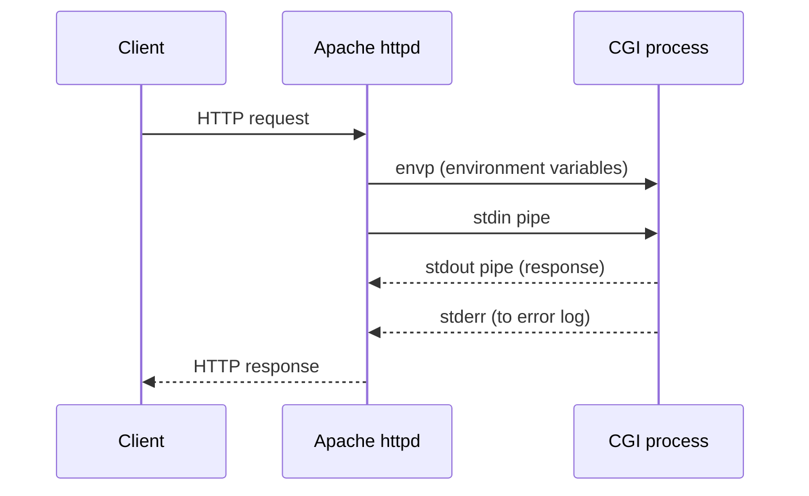
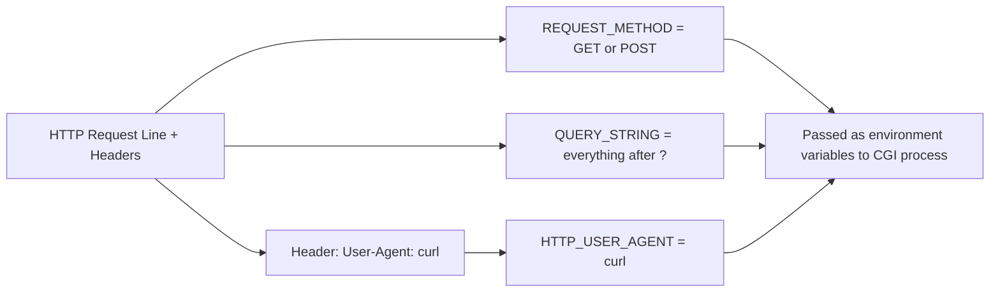
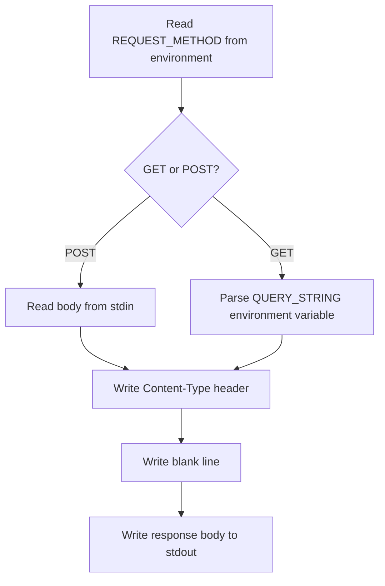

# Part 3 — CGI (Common Gateway Interface)

[← Previous](02-select-epoll.md) | [Next →](04-fastcgi.md)


---

## What This Part Covers

- What CGI is, and how Apache used it
- A new process per request
- The three pipes: stdin, stdout, stderr
- How HTTP metadata becomes environment variables (`REQUEST_METHOD`, `QUERY_STRING`, `HTTP_USER_AGENT`, etc.)
- POST body delivery via stdin
- The CGI response format (`Content-Type`, blank line delimiter)
- The overhead problem CGI creates

## Learning Objectives

- Explain what CGI is and draw its request/response flow
- List which HTTP concepts map to which environment variables, and the naming convention
- Explain how a CGI program reads input and writes output — with no framework at all
- Explain exactly what CGI "costs" per request, and why that cost matters

---

## Concept: CGI — Every Request Forks a New Copy of Your Program

### Simple Explanation

CGI is the oldest way a web server ran "your code." Every single time a request comes in, the server starts up a **brand new copy of your program**, feeds it the request details, captures what it prints, and then throws the whole program away. It's like hiring a brand-new employee for every customer, having them do one task, and firing them immediately after.

### Technical Explanation

> "Apache was the most popular HTTP server on earth, and this is how it ran your code."

CGI (Common Gateway Interface) is a convention: the web server forks a new OS process for every incoming request, wires up that process's standard input/output/error to itself, sets HTTP information as environment variables, and lets the process run to completion, capturing whatever it writes to stdout as the HTTP response.

### How It Works — Request Flow



**Explanation:** Apache converts the incoming HTTP request into environment variables (`envp`) and a stdin pipe for the new CGI process. The CGI process's stdout becomes the HTTP response body (after headers), and anything written to stderr goes straight to Apache's error log, never to the client.

### Key Points

- Apache creates a **brand-new OS process per HTTP request** for CGI.
- Three pipes are wired up: **stdin**, **stdout**, **stderr**.
- This is the real function in Apache's source code that does it:
  > `apache/httpd · modules/generators/mod_cgi.c` line 576 — `run_cgi_child()`

  It creates the child, attaches the three pipes, and **sets a timeout on each** so a hung script cannot hold the worker forever (echoing the timeout discipline from [Part 1](01-scaling-servers.md)).

### Common MCQ Trap

- Confusing which pipe goes where: **stdin** = incoming request body, **stdout** = response to client, **stderr** = error log (NOT sent to client).

---

## Concept: Wiring Up the Pipes (Server Side)

### Simple Explanation

Before running your program, the server has to connect three "phone lines" to it: one it can talk to it on (stdin), one it can listen to it on (stdout), and one for it to complain on privately (stderr).

### Technical Explanation — Pseudocode (from the PDF)

```
Set stdin for the new process to a pipe/fd we control
Set stdout for the new process to another pipe/fd we control
Set stderr for the new process to yet another pipe/fd we control

Send text received from client -> stdin
Send text written to stdout -> client
Send text written to stderr -> error log
```

### Key Points

- This wiring happens **before** the CGI process is exec'd.
- The real Apache function: `run_cgi_child()` in `modules/generators/mod_cgi.c` (line 576).
- A timeout is set on each pipe individually — this is what stops a hung script from blocking the worker indefinitely.

### Common MCQ Trap

- Assuming there's some special CGI-specific IPC mechanism — it's just standard Unix pipes, redirected to the child process's stdin/stdout/stderr before `exec()`.

---

## Concept: HTTP Headers Become Environment Variables

### Simple Explanation

CGI programs don't get an HTTP request object like modern frameworks give you. Instead, the server translates the request into plain **environment variables** — the same kind you'd set with `export` in a shell — and the program just reads those.

### Technical Explanation

> "Convert HTTP headers and verb to variables. E.g. `REQUEST_METHOD` = GET / POST, `QUERY_STRING` = things after ?. Pass these as environment variables while creating the CGI process."

### How It Works — The Naming Convention

For any HTTP header, the conversion rule is:
1. Take the header name (e.g., `User-Agent`)
2. **Upper-case** it
3. **Swap dashes for underscores**
4. **Prefix with `HTTP_`**

So `User-Agent: curl` becomes `HTTP_USER_AGENT=curl`.

> "Every framework you have ever used still carries this shape."

### Example — HTTP → CGI Environment Variables



**Explanation:** The HTTP request's method, query string, and every header get individually translated into environment variables following the `HTTP_<UPPERCASE_WITH_UNDERSCORES>` convention (for headers), and passed to the new process's environment before it runs.

### Key Points — The Real Source

> `server/util_script.c` line 409 — `ap_add_cgi_vars()`

Sets: `GATEWAY_INTERFACE`, `SERVER_PROTOCOL`, `REQUEST_METHOD`, `QUERY_STRING`.
`ap_add_common_vars()` (a related function) sets the rest.

### Common MCQ Trap

- Forgetting the `HTTP_` prefix rule, or getting the transformation backwards (e.g., thinking it's lowercase or keeps dashes).
- Confusing `REQUEST_METHOD` (the verb: GET/POST) with `QUERY_STRING` (everything after the `?`).

---

## Concept: The CGI Program Itself — Just a Program That Prints

### Simple Explanation

A CGI program needs **no library, no framework at all**. It just reads a couple of environment variables, maybe reads some bytes from stdin, and prints text to stdout. That's the entire contract.

### Technical Explanation — Pseudocode (from the PDF)

```
Get environment variable (REQUEST_METHOD) // GET or POST
If POST - read from stdin
If GET - parse another environment variable (QUERY_STRING)
Output "Content-Type: text/html" - two lines and text
```

### How It Works



**Explanation:** Whether the request is GET or POST determines *where* the input comes from (query string vs stdin body); after that, both paths converge on the same output contract: headers, a blank line, then body — all written to stdout.

### Concept: The Two-Line Response Format

> "The header block, then a blank line, then the body. That blank line is the delimiter — the same framing question we ended on last session. Apache reads your headers up to it and streams everything after it to the client."

**Example format:**
```
Content-Type: text/html

<html>...</html>
```

### Key Points

- **No server library or framework is required** — any language that can read an environment variable and print to stdout can serve HTTP.
- This is explicitly why the PDF says **"the early web was written in Perl and shell."**
- The **blank line** is a *delimiter*-style framing mechanism (as opposed to a length-prefixed one) — see [Part 4](04-fastcgi.md) for the "length vs delimiter" theme repeated with FastCGI records.

### Common MCQ Trap

- Thinking a `Content-Length` header is mandatory in basic CGI output — the PDF's example only shows `Content-Type` plus the blank-line delimiter; the framing is **delimiter-based**, not length-based, at this layer.

---

## Concept: CGI's Overhead — Copy the Whole Program, Then Throw It Away

### Simple Explanation

We already established (in [Part 1](01-scaling-servers.md)) that forking and executing a process is expensive. CGI's biggest flaw is that it pays that expensive cost **on every single HTTP request** — not once at startup.

### Technical Explanation

> "The whole program image is created, run once, and discarded. That is what your shell does for every command you type — except your shell is not doing it a thousand times a second."

### Key Points — Two Attempted Fixes, and the One That Won

| Fix | What it does | Trade-off |
|---|---|---|
| **Compile the module into the server** (e.g., `mod_php`, `mod_perl`) | No new process per request | Your application now shares an address space with the web server — **one segfault takes both down** |
| **FastCGI** (the fix that won) | Keep a long-lived process of your own; web server talks to it over a Unix/TCP socket, with a reduced vocabulary | Covered fully in [Part 4](04-fastcgi.md) |

> "Notice the move: take the setup cost off the request path and pay it once at startup. Exactly what pre-forking did for connections in block 01."

This is your first concrete instance of **Core Idea #1 — Amortise the setup** (see [Part 8](08-revision-and-mcqs.md)).

### Common MCQ Trap

- Thinking `mod_php`/`mod_perl` are the "final" solution — the PDF frames them as an intermediate, risky fix (shared address space = shared failure domain), with FastCGI being the fix that actually won.

---

## Key Points Summary

- CGI = a **new OS process per HTTP request**.
- Three pipes wired up: stdin (request body in), stdout (response out), stderr (error log).
- HTTP → environment variables: `REQUEST_METHOD`, `QUERY_STRING`, `HTTP_<HEADER_NAME>`.
- CGI response = headers + blank line (delimiter) + body, written to stdout.
- Cost: full process create/destroy **per request** — this is exactly what FastCGI fixes.

## Common MCQ Traps (Summary)

- Pipe roles: stdin (in), stdout (client response), stderr (server log — never client-visible).
- Header naming convention: uppercase, dashes → underscores, `HTTP_` prefix.
- `mod_php`/`mod_perl` are a risky intermediate fix, not the final answer — that's FastCGI.
- The blank line is a **delimiter**, not a length field.

---

## Quick Revision

- CGI = fork + exec a whole new program, per request, with HTTP info handed in via environment variables and stdin/stdout/stderr.
- Naming rule: `User-Agent` → `HTTP_USER_AGENT`.
- Real Apache functions: `run_cgi_child()` (mod_cgi.c:576), `ap_add_cgi_vars()` (util_script.c:409).
- CGI's problem: pays full process-creation cost on every request.
- Two attempted fixes: embed-in-server (`mod_php`/`mod_perl` — risky), or keep-a-long-lived-process (**FastCGI**, the winner — [Part 4](04-fastcgi.md)).

---

[← Previous](02-select-epoll.md) | [Next →](04-fastcgi.md)
