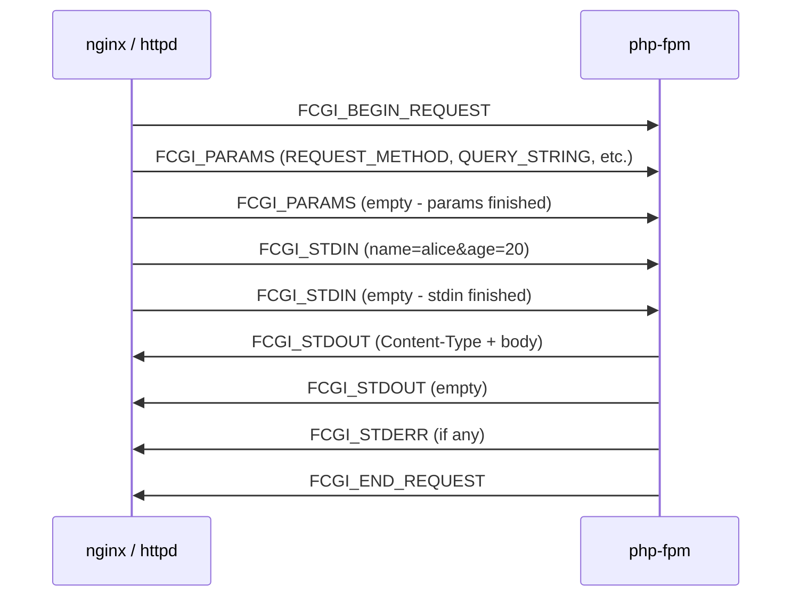
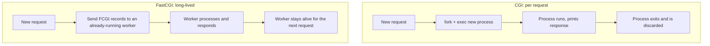

# Part 4 — FastCGI

[← Previous](03-cgi.md) | [Next →](05-servlets-and-protocols.md)


---

## What This Part Covers

- Why FastCGI exists
- Long-running application processes and php-fpm
- Unix/TCP socket communication, nginx/httpd's role vs php-fpm's role
- FastCGI records: `FCGI_BEGIN_REQUEST`, `FCGI_PARAMS`, `FCGI_STDIN`, `FCGI_STDOUT`, `FCGI_STDERR`, `FCGI_END_REQUEST`
- Empty records as delimiters
- Framing: length vs delimiter, and how FastCGI uses both
- Amortising setup cost

## Learning Objectives

- Explain why FastCGI was created and what specific CGI problem it solves
- Draw the nginx/httpd ↔ php-fpm architecture
- List the FastCGI record types in the order they appear in a request/response cycle
- Explain how FastCGI frames its data (length AND delimiter) and connect this to the "framing" theme from the previous session

---

## Concept: FastCGI — Keep the Process, Talk Over a Socket

### Simple Explanation

Instead of hiring a brand-new employee for every customer (CGI), FastCGI keeps a **small team of employees already on staff**, and customers' requests are handed to them over an internal phone line (a socket). No hiring or firing per request.

### Technical Explanation

> "You define an upstream. The user-facing server handles slow clients; an internal server does the work."

FastCGI splits responsibilities across two tiers:


**Explanation:** The user-facing server (nginx/httpd) absorbs slow clients, TLS termination, and buffering. It then talks to a **fixed pool of long-lived application workers** (e.g., php-fpm) over the FastCGI protocol — a modified HTTP that carries the same information (method, headers, query string, body) but in **binary, typed, and multiplexed** form, avoiding parsing a text protocol twice.

### Key Points

- **nginx/httpd role:** user-facing, absorbs slow clients, TLS, buffering.
- **php-fpm role:** internal, a **fixed pool** of long-lived workers — no process created/destroyed per request.
- Communication happens over a **Unix or TCP socket**.
- What application code actually sees: often not raw environment variables, but **a request object** with the same headers/query string, already decoded.

### Common MCQ Trap

- FastCGI is NOT literally HTTP — it's described as "a modified HTTP, with less vocabulary": same information, but binary/typed/multiplexed, not a re-parsed text protocol.

---

## Concept: A FastCGI Request Is a Stream of Typed Records

### Simple Explanation

Instead of a big blob of environment variables and raw bytes (like CGI), FastCGI sends information as a sequence of labeled, structured "packages" (records) — like sending a parcel with a clear label on each box instead of dumping everything loose into a truck.

### Technical Explanation — Request Sequence (from the PDF)

```
FCGI_BEGIN_REQUEST

FCGI_PARAMS
  REQUEST_METHOD = POST
  SCRIPT_FILENAME = /var/www/test.php
  QUERY_STRING = x=10
  CONTENT_TYPE = application/x-www-form-urlencoded
  CONTENT_LENGTH = 17
  HTTP_HOST = localhost
  HTTP_USER_AGENT = curl/...

FCGI_PARAMS
  <empty record means parameters finished>

FCGI_STDIN
  name=alice&age=20

FCGI_STDIN
  <empty record means stdin finished>
```

### How It Works — Sequence Diagram



**Explanation:** The request phase sends a `BEGIN_REQUEST`, then one or more `PARAMS` records (terminated by an **empty** `PARAMS` record), then one or more `STDIN` records (terminated by an **empty** `STDIN` record). The response phase (below) mirrors this with `STDOUT`/`STDERR`/`END_REQUEST`.

### Key Points

- **Same nouns as CGI:** `REQUEST_METHOD`, `QUERY_STRING`, `CONTENT_LENGTH` — the CGI environment concept survived; **only the transport changed** (records on a socket instead of `envp` on a fork).
- **STDIN is the body:** `name=alice&age=20` is exactly **17 bytes**, matching the `CONTENT_LENGTH = 17` declared in the params.
- **Empty record = "this stream is finished"** — used for both `FCGI_PARAMS` and `FCGI_STDIN`.

### Common MCQ Trap

- Assuming `CONTENT_LENGTH` and the FastCGI record length are the same field — they're related but distinct: `CONTENT_LENGTH` describes the **body's** size (an HTTP-level concept carried over from CGI); the FastCGI record framing has its **own** per-record length field (see "Framing" below).

---

## Concept: The Response Comes Back the Same Way

### Technical Explanation — Response Sequence (from the PDF)

```
FCGI_STDOUT
  Content-Type: text/html
  <html>...</html>

FCGI_STDOUT
  <empty>

FCGI_STDERR
  ...

FCGI_END_REQUEST
```

### Key Points

- **STDOUT goes to the client:** Headers, blank line, body — **byte for byte** what a CGI program printed (see [Part 3](03-cgi.md)). The web server parses off the headers and streams the rest to the client.
- **STDERR goes to the log:** A **separate record type**, so debug output can never corrupt the actual page — the same stdout/stderr split as the pipes in the CGI diagram.

### Common MCQ Trap

- Thinking FastCGI abandoned the "headers, blank line, body" convention — it didn't. That convention survives **inside** the `FCGI_STDOUT` record's payload; FastCGI only changed the outer transport (records vs raw pipe).

---

## Concept: The Empty Record Is the Delimiter — Framing, Revisited

### Simple Explanation

Last session (per the PDF's own reference) ended on the question: when you receive a stream of bytes, how do you know where one "message" ends and the next begins? There are only two ways — a **length** you're told upfront, or a **delimiter** (a special marker) you watch for. FastCGI uses **both**, in different places.

### Technical Explanation

| Framing style | How it works | Where FastCGI uses it |
|---|---|---|
| **Length** | Every record header carries its own content length; the reader knows exactly how many bytes to take, so a body can contain *any* byte at all — including newlines and nulls | Each FastCGI record header; also `CONTENT_LENGTH = 17` at the HTTP-body level |
| **Delimiter** | A record of length **zero** means "that stream is finished" — a structural marker that can't collide with real content | The empty `FCGI_PARAMS` / empty `FCGI_STDIN` records; also the blank line after `Content-Type` in text form |

> "SMS chose length. SMTP chose a dot. IMAP chose both. FastCGI chose both too — and for the same reason."

### Key Points

- **Length-prefixing** lets binary data (including bytes that look like delimiters) pass through safely.
- **Delimiter (empty record)** cleanly signals "no more records of this type."
- FastCGI is presented as using **both** mechanisms simultaneously, at different layers.

### Common MCQ Trap

- Believing framing must be "either/or" for an entire protocol — FastCGI is the counter-example: it uses length **inside** each record, and a delimiter (empty record) **between** groups of records.

---

## Concept: Amortising Setup Cost (Why FastCGI Wins)

### Simple Explanation

CGI pays the "hire a new employee" cost on every single request. FastCGI hires the team **once**, at startup, and every request after that is nearly free in terms of process-creation cost.

### Technical Explanation

This directly follows from [Part 3](03-cgi.md)'s framing:
> "Notice the move: take the setup cost off the request path and pay it once at startup. Exactly what pre-forking did for connections in block 01."

FastCGI's php-fpm workers are a **fixed pool of long-lived processes** — created once, reused across many requests, communicating over a persistent socket rather than being forked/exec'd per request.

### Key Points

- This is **Core Idea #1 — Amortise the setup** in action (see [Part 8](08-revision-and-mcqs.md)).
- The same idea recurs across the whole session: pre-forking (Part 1), FastCGI (this part), connection pools and servlets (Part 5).

---

## CGI vs FastCGI — Comparison

| Aspect | CGI | FastCGI |
|---|---|---|
| Process lifetime | New process **per request**, then discarded | Long-lived, fixed pool of workers |
| Transport | envp, stdin/stdout/stderr pipes via `fork`+`exec` | Records over a Unix or TCP socket |
| Data format | Plain environment variables + raw stdin/stdout text | Binary, typed, length-framed records; same "nouns" (`REQUEST_METHOD`, etc.) |
| Setup cost | Paid on **every** request | Paid **once** at startup (amortised) |
| Response format | Headers + blank line + body via stdout | Same "headers + blank line + body" convention, carried inside `FCGI_STDOUT` |
| Error output | stderr → Apache error log | `FCGI_STDERR` → separate record, same log destination concept |
| Typical use | Early web (Perl, shell scripts) | php-fpm behind nginx/httpd today |



**Explanation:** CGI's loop creates and destroys a process every time (left), while FastCGI's loop reuses an already-running worker across many requests (right) — this is the single structural difference that eliminates CGI's per-request process-creation cost.

---

## Key Points Summary

- FastCGI exists to fix CGI's "new process per request" cost by keeping **long-lived** application processes (e.g., php-fpm) that the web server talks to over a **socket**.
- Same "nouns" as CGI (`REQUEST_METHOD`, `QUERY_STRING`, `CONTENT_LENGTH`) — only the transport changed.
- Records: `FCGI_BEGIN_REQUEST` → `FCGI_PARAMS` (+ empty) → `FCGI_STDIN` (+ empty) → [server processes] → `FCGI_STDOUT` (+ empty) → `FCGI_STDERR` → `FCGI_END_REQUEST`.
- Framing uses **both** length (per-record header) and delimiter (empty record) — same theme as SMS (length) / SMTP (dot delimiter) / IMAP (both).
- This is Core Idea #1 in action: **amortise the setup**.

## Common MCQ Traps (Summary)

- FastCGI is not literally HTTP — it's a binary, typed, less-verbose cousin.
- `CONTENT_LENGTH` (HTTP body size) ≠ a FastCGI record's own length field.
- The empty record = delimiter ("stream finished"), used for both PARAMS and STDIN.
- FastCGI uses BOTH length and delimiter framing, not just one.

---

## Quick Revision

- FastCGI = long-lived process pool (e.g., php-fpm) + socket, instead of fork-per-request.
- Two-tier architecture: nginx/httpd (user-facing) → php-fpm (internal, fixed pool).
- Record order: BEGIN_REQUEST → PARAMS (+empty) → STDIN (+empty) → STDOUT (+empty) → STDERR → END_REQUEST.
- Framing: length inside each record; empty record = delimiter between groups.
- This is "amortise the setup" — pay process-creation cost once, not per request.

---

[← Previous](03-cgi.md) | [Next →](05-servlets-and-protocols.md)
