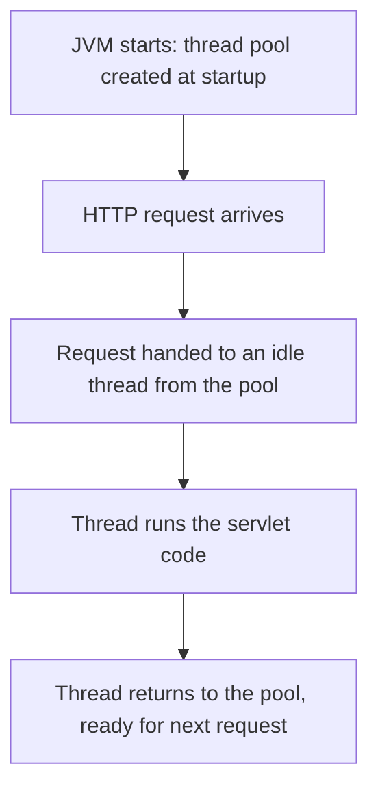
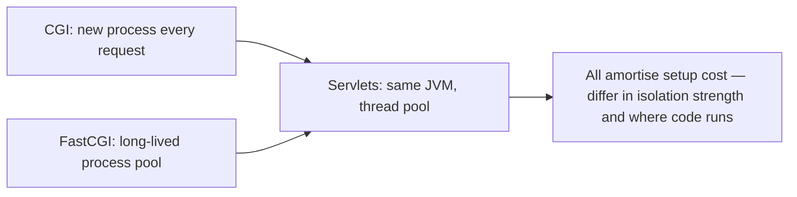

# Part 5 — Servlets & Server Protocols

[← Part 4 — FastCGI](04-fastcgi.md) | [Back to Index](00-index.md) | Next: [Part 6 — Scaling Limits →](06-scaling-limits.md)

---

## What This Part Covers

- Servlets: Jetty/Tomcat, the JVM as the server itself, thread pools
- How a request maps to an idle thread
- Isolation: process vs thread/class-loader isolation
- CGI vs FastCGI vs Servlets comparison
- Web servers vs other kinds of servers
- Non-HTTP protocols: Redis RESP, MySQL binary protocol, MQTT, Kafka
- Why the protocol in use affects which scaling strategy applies

## Learning Objectives

- Explain how servlets avoid creating a new process per request, and how that differs from both CGI and FastCGI
- Explain what "isolation by convention" means for servlets, and its trade-off
- List examples of things that do and do not speak HTTP
- Explain why HTTP's statelessness matters for scaling, and why some protocols deliberately give it up

---

## Concept: Servlets — The Same Idea, Wearing a JVM

### Simple Explanation

A servlet server (like Jetty or Tomcat) doesn't hand your code off to a separate program or process at all. The Java Virtual Machine (JVM) **is** the web server, already running, with a pool of threads on standby. When a request comes in, one of those already-alive threads just picks it up.

### Technical Explanation

> "Another way to avoid making a different program per request."

Three key properties, per the PDF:

| Property | Explanation |
|---|---|
| **The server is the runtime** | Jetty and Tomcat act as the web server themselves. There is no separate `httpd` in front doing the forking — the JVM is already running your code. |
| **Pre-threading** | A pool of threads is created **at startup**. A request is handed to an idle thread, which runs the servlet and returns to the pool. This is exactly the pre-threading concept from [Part 1](01-scaling-servers.md). |
| **Isolation by convention** | Servlets are isolated by **class loader** and **thread**, not by process. Cheaper than fork — but one runaway servlet can still hurt its neighbours. |

### How It Works

**Explanation:** Unlike CGI (new process) or even a naive thread-per-request model, servlet containers pre-create their thread pool once at startup, and each request simply borrows and returns a thread — no process or thread creation on the request path itself.

### Key Points

- No separate front-end server process is doing the forking — the **JVM itself is the server**.
- Isolation comes from **class loaders and threads**, not OS processes — cheaper, but weaker: a badly-behaved servlet can still affect others sharing the same JVM.
- This is the **same "amortise the setup" idea** as FastCGI, applied inside a single JVM process instead of across a socket to a separate process pool.

### Common MCQ Trap

- Thinking servlets provide the same isolation guarantees as CGI (separate OS processes) — they explicitly do **not**; isolation is "by convention" (class loader/thread), and the PDF is explicit that "one runaway servlet can still hurt its neighbours."

---

## Concept: The Unifying Question Behind CGI, FastCGI, and Servlets

> "CGI, FastCGI, servlets, and every modern framework are answering one question: how do we run user code per request without paying to create the world each time?"

### CGI vs FastCGI vs Servlets — Comparison Table

| Aspect | CGI | FastCGI | Servlets |
|---|---|---|---|
| Isolation unit | OS process (new one per request) | OS process (long-lived, pooled) | Thread + class loader (inside one JVM) |
| Setup cost paid | Every request | Once at startup (pool created) | Once at startup (pool created) |
| Communication | envp + stdin/stdout/stderr pipes | Records over Unix/TCP socket | In-process method calls (no IPC at all) |
| Crash blast radius | Just that one request's process | Limited to the worker process that crashed | Can affect the whole JVM (weaker isolation) |
| Example software | Early Apache + Perl/shell scripts | nginx/httpd + php-fpm | Jetty, Tomcat |

**Explanation:** All three approaches solve "run my code without per-request setup cost," but trade off differently: CGI has the strongest isolation and worst performance, servlets have the weakest isolation and best in-process performance, and FastCGI sits in between (separate OS process, but long-lived).

### Common MCQ Trap

- All three (CGI, FastCGI, servlets) are presented as **answers to the same underlying question** — an MCQ might ask "what do CGI, FastCGI, and servlets have in common?" and the answer is: avoiding "paying to create the world" (full setup cost) on every single request.

---

## Concept: Almost Everything Runs a Web Server — But Not Everything

### Simple Explanation

Just because something is a "server" doesn't mean it speaks HTTP. Some things speak HTTP because it's convenient (admin dashboards, cloud tooling). Others deliberately use their **own** protocol because HTTP's overhead doesn't suit their job (databases, message brokers, IoT).

### Technical Explanation — The PDF's Two Lists

**Yes — it speaks HTTP:**
- Your Wi-Fi router admin page
- Modern agent runtimes and cloud tooling
- Most Node applications
- Firestore (the popular one)
- CouchDB, which has had REST for years
- Kafka, *if* you put the REST proxy in front of it

**No — and it does not need to:**
- **Redis** — its own line protocol, **RESP**
- **MySQL** — its own binary wire protocol
- **MQTT brokers** — across the whole IoT estate
- **Messenger backends** — WhatsApp-shaped things
- **Kafka natively** — a binary protocol, not HTTP

> "The distinction earns a slide because everything you are about to learn about scaling web servers assumes HTTP's properties. Change the protocol and the advice changes with it."

### Key Points

- This distinction matters because it's a **setup** for [Part 6](06-scaling-limits.md)'s discussion of statelessness — HTTP scaling advice assumes HTTP's specific properties, and doesn't automatically transfer to Redis/MySQL/MQTT/Kafka.
- Kafka is a useful edge case: it can go **either way** — natively binary, but HTTP-accessible if you add a REST proxy.

### Common MCQ Trap

- Assuming "server" always implies "web server" / HTTP. The PDF explicitly warns against this — Redis, MySQL, MQTT, and Kafka (natively) are all servers that do **not** speak HTTP.
- Miscategorizing Kafka — it's **binary natively**, HTTP only via an added REST proxy.

---

## Concept: Why Protocol Choice Affects Scaling Strategy

### Simple Explanation

HTTP is designed so any request can, in principle, be answered by any server and then forgotten. Databases and message brokers are the opposite — they'd rather you stick around and keep talking to the *same* server, because setting up a fresh connection every time is expensive.

### Technical Explanation

| Protocol type | Statefulness | Scaling implication |
|---|---|---|
| **HTTP** | Stateless — every request carries everything it needs | Any box can answer any request; horizontal scaling is "free-ish" (add a server, add it to the pool, done) |
| **Redis / MySQL** | Prefers persistent connections | Would rather hold a connection open than repeatedly pay for TCP connect + handshake + auth + session setup |

This directly sets up the deeper discussion in [Part 6](06-scaling-limits.md): once you're not dealing with pure stateless HTTP, the scaling question changes from "requests per second" to **"how many persistent connections can one box hold at once?"**

### Common MCQ Trap

- Assuming all "scaling" advice (like horizontal scaling being trivial) applies equally to databases — the PDF is explicit that a database "wants to stay," so the scaling problem literally changes shape when you move from HTTP to a persistent-connection protocol.

---

## Key Points Summary

- Servlets avoid per-request process creation the same way FastCGI does, but do it **inside a single JVM** using a pre-created thread pool — isolation is weaker (class loader + thread, not OS process).
- CGI, FastCGI, and servlets are three answers to the same question: run user code per request without paying full setup cost each time.
- Not everything is HTTP: Redis (RESP), MySQL (binary wire protocol), MQTT, and Kafka (natively) all use their own protocols.
- HTTP's statelessness is *why* horizontal scaling is easy for web servers — but databases/brokers prefer persistent connections, which changes the scaling problem's shape entirely (this is the bridge into [Part 6](06-scaling-limits.md)).

## Common MCQ Traps (Summary)

- Servlet isolation ≠ process isolation (it's class-loader/thread based).
- Kafka is binary natively; HTTP only via an added REST proxy.
- "Server" ≠ "web server" — many important systems (Redis, MySQL, MQTT) don't speak HTTP at all.
- Scaling advice for HTTP does not automatically transfer to stateful, persistent-connection protocols.

---

## Quick Revision

- Servlets = JVM as the server + pre-created thread pool + isolation by class loader/thread (not process).
- CGI / FastCGI / Servlets = three ways of avoiding "creating the world" (full setup) per request.
- HTTP-speaking: router admin pages, cloud tooling, Node apps, Firestore, CouchDB, Kafka+REST-proxy.
- Non-HTTP: Redis (RESP), MySQL (binary), MQTT, WhatsApp-shaped backends, Kafka natively.
- HTTP is stateless → horizontal scaling is easy. Databases/brokers prefer persistent connections → scaling problem changes shape.

---

[← Part 4 — FastCGI](04-fastcgi.md) | [Back to Index](00-index.md) | Next: [Part 6 — Scaling Limits →](06-scaling-limits.md)
