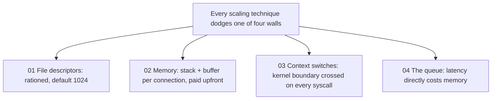
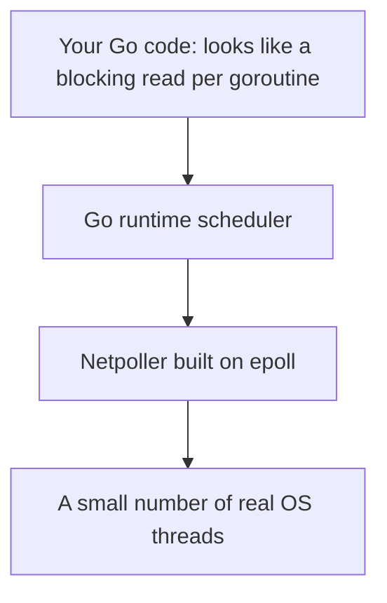
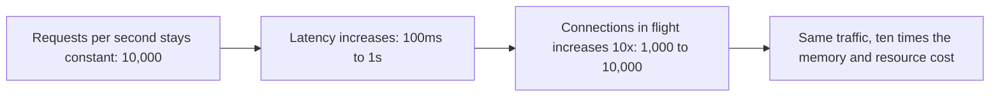

# Part 6 — Scaling Limits, C10K/C10M & Little's Law

[← Previous](05-servlets-and-protocols.md) | [Next →](07_real_world_server_architectures.md)


---

## What This Part Covers

- HTTP statelessness and horizontal scaling (recap and extension)
- The four walls: file descriptors, memory, context switching, queueing
- C10K and C10M, and today's numbers
- `ulimit -n`
- OS thread stacks vs goroutines; the Go runtime/netpoller
- The syscall tax; kernel-bypass approaches (DPDK, netmap, mTCP, Seastar)
- `sendfile()` and `io_uring`
- Concurrency = throughput × latency; Little's Law

## Learning Objectives

- Explain why HTTP's statelessness makes horizontal scaling easy, and why persistent-connection protocols change that
- Name and explain each of the "four walls"
- State the C10K and C10M numbers, who named/argued them, and today's demonstrated numbers
- Compare an OS thread's stack size to a goroutine's, and explain why that difference matters
- Explain the syscall tax and name techniques used to reduce or bypass it
- State and apply the Little's Law formula from the session

---

## Concept: HTTP Is Stateless — What You Scale Next May Not Be

### Simple Explanation

Because every HTTP request comes with everything it needs to be understood, any server can answer any request — you don't need to remember who you talked to last. Databases are different: they'd rather you stick with the same connection because setting one up is expensive.

### Technical Explanation

| Property | HTTP (stateless) | Database (e.g. Redis/MySQL) |
|---|---|---|
| Request self-sufficiency | Every request carries everything it needs | N/A — depends on connection state |
| Can hang up freely? | Yes — any box can answer any request; connection can close anytime | No — prefers to hold a persistent connection |
| Horizontal scaling | "Free-ish" — add a server, add it to the pool, done | Harder — the statelessness that makes HTTP scaling easy doesn't apply |
| Why persistent connections preferred | N/A | TCP connect + handshake + auth + session setup is costly **per connection** |

> "So the problem changes shape. Now the question is not requests per second. It is: how many persistent connections can one box hold at once?"

This is the direct bridge from [Part 5](05-servlets-and-protocols.md) into this part's "four walls."

### Common MCQ Trap

- Assuming "horizontal scaling is easy" is a universal truth — it specifically follows from HTTP's **statelessness**, and does not automatically apply to stateful, persistent-connection protocols like Redis/MySQL.

---

## Concept: Four Walls, and You Will Hit All of Them

### Simple Explanation

No matter how clever your architecture is, you will eventually run into one of four physical/OS-level limits. Every scaling technique in this course is really just a way of dodging one of these four walls.

### Technical Explanation

| # | Wall | Description (from the PDF) |
|---|---|---|
| 01 | **File descriptors** | A connection is a descriptor, and descriptors are rationed. Your default is still **1024**. |
| 02 | **Memory** | A stack per thread, a buffer per connection. Paid **before any work happens**. |
| 03 | **Context switches** | Every read and write crosses the kernel boundary. So does every syscall. |
| 04 | **The queue** | Latency and throughput are not independent. Being slow costs you memory. |



**Explanation:** These four walls are presented as an exhaustive checklist — any time a server design decision is made (pre-forking, epoll, FastCGI, sendfile), it's ultimately dodging one of these four physical constraints.

### Common MCQ Trap

- Confusing wall #1 (file descriptors, a *count* limit) with wall #2 (memory, a *size* limit) — they're related (more fds often implies more memory) but are listed as **distinct** walls in the PDF.

---

## Concept: C10K → C10M — The Problem Moved, the Default Didn't

### Simple Explanation

In 1999, holding ten thousand connections on one server was considered basically impossible. By 2013, people argued the *kernel itself* was the bottleneck, and that bypassing it could get you to ten million. Today, people have actually demonstrated millions of connections on a single box — but your computer's **default** connection limit hasn't moved in decades.

### Technical Explanation — Timeline (from the PDF)

| Year | Name | Number | Who / What |
|---|---|---|---|
| 1999 | **C10K** | 10,000 | Dan Kegel names the problem: can one box hold ten thousand simultaneous persistent connections? At the time: **no**. |
| 2013 | **C10M** | 10,000,000 | Robert Graham argues the **kernel is the problem, not the solution**. Bypass it and the number moves by three orders of magnitude. |
| Today | — | **2–3 million** | People have demonstrated two to three million connections on a single server. **The problem moved; the default did not.** |

```
$ ulimit -n
1024   # the soft limit on most distributions, unchanged since the problem was named
```

### Key Points

- **C10K** = Dan Kegel, 1999, 10,000 connections.
- **C10M** = Robert Graham, 2013, 10,000,000 connections, argues for **kernel bypass**.
- **Today:** 2–3 million connections demonstrated on a single server.
- Despite these advances, the **default `ulimit -n` is still 1024** on most distributions — tying directly back to `FD_SETSIZE` from [Part 2](02-select-epoll.md).

### Common MCQ Trap

- Mixing up who's associated with which number: **Kegel → C10K (10K)**; **Graham → C10M (10M)**. Also remember today's *demonstrated* figure (2–3 million) is neither of the two round numbers — it's a real-world in-between result.

---

## Concept: Every Thread Costs Memory Before It Does Any Work

### Simple Explanation

Reserving a thread is like reserving a parking spot the size of a small house, "just in case" — even before the thread does anything. Lightweight, cooperatively-scheduled units (like Go's goroutines) reserve a much smaller "spot" that grows only as needed.

### Technical Explanation

| Unit | Default/initial stack size | 10,000 of them costs... |
|---|---|---|
| **OS thread** | **8 MB** default stack, reserved up front | Roughly **80 GB** of address space reserved before a single byte of data exists |
| **Goroutine** | **2 KB** initial stack, **grown on demand** | Four thousand times smaller than an OS thread's default |

> "This single number is most of why Go took over this problem space."

### How It Works — Underneath, It's the Same Loop

> "Goroutines are lightweight because the Go runtime multiplexes them onto a few OS threads using a netpoller built on epoll — and runs its own scheduler on top. You write blocking reads; the runtime parks you on a poll."



**Explanation:** Goroutines *appear* to block individually, but under the hood the Go runtime is really running the same "one loop, many sockets" pattern from [Part 1](01-scaling-servers.md)/[Part 2](02-select-epoll.md) — epoll — and multiplexing many goroutines onto a small number of actual OS threads.

### Key Points

- **8 MB** (OS thread stack) vs **2 KB** (goroutine initial stack) — a **4,000×** difference.
- The underlying mechanism is still epoll — goroutines are a nicer syntax over the same event-loop idea.
- "The more requests you handle at the same time, the more memory you need — the only question is how much **per request**."

### Common MCQ Trap

- Reversing the numbers (thinking goroutines start at 8MB or OS threads at 2KB) — memorize the direction: **OS thread = 8 MB (large, fixed upfront)**, **goroutine = 2 KB (small, grows on demand)**.

---

## Concept: Every Syscall Is a Trip Across the Kernel Boundary

### Simple Explanation

Every time your program asks the operating system to do something (like read or write), there's a toll booth to cross — switching from "user mode" to "kernel mode" and back. At high enough request rates, all those tiny tolls add up to real money (time).

### Technical Explanation

> "User space to kernel space and back: save state, switch page tables, validate, copy, return. Hundreds of nanoseconds each — and Spectre and Meltdown mitigations made it worse, not better."

### Key Points — Three Approaches to the Syscall Tax

| Approach | Description | Examples |
|---|---|---|
| **Bypass the kernel** | Implement TCP in user space, bypassing the kernel entirely (for well-known internal networks) — you give up every OS tool you own in exchange for raw packet access | **DPDK, netmap, mTCP, Seastar** |
| **Make fewer calls** | Batch or eliminate syscalls rather than avoiding the kernel entirely | **`sendfile()`** — moves a file to a socket without a user-space round trip; **`io_uring`** — submits a batch of operations through a shared ring instead of one syscall each |

> "Remember sendfile — it is the reason nginx serves static files the way it does" (see [Part 7](07-real-world-server-architectures.md)).

### Common MCQ Trap

- Confusing "kernel bypass" (DPDK/netmap/mTCP/Seastar — no kernel involvement at all) with "fewer syscalls" (sendfile/io_uring — still using the kernel, just more efficiently). These are two **different** strategies for the same underlying problem (syscall tax), not the same thing.

---

## Concept: Concurrency Isn't a Setting — It's Throughput × Latency (Little's Law)

### Simple Explanation

How many connections you're juggling at once isn't something you configure directly — it's a direct consequence of how fast requests come in and how long each one takes to finish. If requests get ten times slower, you're suddenly holding ten times as many of them, for the exact same amount of traffic.

### Technical Explanation — The Formula

```
connections in flight = requests per second × seconds per request
```

This is a version of **Little's Law** applied to server concurrency.

### Example (from the PDF) — At a Steady 10,000 Requests/Second

| Latency (seconds per request) | Connections in flight |
|---|---|
| 0.01 s (10 ms) | 100 |
| 0.05 s (50 ms) | 500 |
| 0.1 s (100 ms) | 1,000 |
| 0.5 s (500 ms) | 5,000 |
| 1.0 s (1 s) | 10,000 |

> "**Ten times the cost:** At 100 ms you hold a thousand connections. At one second, ten thousand — for identical traffic."

### How It Works



**Explanation:** This diagram shows that connections-in-flight is not fixed by traffic volume alone — it's the *product* of traffic volume and latency, so a slowdown alone (with no change in incoming traffic) directly multiplies how many connections you must hold simultaneously.

### Key Points

- **"Slowness is a memory bug":** this is exactly why high-latency work goes **asynchronous** — take it off the request path, and the queue drains.
- You **cannot configure your way past this** — this is **Core Idea #4** (see [Part 8](08-revision-and-mcqs.md)): getting faster is the only thing that reduces what you're holding.

### Common MCQ Trap

- Thinking you can raise `ulimit`/add more workers to "solve" high latency — the PDF is explicit that the only real fix for a latency-driven concurrency problem is to reduce latency itself (e.g., make slow work asynchronous), not just add more capacity to hold more in-flight connections.

---

## Key Points Summary

- HTTP's statelessness makes horizontal scaling easy; persistent-connection protocols (Redis/MySQL) change the scaling question to "how many connections can one box hold."
- Four walls: **file descriptors, memory, context switches, the queue.**
- **C10K** (Kegel, 1999, 10K) → **C10M** (Graham, 2013, 10M, kernel-bypass argument) → **today: 2–3 million** demonstrated; default `ulimit -n` is still **1024**.
- OS thread stack: **8 MB** upfront. Goroutine: **2 KB**, grows on demand — 4,000× smaller. Goroutines still ultimately run on epoll via the Go netpoller.
- Syscall tax: hundreds of nanoseconds per call, worsened by Spectre/Meltdown mitigations. Fixes: kernel bypass (DPDK, netmap, mTCP, Seastar) or fewer calls (`sendfile()`, `io_uring`).
- **Concurrency = throughput × latency** (Little's Law). Slower requests directly multiply connections in flight for the same traffic — the only real fix is reducing latency (often via async work).

## Common MCQ Traps (Summary)

- Kegel = C10K; Graham = C10M — don't swap them.
- 8 MB (OS thread) vs 2 KB (goroutine) — don't reverse these.
- Kernel bypass (DPDK/netmap/mTCP/Seastar) ≠ fewer syscalls (sendfile/io_uring) — different strategies.
- You cannot "configure" your way out of the throughput × latency relationship.

---

## Quick Revision

- Four walls: fds, memory, context switches, the queue.
- C10K (1999, Kegel, 10K) → C10M (2013, Graham, 10M) → today ~2-3M demonstrated; default ulimit still 1024.
- OS thread = 8MB stack upfront; goroutine = 2KB, grows on demand; both ultimately ride on epoll.
- Syscall tax fixed via kernel bypass (DPDK/netmap/mTCP/Seastar) or fewer calls (sendfile/io_uring).
- Little's Law: connections in flight = requests/sec × seconds/request. Concurrency = throughput × latency.

---

[← Previous](05-servlets-and-protocols.md) | [Next →](07_real_world_server_architectures.md)
