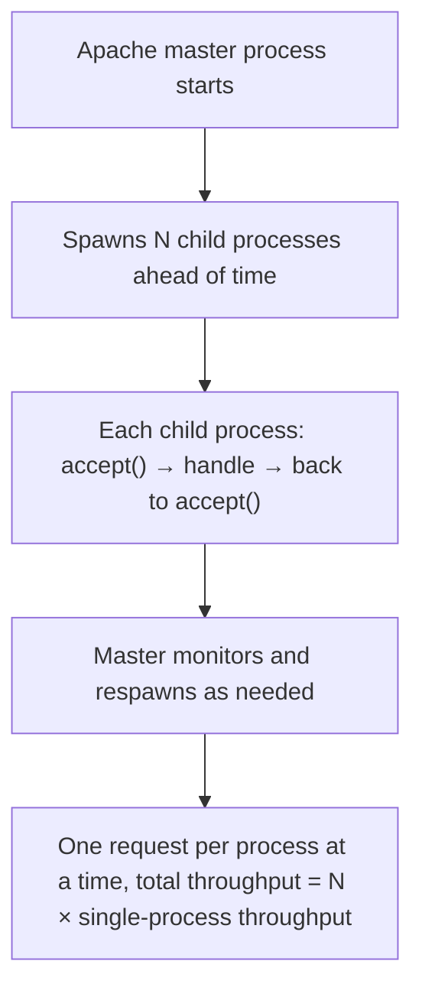
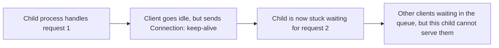
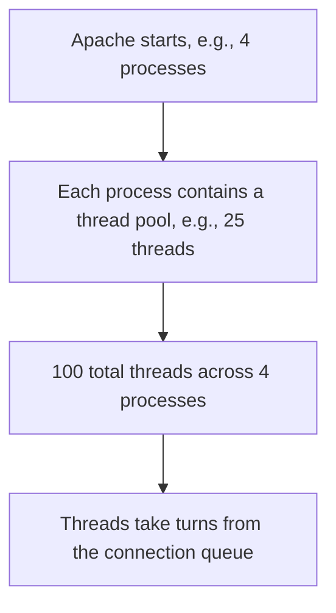
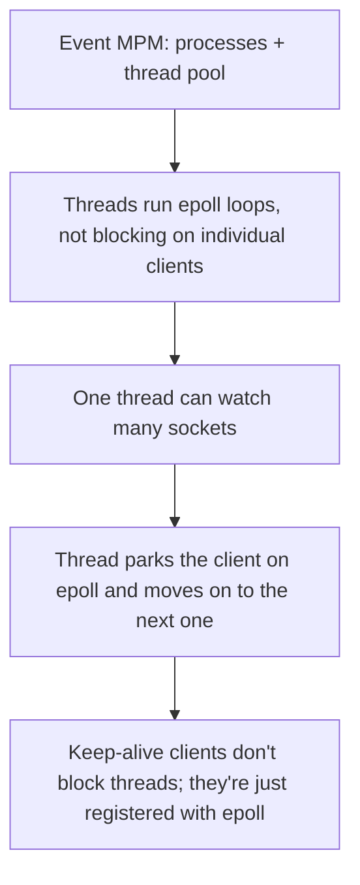
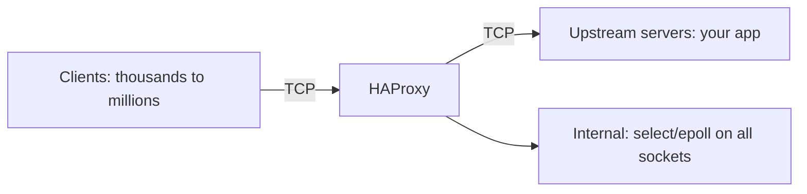
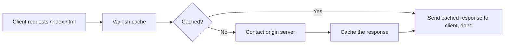
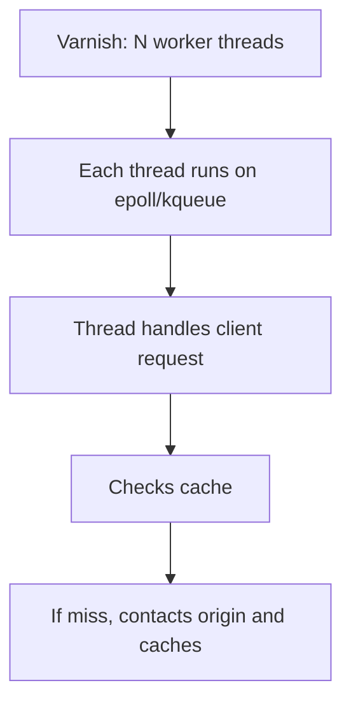
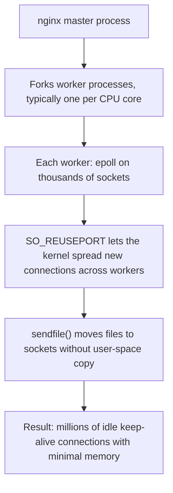
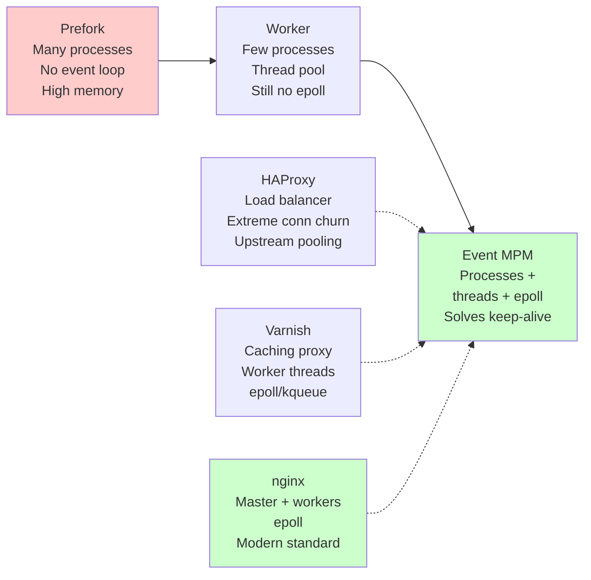

# Part 7 — Real-World Server Architectures

[← Part 6 — Scaling Limits](06-scaling-limits.md) | [Back to Index](00-index.md) | Next: [Part 8 — Revision & Quiz Preparation →](08-revision-and-mcqs.md)

---

## What This Part Covers

- Apache prefork, worker, and event MPM modules
- Apache's keep-alive issue and how event MPM fixes it
- HAProxy: select/epoll, multi-threading, connection churn, upstream pools
- Varnish: caching reverse proxy, worker threads, epoll/kqueue
- nginx: master process, workers per CPU core, epoll, sendfile, reverse proxy, caching, load balancing, TLS termination, rate limiting, thread pool for blocking I/O
- Architecture comparison across all systems

## Learning Objectives

- Explain the differences between Apache's prefork, worker, and event MPMs
- Explain what "keep-alive is the problem" means and how event MPM fixes it
- Describe HAProxy's role, connection churn cost, and upstream pools
- Describe Varnish's architecture and why it's good at caching
- Describe nginx's process model, event loop, and why it's widely adopted
- Compare and contrast all four systems using process model, threading, event loop, connection handling, purpose, and scaling strategy

---

## Concept: Apache Prefork MPM — Process Isolation with a Cost

### Simple Explanation

Apache's **prefork** model spins up a fixed number of independent processes at startup, each waiting to accept one incoming connection at a time. It is the most isolated (a crash in one child can't reach others) but also the most memory-hungry and least concurrent.

### Technical Explanation

> "Prefork: a pool of independent processes, each one blocked on accept(), each one waiting for a client to connect."

### How It Works

**Explanation:** The master process forks a fixed pool of children (configurable, typically matching the expected concurrent connections). Each child is a completely independent OS process, ready to accept() and handle a single client at a time. This is exactly the "pre-fork" pattern from [Part 1](01-scaling-servers.md).

### Key Points

- **Strongest isolation:** a crash in one child process cannot reach other children.
- **High memory cost:** each child process is a full image in memory, even if idle.
- **No event loop:** each child is truly blocked on **one** client at a time.
- **Keep-alive problem:** if a child is holding a keep-alive connection to a slow client, that child cannot serve other clients (see below).

### Common MCQ Trap

- Confusing prefork with fork-per-request (they solve the same problem via different amortization strategies) — prefork **creates workers once**, fork-per-request **creates a process per connection**. Prefork is the production-grade version (see [Part 1](01-scaling-servers.md)).

---

## Concept: Apache's Keep-Alive Problem — Idle Connections Waste Workers

### Simple Explanation

HTTP keep-alive lets a client reuse the same TCP connection for multiple requests, which is efficient. But in prefork, while a process is **waiting** for the client to send the next request (i.e., idle), that entire process is **unavailable** to serve other clients.

### Technical Explanation

> "A keep-alive connection means the client can send another request on the same socket, so the child process stays bound to that socket and **cannot** accept a new client."

### The Problem

**Explanation:** The child has no event loop, so it can't multiplex. It's blocked on `read()` waiting for the next request from this one client. Meanwhile, new connections are queued up, unable to find an available worker.

### The Cost (from the PDF)

This is particularly bad for **high-latency networks** (e.g., the internet with variable client speeds):
- A client on a slow connection holding keep-alive ties up a whole process.
- With N total children, if M of them are held by slow keep-alive clients, you can only serve N-M new connections.
- Latency directly multiplies connection count (see Little's Law, [Part 6](06-scaling-limits.md)).

### The Solution (Partial) — Lower the Keep-Alive Timeout

Apache's `KeepAliveTimeout` directive sets how long a process will wait for the next request before giving up. But this is a **blunt instrument** — it doesn't solve the fundamental problem, it just reduces the pain.

---

## Concept: Apache Worker MPM — Threads Inside a Process

### Simple Explanation

Instead of N independent processes, the worker MPM has a smaller number of processes, each containing a **thread pool**. The threads inside each process handle connections.

### Technical Explanation

> "A handful of processes, each containing a thread pool — isolation from the multiple processes, but threads share memory within a process."

### How It Works

**Explanation:** Instead of one child per connection (or one thread per connection), you have a fixed number of processes, each with a fixed thread pool. Threads are cheaper than processes (less memory, less scheduler overhead), so you can have more of them.

### Key Points

- **Isolation:** a crash in one process can still affect threads in that process, but won't touch other processes.
- **Memory savings:** threads share memory within a process.
- **Still no event loop:** threads still block on individual sockets.
- **Keep-alive still a problem:** a thread holding keep-alive still ties up one thread slot.

### Common MCQ Trap

- Thinking worker MPM solves the keep-alive problem — it doesn't. It just makes the cost slightly cheaper (thread << process memory).

---

## Concept: Apache Event MPM — The Fix

### Simple Explanation

The event MPM is like worker MPM (processes + thread pool) but adds an **event loop** inside each process to handle the keep-alive problem directly.

### Technical Explanation

> "Event MPM is worker MPM, but with the threads running an epoll-style event loop instead of one thread per connection."

### How It Works

**Explanation:** Instead of a thread blocking on a single socket's `read()`, waiting for the next HTTP request, the thread runs an event loop. When a keep-alive client is idle, it's just an entry in the epoll set; the thread is free to handle other work.

### Key Points

- **Solves keep-alive:** idle connections no longer tie up threads.
- **Scales well:** one thread can watch thousands of mostly-idle keep-alive connections.
- **Still isolated:** multiple processes for fault isolation.
- **Typical modern configuration:** worker threads inside processes running event loops is the standard.

### Common MCQ Trap

- Confusing "event MPM" (Apache's event-loop version) with the earlier "event-driven" model in [Part 1](01-scaling-servers.md) — they're the same conceptual thing, but Apache's implementation is "event MPM" specifically.

---

## Concept: HAProxy — Load Balancer, Connection Multiplexer

### Simple Explanation

HAProxy is a **load balancer** — it sits in front of your real servers and distributes incoming connections across them. Internally, it's built around `select()`/`epoll` and optimised for extreme connection churn.

### Technical Explanation

HAProxy's role is to:
1. Accept incoming TCP connections from clients.
2. Maintain a pool of connections to upstream servers.
3. Forward requests from clients to upstream servers.
4. Send responses back.

All of this happens at **extreme scale** — HAProxy is known for handling millions of connections.

### How It Works

**Explanation:** HAProxy has an incoming socket pool and an outgoing socket pool (to upstream servers), both multiplexed via `select`/`epoll`. When a client connects, HAProxy picks an upstream server (via load-balancing algorithm) and bridges the client socket to the upstream socket.

### Two Key Concepts

#### 1. Connection Churn

Opening and closing TCP connections is expensive (3-way handshake, TIME_WAIT state, OS bookkeeping). HAProxy solves this by maintaining a **pool of persistent upstream connections** — when a request finishes, the upstream connection is returned to the pool, not closed.

> "Connection churn is the biggest cost HAProxy pays. Keep connections alive to upstream servers and reuse them."

#### 2. Upstream Connection Pools

Instead of closing a connection to the upstream server and opening a new one for the next request, HAProxy holds a pool of **already-open** connections to each upstream server. This amortises the TCP setup cost (see [Part 1](01-scaling-servers.md) — amortise setup).

### Key Points

- HAProxy is **not** a web server — it's a load balancer / reverse proxy.
- It handles extreme connection churn by pooling upstream connections.
- Multi-threading: HAProxy can use multiple threads for CPU-bound work (hashing, crypto) while the main loop is event-driven.

### Common MCQ Trap

- Assuming HAProxy is "slow" because it's a proxy — it's actually highly optimised for throughput and latency specifically for this use case.

---

## Concept: Varnish — Caching Reverse Proxy

### Simple Explanation

Varnish is a **caching reverse proxy** — it sits in front of your web server and stores frequently-accessed responses. If a response is cached, Varnish sends it directly to the client without ever contacting the origin server.

### Technical Explanation

> "Varnish is a caching reverse proxy. Its job is to cache responses from your origin server and serve them directly to clients."

### How It Works

**Explanation:** Varnish stores responses in memory, keyed by request (typically method + URL + headers). When a request comes in, Varnish checks the cache; if a hit, it serves directly. If a miss, it contacts the origin and caches the result.

### Architecture (from the PDF)

Varnish uses **worker threads** — a relatively small number of threads, each running independently:

**Explanation:** Unlike some servers that pre-fork, Varnish uses a fixed number of worker threads (configurable, but typically a dozen or so), each running its own event loop on top of epoll (Linux) or kqueue (BSD/macOS).

### Key Points

- **Caching is the whole point** — Varnish's main value is reducing load on the origin server by serving cached responses.
- **Worker threads + epoll/kqueue** — similar architecture to nginx, but purpose-built for caching.

### Common MCQ Trap

- Confusing Varnish with a CDN — Varnish is an origin-side cache, not a geographically distributed edge network like a CDN.

---

## Concept: nginx — The Modern Web Server

### Simple Explanation

nginx is the most widely-deployed event-driven web server today. It combines a **master process** (supervisor) with **worker processes** (each running an epoll event loop), and has been optimised for speed, concurrency, and low memory usage for over a decade.

### Technical Explanation

> "nginx uses a master-and-workers architecture. The master does process management; each worker runs its own epoll loop and handles thousands of connections."

### How It Works

**Explanation:** The master oversees the workers and handles config reloads. Each worker is independent and runs an epoll loop. The kernel spreads new connections across workers via `SO_REUSEPORT`, and sendfile avoids copying file data through user space.

### Key Points — nginx's Strengths

| Aspect | What nginx does |
|---|---|
| **Process model** | Master + worker per CPU core (typically) |
| **Event loop** | epoll on each worker |
| **Keep-alive** | Event loop handles it naturally — idle connections don't block threads |
| **Static files** | `sendfile()` — zero-copy to socket |
| **Reverse proxy** | Can proxy requests to upstream servers; load balances across them |
| **Caching** | Built-in caching of upstream responses |
| **TLS termination** | Handles HTTPS; upstream can be plain HTTP |
| **Rate limiting** | Token-bucket rate limiting per client |
| **Blocking I/O** | Thread pool for slow operations (e.g., gzip, disk access) |

### Four Strengths Highlighted in the PDF

1. **sendfile()** — static file serving without user-space copy (see [Part 6](06-scaling-limits.md)).
2. **Reverse proxy + caching** — like Varnish, but built in, plus load balancing.
3. **TLS termination** — handles HTTPS so upstream servers don't have to.
4. **Thread pool for blocking ops** — e.g., gzip compression or slow disk reads don't block the event loop.

### Common MCQ Trap

- Assuming nginx has "no threads" because it's event-driven — it has **worker processes** (not threads per se) running epoll, plus **an optional thread pool** for blocking I/O. Don't confuse "event-driven" with "single-threaded" — they're not synonyms.

---

## Architecture Comparison Table

| Aspect | Apache Prefork | Apache Worker | Apache Event | HAProxy | Varnish | nginx |
|---|---|---|---|---|---|---|
| **Process model** | Pool of independent processes | Few processes, thread pool per process | Few processes, thread pool per process | Single-process (or multi-threaded) | Worker threads | Master + worker processes |
| **Thread model** | No threads | Threads per process | Threads per process | Optional threads for CPU work | Fixed worker thread pool | Processes; optional thread pool for I/O |
| **Event loop** | No — each process blocks on one client | No — threads block on individual clients | Yes — epoll/kqueue per process | Yes — select/epoll | Yes — epoll/kqueue per thread | Yes — epoll per worker |
| **Connection handling** | One process, one client at a time | One thread, one client at a time | Threads watch many via epoll; keep-alive handled by epoll | Connection pooling to upstream; extreme multiplexing | Worker threads watch many via epoll/kqueue | One worker watches thousands via epoll |
| **Keep-alive problem** | Severe — ties up a process | Still a problem — ties up a thread | Solved — event loop | Not applicable (reverse proxy) | Not applicable (reverse proxy) | Solved — event loop |
| **Memory per connection** | High (full process) | Medium (process + thread) | Medium (process + thread) | Low (just socket + state) | Low (epoll entry) | Very low (epoll entry) |
| **Primary purpose** | Traditional web server | Improved prefork | High-concurrency web server | Load balancing / reverse proxy | Caching reverse proxy | High-concurrency web server / reverse proxy |
| **Scaling strategy** | More processes if needed | Tune thread pool size | Event loop scales; tune thread pool for blocking I/O | Connection pooling; tune upstream pool size | Cache hit rate optimization | Minimal config; workers ≈ CPU cores |
| **Best for** | Isolation, backward compatibility | Incremental improvement on prefork | High concurrency, keep-alive, static files | Load balancing, connection churn | Origin-side caching | Static files, reverse proxy, general web serving |
| **Typical deployment** | Legacy setups | Uncommon | Common | In front of app servers | In front of origin | Most common |

**Explanation:** The left side shows Apache's evolution — from isolated-but-heavy (prefork) through shared-memory-but-still-blocking (worker) to event-driven (event MPM). The right side shows modern alternatives, all converging on the event-loop pattern (epoll/kqueue).

---

## Key Points Summary

- **Apache prefork:** maximum isolation, high memory, no event loop.
- **Apache worker:** fewer processes, thread pool, still no event loop — keep-alive still a problem.
- **Apache event:** workers + threads + epoll per process — solves keep-alive, widely used.
- **HAProxy:** load balancer, not a web server; connection pooling to upstream; handles extreme churn.
- **Varnish:** caching reverse proxy; worker threads + epoll/kqueue; solves origin load via caching.
- **nginx:** master + workers (typically per CPU), epoll, sendfile, built-in reverse proxy/caching/TLS/rate limiting/thread pool for blocking I/O; modern standard.
- **All modern systems converge on:** worker processes/threads running event loops (epoll/kqueue), with optional thread pools for blocking I/O.

## Common MCQ Traps (Summary)

- Prefork (setup cost amortised) ≠ fork-per-request (setup cost per client).
- Event MPM solves the keep-alive problem via event loop, not by tuning timeouts.
- HAProxy and Varnish are **not** web servers — they're proxies (load balancer and caching, respectively).
- nginx is event-driven **and** can use threads (for blocking I/O) — not mutually exclusive.
- All modern systems use the worker-pool + event-loop pattern (differences are in details: sendfile, caching, thread pool, etc.).

---

## Quick Revision

- **Prefork:** N processes, no threads, no epoll, high memory, isolation.
- **Worker:** fewer processes, thread pool, still no epoll, keep-alive problem remains.
- **Event:** processes + threads + epoll, keeps keep-alive idle clients off threads.
- **HAProxy:** load balancer, upstream connection pooling, extreme concurrency.
- **Varnish:** caching proxy, worker threads + epoll/kqueue.
- **nginx:** master + worker processes (per CPU core), epoll, sendfile, reverse proxy, caching, TLS, rate limiting, thread pool for I/O.
- **Modern standard:** worker pool + event loop per worker; optional thread pool for blocking I/O.

---

[← Part 6 — Scaling Limits](06-scaling-limits.md) | [Back to Index](00-index.md) | Next: [Part 8 — Revision & Quiz Preparation →](08-revision-and-mcqs.md)
