# Binary Line Protocol — Assignment

> **"Build a calculator that stays on the line"**

---

## 1. Project overview

### What the assignment is

The assignment asks you to build a **file server and calculator** that communicate
over a single persistent TCP connection using a custom **binary framing protocol**.

### What we are building

- A **server** (`bserve.py`) that serves files from a directory and performs
  arithmetic, all over one long-lived TCP connection.
- A **client** (`bcurl.py`) that sends one binary request and prints the response body.
- A **binary framing protocol** (BLP/1) that defines exactly how requests and
  responses are packaged into bytes.

### Why TCP alone does not provide message boundaries

TCP is a **byte stream**. When you call `send()` twice in a row, the OS may
merge both sends into a single chunk, or split one send across multiple packets.
When the receiver calls `recv()`, it gets *some* bytes — not necessarily one
complete request. TCP guarantees **order** and **reliability**, but never tells
you "this is one complete message". That boundary is the application's
responsibility.

### Why a binary framing protocol is needed

Because TCP has no message boundaries, we need an **application-level protocol**
that tells the receiver exactly how long each message is. BLP/1 does this by
starting every message with a fixed 20-byte **header** that contains a
**Payload Length** field. The receiver reads exactly 20 bytes, extracts the
length, then reads exactly that many more bytes — one complete frame, no more,
no less.

### What "stays on the line" means

"Stays on the line" means the TCP connection remains open between requests.
Instead of connect → request → response → disconnect for every operation, we do:

```
Connect → Request 1 → Response 1 → Request 2 → Response 2 → … → Disconnect
```

One TCP handshake. Many request/response pairs. This is a **persistent connection**.

---

## 2. What we built

| Component | File | Responsibility |
|---|---|---|
| Server entry point | `bserve.py` | Parses CLI args, starts the server |
| Client entry point | `bcurl.py` | Parses CLI args, sends one request |
| Binary protocol | `app/protocol.py` | Encodes/decodes frames, partial I/O loops |
| Server logic | `app/server.py` | TCP socket, accept loop, request handler |
| Client logic | `app/client.py` | Connect, send, receive, print |

**Binary protocol (BLP/1):** Every message is a 20-byte header followed by a
variable-length payload. The header contains a magic marker, version, frame type,
and the exact number of payload bytes that follow.

**Persistent TCP connection:** The server's `handle_connection()` loops over the
same accepted socket, reading one frame per iteration, until the client closes.

**File serving:** A `GET /filename` request reads the file from the configured
web root and returns it in the response payload.

**Calculator:** A `GET /add?a=2&b=3` request parses the query string and returns
the arithmetic result as plain text.

---

## 3. Project structure

```
05_Binary_Calculator_Assignment/
├── bserve.py            ← server entry point (thin wrapper)
├── bcurl.py             ← client entry point (thin wrapper)
├── app/
│   ├── __init__.py
│   ├── protocol.py      ← BLP/1 frame encoding, decoding, I/O loops
│   ├── server.py        ← TCP socket setup, accept loop, request handlers
│   └── client.py        ← connect, send request, receive response, print
├── tests/
│   ├── __init__.py
│   └── test_blp.py      ← 7 unit/integration tests
├── www/
│   └── index.html       ← file the server can serve
└── docs/
    ├── PROTOCOL_SPEC.md         ← formal two-page protocol specification
    ├── LEARNING_GUIDE.md        ← detailed study notes for every concept
    └── REQUIREMENTS_CHECKLIST.md ← requirement-to-code mapping
```

**`bserve.py`** — three lines. Imports `main` from `app/server.py` and calls it.

**`bcurl.py`** — three lines. Imports `main` from `app/client.py` and calls it.

**`app/protocol.py`** — the wire contract. `read_exact()` loops until all bytes
arrive; `write_all()` loops until all bytes are sent; `read_frame()` reads
exactly one header+payload; encode/decode functions handle request and response
payloads; `hexdump()` formats bytes as a readable hex table.

**`app/server.py`** — `serve()` owns bind/listen/accept;
`handle_connection()` loops over the same accepted socket until the client closes;
`serve_request()` routes GET to calculator or file serving;
`calculator()` handles `/add`, `/sub`, `/mul`, `/div`.

**`app/client.py`** — `parse_destination()` splits `host:port/path`;
`main()` connects once, encodes and sends the request, reads the response,
prints the body, exits non-zero for 4xx/5xx.

**`tests/test_blp.py`** — 7 integration/unit tests (see §9).

**`www/index.html`** — minimal HTML used by tests and demos.

---

## 4. Requirements

| Assignment requirement | How this project satisfies it |
|---|---|
| TCP sockets, raw API | `socket.socket`, `bind`, `listen`, `accept`, `recv`, `send` — no framework |
| Persistent connection | `handle_connection()` loops over one accepted socket |
| Multiple requests over one connection | Six-frame test uses a single socket |
| Binary framing protocol | 20-byte BLP/1 header with magic, version, type, payload length |
| Fixed-size frame header | `HEADER_SIZE = 20` bytes, always |
| Length-prefixed payload | Payload Length at offset 16, 4 bytes, big-endian |
| Fragmented TCP data handled correctly | `read_exact()` loops; one-byte-at-a-time test |
| Coalesced frames handled correctly | `read_frame()` reads exactly one frame; six-frame test |
| Unknown frame types skippable | `read_frame()` reads the payload; server skips non-REQUEST frames |
| Server | `app/server.py` + `bserve.py` |
| Client with verbose hex output | `app/client.py` `-v` flag; `hexdump()` |
| File serving | `serve_request()` reads files from the web root |
| 200 / 400 / 404 / 405 status codes | All returned by `serve_request()` and `calculator()` |
| Path traversal protection | `.resolve()` + `.relative_to(root)` check |
| Two-page protocol specification | `docs/PROTOCOL_SPEC.md` |
| Annotated hexdump | §10 below and `docs/PROTOCOL_SPEC.md` |

---

## 5. Installation / prerequisites

**Only Python 3.9 or later is required.** No third-party packages. No pip install.

```powershell
python --version
```

Expected: `Python 3.9.x` or higher. That is everything.

---

## 6. How to run

### Step 1 — Navigate to the project directory

```powershell
cd D:\Network_Architecture\05_Binary_Calculator_Assignment
```

Changes the working directory to the project root. All subsequent commands must
be run from here because Python imports `app/` as a package relative to this path.

### Step 2 — Start the server

```powershell
python bserve.py ./www 9000
```
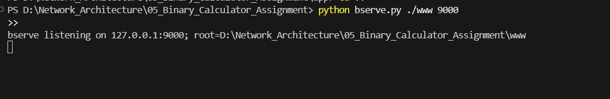

| Part | Meaning |
|---|---|
| `python` | Runs the Python interpreter |
| `bserve.py` | The server entry point script |
| `./www` | Web root directory — the server only serves files inside here |
| `9000` | Port number the server listens on |

**What happens internally:**
1. `bserve.py` calls `app.server.main()`
2. `main()` validates args, then calls `serve(root=./www, port=9000)`
3. `serve()` creates a TCP socket, calls `setsockopt(SO_REUSEADDR)`, `bind(("127.0.0.1", 9000))`, then `listen()`
4. A loop calls `accept()` — blocking until a client connects
5. When a client connects, `handle_connection()` is called on that socket

**Expected output:**
```
bserve listening on 127.0.0.1:9000; root=...\www
```

Leave this terminal open. The server blocks here.

### Step 3 — Open a second terminal

```powershell
cd D:\Network_Architecture\05_Binary_Calculator_Assignment
```

### Step 4 — Fetch a file

```powershell
python bcurl.py -v "localhost:9000/index.html"
```
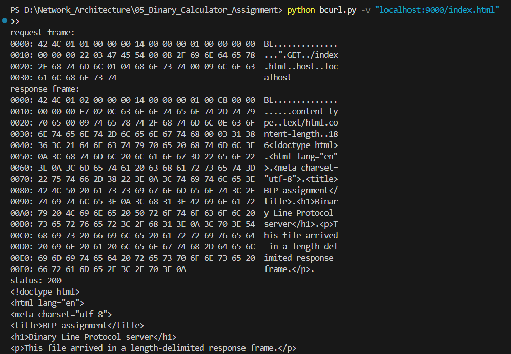

| Part | Meaning |
|---|---|
| `python` | Runs the Python interpreter |
| `bcurl.py` | The client entry point script |
| `-v` | **Verbose** — prints hexdumps of the request and response frames to stderr |
| `localhost` | Server hostname; resolves to `127.0.0.1` |
| `9000` | Server port |
| `/index.html` | Request target — the path to fetch |

**What happens internally:**
1. `parse_destination("localhost:9000/index.html")` → `host="localhost"`, `port=9000`, `target="/index.html"`
2. `encode_request(Request("GET", "/index.html", {"host": "localhost"}), 1)` builds the BLP/1 frame bytes
3. `socket.create_connection(("localhost", 9000))` opens a TCP connection
4. `write_all(sock, request_bytes)` sends every byte
5. `read_frame(sock)` reads the 20-byte header, extracts Payload Length, reads exactly that many bytes
6. `decode_response(frame)` parses status + headers + body
7. `-v` prints hexdumps to stderr; body goes to stdout
8. Exits code 0 (success) or 1 (4xx/5xx)

### Calculator request

```powershell
python bcurl.py -v "localhost:9000/add?a=2&b=3"
```
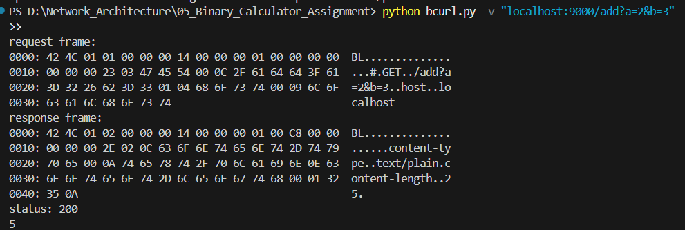

**Expected:** prints `5` to stdout, status 200.

---

## 7. Calculator examples

| Command | Expected result | Status |
|---|---|---|
| `python bcurl.py "localhost:9000/add?a=2&b=3"` | `5` | 200 |
| `python bcurl.py "localhost:9000/sub?a=10&b=4"` | `6` | 200 |
| `python bcurl.py "localhost:9000/mul?a=6&b=7"` | `42` | 200 |
| `python bcurl.py "localhost:9000/div?a=10&b=2"` | `5` | 200 |
| `python bcurl.py "localhost:9000/div?a=1&b=0"` | `bad calculator arguments` | 400 |

---

## 8. Error examples

### 404 — File not found

```powershell
python bcurl.py "localhost:9000/missing.html"
```


`missing.html` does not exist in `./www`. Server returns 404.

### 400 — Path traversal rejected

```powershell
python bcurl.py "localhost:9000/../../secret"
```

`../../secret` would escape the web root. Server resolves the path and checks
it is still inside `./www`. It is not — returns 400.

### 400 — Bad calculator arguments

```powershell
python bcurl.py "localhost:9000/add?a=hello&b=3"
```

`hello` is not a valid number. Server returns 400.

### 405 — Method not allowed

`bcurl` always sends GET. To see a 405, run the test suite — it sends POST directly.

---

###

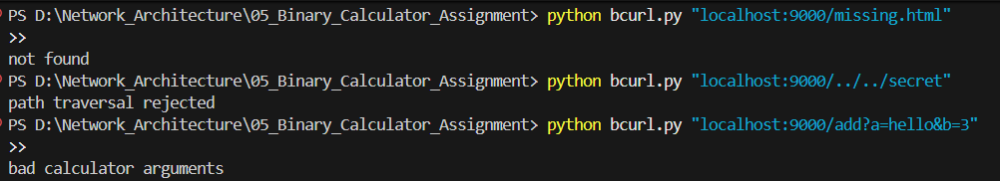


## 9. Testing

```powershell
python -m unittest discover -s tests -v
```

| Part | Meaning |
|---|---|
| `python -m` | Run a module as a script |
| `unittest` | Python's built-in test framework |
| `discover` | Automatically find test files matching `test*.py` |
| `-s tests` | Start discovery in the `tests/` subdirectory |
| `-v` | Verbose — print each test name and result |

**Expected output:**
```
test_file_and_calculator_routes ... ok
test_frame_can_arrive_in_small_pieces ... ok
test_invalid_version_yields_400_and_next_frame_stays_synced ... ok
test_malformed_and_oversized_headers_close_connection ... ok
test_path_traversal_and_method_are_rejected ... ok
test_protocol_rejects_truncated_request_payload ... ok
test_six_frames_one_tcp_connection_and_unknown_skip ... ok
----------------------------------------------------------------------
Ran 7 tests in 0.039s
OK
```

### What each test checks

| Test name | What it proves |
|---|---|
| `test_file_and_calculator_routes` | 200 for file; correct add/sub/mul bodies; 400 for div-by-zero; 404 for missing — **all on one socket** |
| `test_frame_can_arrive_in_small_pieces` | Frame sent one byte at a time; `read_exact()` loop reconstructs it correctly |
| `test_invalid_version_yields_400_and_next_frame_stays_synced` | Version-2 frame → 400; next valid frame on same connection → correct response |
| `test_malformed_and_oversized_headers_close_connection` | Bad magic → server closes; oversized Payload Length → `ProtocolError` |
| `test_path_traversal_and_method_are_rejected` | `../../secret` → 400; POST → 405 |
| `test_protocol_rejects_truncated_request_payload` | Frame declares 4-byte payload but only 2 arrive + close → `ProtocolError` |
| `test_six_frames_one_tcp_connection_and_unknown_skip` | 6 requests + 1 type-99 frame in one write; 6 correct responses; unknown frame silently skipped |

---

## 10. Hexdump

The `-v` flag prints actual bytes on the wire. Output below is real — captured
from `python bcurl.py -v "localhost:9000/add?a=2&b=3"`.

### Request frame

```
0000: 42 4C 01 01 00 00 00 14 00 00 00 01 00 00 00 00  BL..............
0010: 00 00 00 23 03 47 45 54 00 0C 2F 61 64 64 3F 61  ...#.GET../add?a
0020: 3D 32 26 62 3D 33 01 04 68 6F 73 74 00 09 6C 6F  =2&b=3..host..lo
0030: 63 61 6C 68 6F 73 74                             calhost
```

| Bytes (hex) | Decimal / ASCII | Field |
|---|---|---|
| `42 4C` | `BL` | Magic — identifies a BLP frame |
| `01` | 1 | Version |
| `01` | 1 | Type = REQUEST |
| `00 00` | 0 | Flags (zero in v1) |
| `00 14` | 20 | Header Length |
| `00 00 00 01` | 1 | Request ID |
| `00 00` | 0 | Status (always 0 in requests) |
| `00 00` | 0 | Reserved |
| `00 00 00 23` | 35 | Payload Length = 35 bytes |
| `03` | 3 | Method length |
| `47 45 54` | `GET` | Method |
| `00 0C` | 12 | Target length |
| `2F 61 64 64 3F 61 3D 32 26 62 3D 33` | `/add?a=2&b=3` | Target |
| `01` | 1 | Header count |
| `04` | 4 | Name length |
| `68 6F 73 74` | `host` | Header name |
| `00 09` | 9 | Value length |
| `6C 6F 63 61 6C 68 6F 73 74` | `localhost` | Header value |

### Response frame

```
0000: 42 4C 01 02 00 00 00 14 00 00 00 01 00 C8 00 00  BL..............
0010: 00 00 00 2E 02 0C 63 6F 6E 74 65 6E 74 2D 74 79  ......content-ty
0020: 70 65 00 0A 74 65 78 74 2F 70 6C 61 69 6E 0E 63  pe..text/plain.c
0030: 6F 6E 74 65 6E 74 2D 6C 65 6E 67 74 68 00 01 32  ontent-length..2
0040: 35 0A                                            5.
```

| Bytes (hex) | Decimal / ASCII | Field |
|---|---|---|
| `42 4C` | `BL` | Magic |
| `01` | 1 | Version |
| `02` | 2 | Type = RESPONSE |
| `00 00` | 0 | Flags |
| `00 14` | 20 | Header Length |
| `00 00 00 01` | 1 | Request ID (echoes the request) |
| `00 C8` | 200 | Status = 200 OK |
| `00 00` | 0 | Reserved |
| `00 00 00 2E` | 46 | Payload Length = 46 bytes |
| `02` | 2 | Header count |
| `0C` + `content-type` | — | First header name (12 bytes) |
| `00 0A` + `text/plain` | — | First header value (10 bytes) |
| `0E` + `content-length` | — | Second header name (14 bytes) |
| `00 01` + `2` | — | Second header value (1 byte: the text `"2"`) |
| `35 0A` | `5\n` | Body — the calculator result |

---

## 11. Protocol overview

BLP/1 (Binary Line Protocol, version 1) is a request/response protocol over TCP.

Every message is a **frame**: a fixed 20-byte header followed by a
variable-length payload whose exact size is in the header.

| Field | Offset | Size | Notes |
|---|---|---|---|
| Magic | 0 | 2 | Always `BL` (`42 4C`) |
| Version | 2 | 1 | Always `1` in this implementation |
| Type | 3 | 1 | `1` = Request, `2` = Response, other = extension |
| Flags | 4 | 2 | Zero in v1 |
| Header Length | 6 | 2 | Always `20` |
| Request ID | 8 | 4 | Correlation number; response echoes request's ID |
| Status | 12 | 2 | `0` in requests; 200/400/404/405 in responses |
| Reserved | 14 | 2 | Zero in v1 |
| Payload Length | 16 | 4 | How many payload bytes follow |

Total frame size = `20 + Payload Length`.

---

## 12. Architecture

### Overall architecture

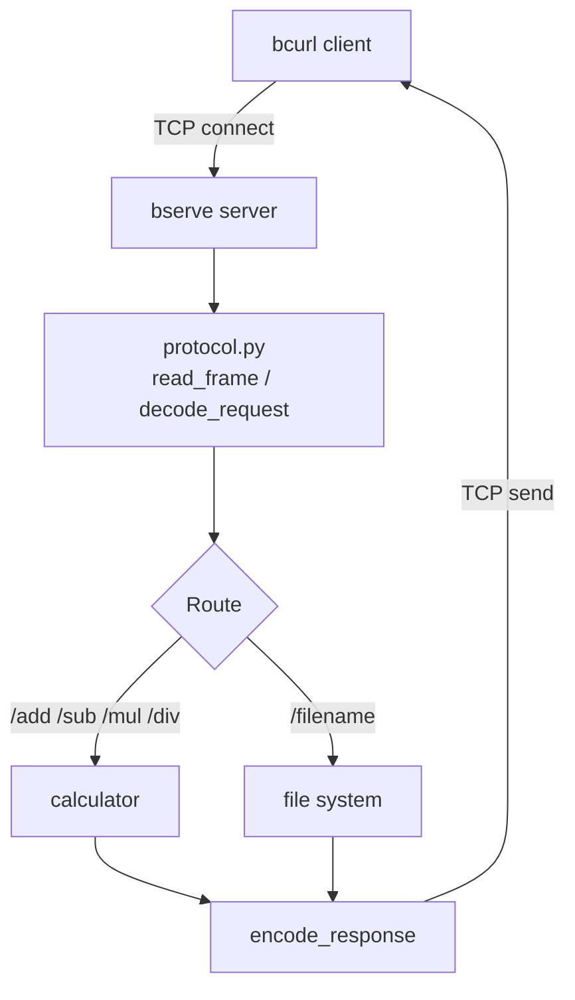

### Persistent connection — same socket, multiple requests

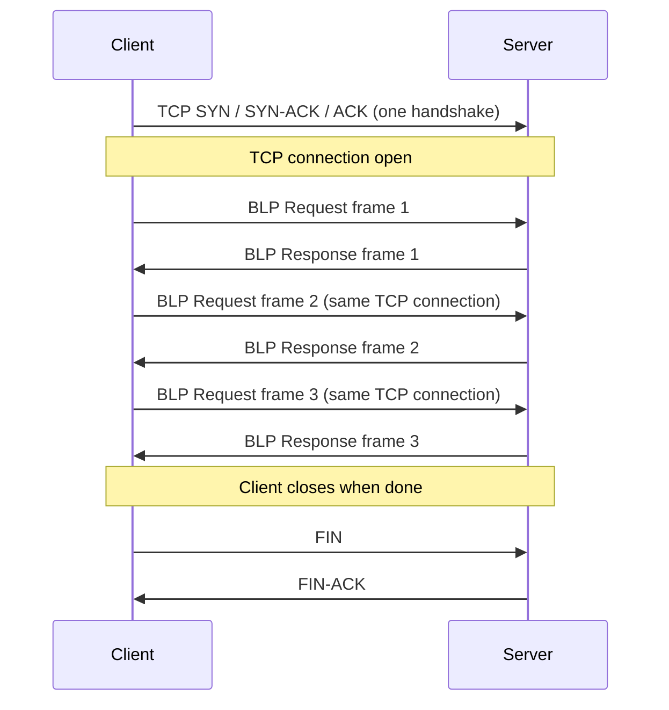

### Server flow

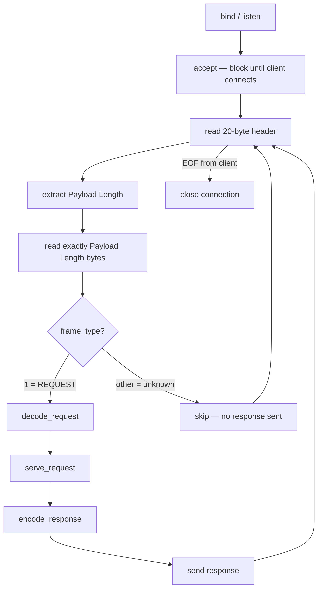

### Client flow

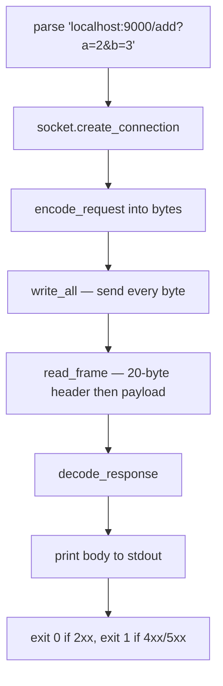

### Binary frame structure

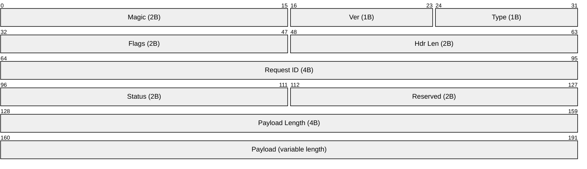

### TCP fragmentation — one frame, many reads

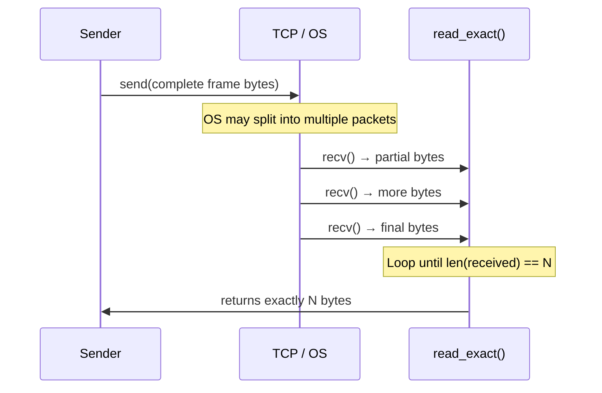

### Multiple coalesced frames

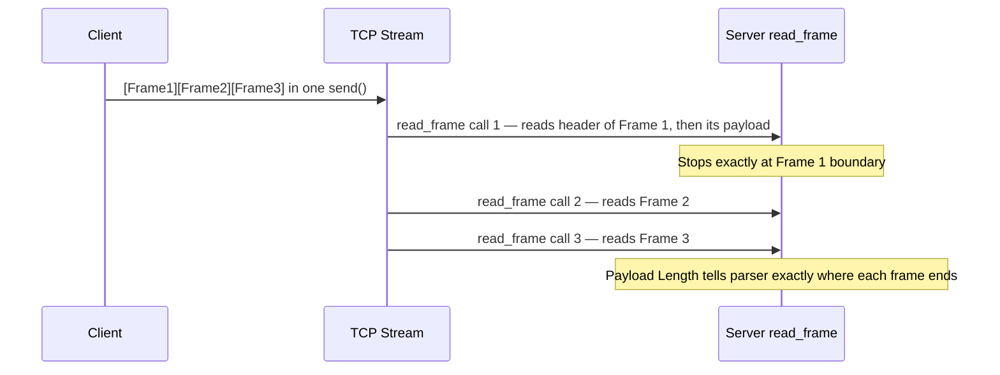

### Unknown frame type — skip cleanly

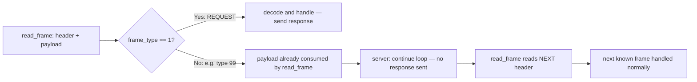

---

## How to Demonstrate the Assignment

Use the normal commands below — no special mode needed.

**Terminal 1:**

```powershell
cd D:\Network_Architecture\05_Binary_Calculator_Assignment
python bserve.py ./www 9000
```

*Say: "This starts the TCP server. It calls `bind()` on port 9000, then `listen()`,
then blocks on `accept()` waiting for a client."*

**Terminal 2 — successful file request:**

```powershell
cd D:\Network_Architecture\05_Binary_Calculator_Assignment
python bcurl.py -v "localhost:9000/index.html"
```

*Say: "The `-v` flag shows the actual bytes. `42 4C` is the magic `BL`.
`00 00 00 14` is the header length 20. `00 00 00 22` is the payload length 34.
The server responds with type `02` and status `00 C8` = 200."*

**Calculator:**

```powershell
python bcurl.py -v "localhost:9000/add?a=2&b=3"
```

*Say: "The target `/add?a=2&b=3` is parsed as a calculator route. The server
returns `5\n`. Notice the request ID `00 00 00 01` appears in both frames —
that is the correlation number."*

**404:**

```powershell
python bcurl.py "localhost:9000/missing.html"
```

*Say: "This file does not exist. Status 404."*

**Path traversal:**

```powershell
python bcurl.py "localhost:9000/../../secret"
```

*Say: "The server resolves the path and checks it is still inside `./www`. It
is not, so it returns 400."*

**Run the test suite:**

```powershell
python -m unittest discover -s tests -v
```

*Say: "`test_six_frames_one_tcp_connection_and_unknown_skip` sends 3 add
requests + 1 unknown frame (type 99) + 3 multiply requests in a single write.
The server returns all 6 correct responses and silently skips the unknown type.
`test_frame_can_arrive_in_small_pieces` sends one byte at a time to prove
`read_exact()` correctly handles TCP fragmentation."*
