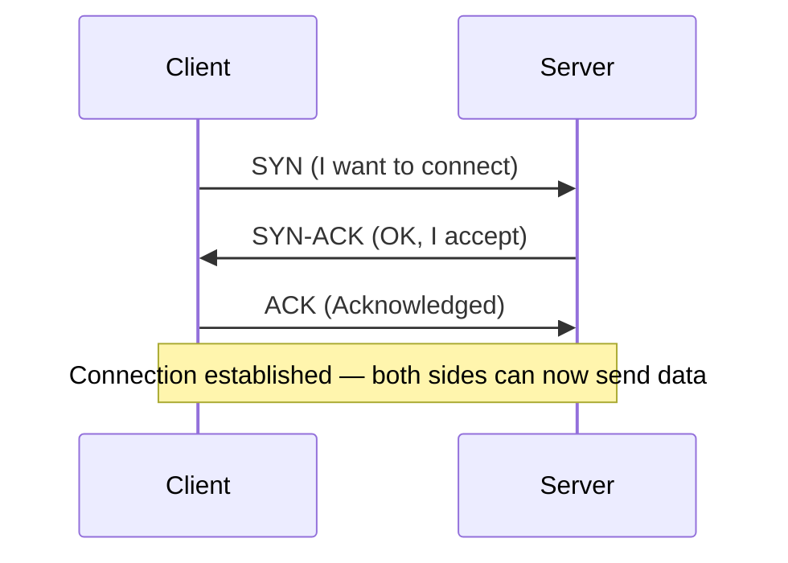
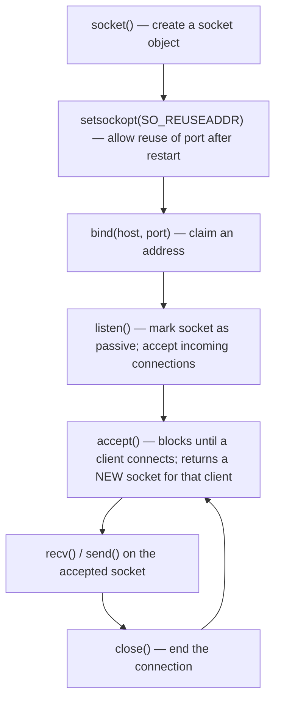
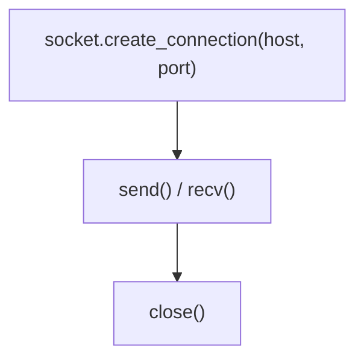
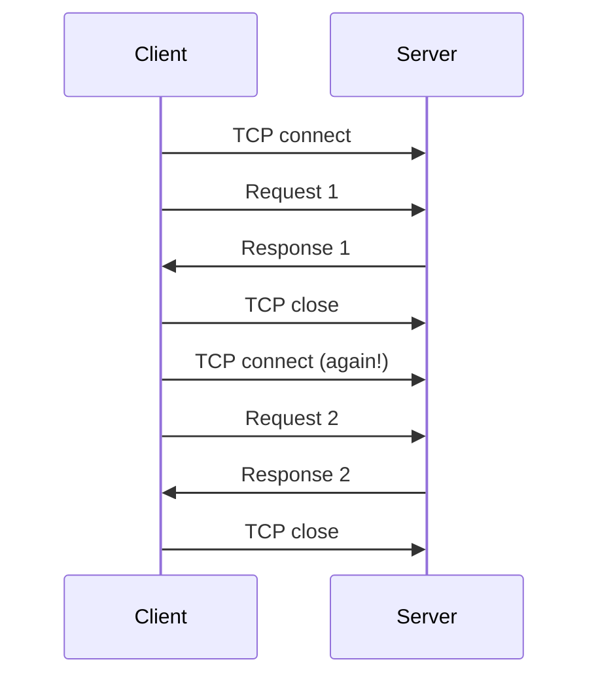
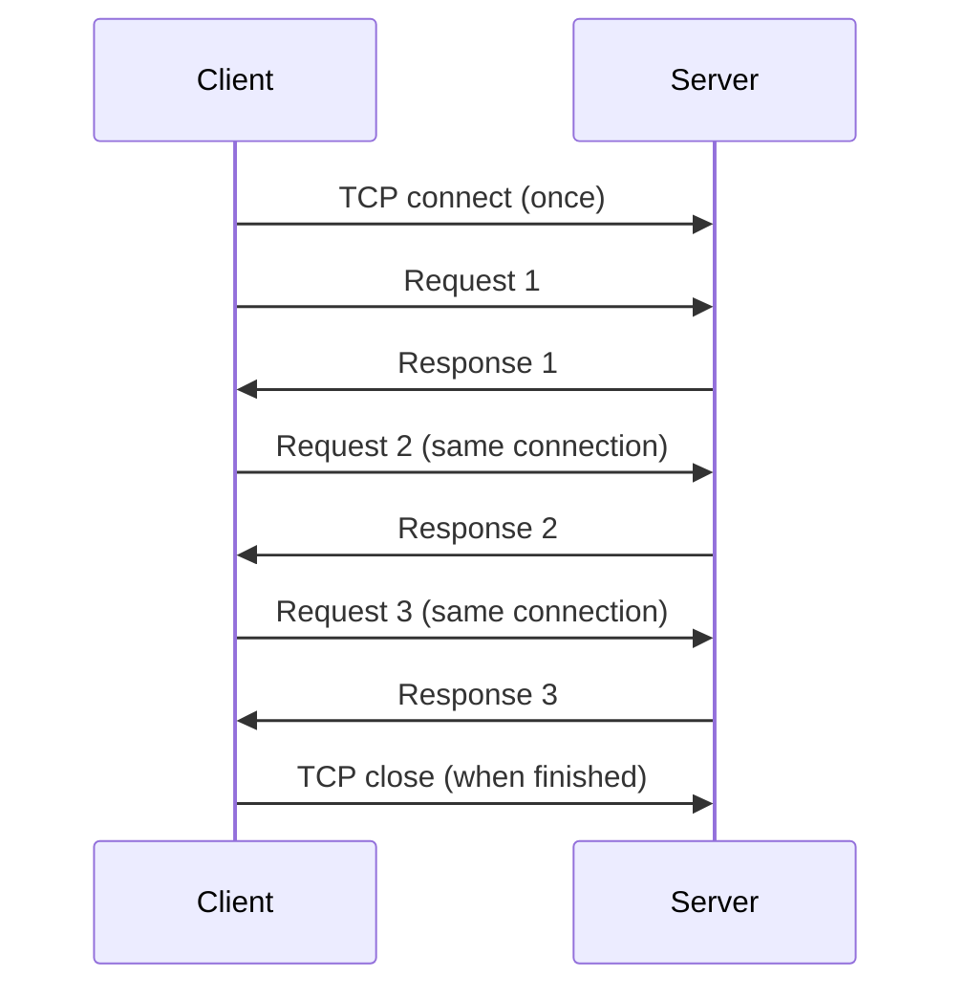
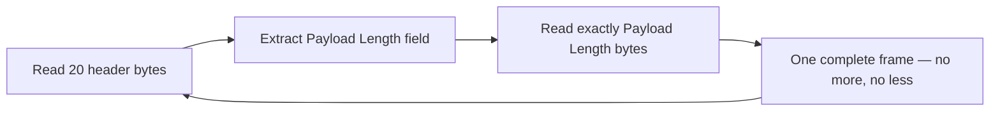
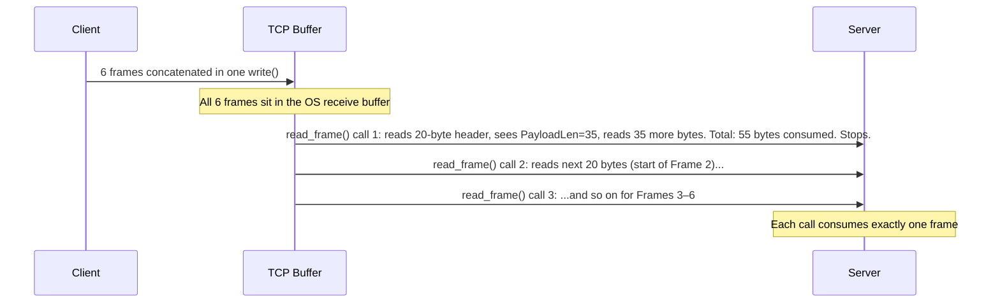
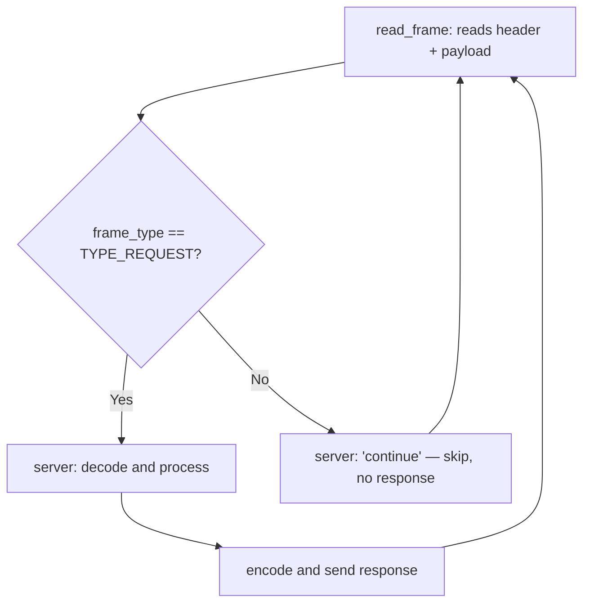
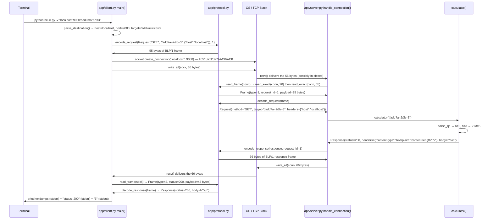

# Learning Guide — Binary Line Protocol Assignment

This guide explains every concept involved in this assignment, starting from
first principles and connecting each idea to the actual code.

---

## A. TCP

### What TCP is

TCP (Transmission Control Protocol) is the transport-layer protocol underneath
nearly all internet applications. It runs on top of IP and provides a
connection-oriented, reliable, ordered byte stream between two endpoints.

### TCP connection — the three-way handshake

Before any data flows, TCP requires three messages:



In code, this happens inside `socket.create_connection()` on the client side
and `listener.accept()` on the server side.

### Reliable and ordered delivery

TCP guarantees:
- **Reliability**: if a packet is lost in the network, TCP automatically
  retransmits it. The application never sees missing data.
- **Order**: bytes arrive at the receiver in the same order the sender wrote them.
- **Flow control**: the receiver can slow the sender if its buffer fills up.

### TCP is a byte stream — not a message stream

This is the most important concept in the assignment.

TCP does not know or care about application messages. When your program calls
`send("hello")` and then `send("world")`, TCP may deliver both as `"helloworld"`
in a single `recv()`, or as `"hell"` then `"oworld"`, or in any other
combination. The only guarantee is that all bytes arrive and in order.

**TCP preserves order of bytes. It does not preserve boundaries between calls
to `send()`.**

This is why BLP/1 exists. Without it, the server would have no way to know
where one request ends and the next begins.

---

## B. TCP sockets

A **socket** is the operating system's API for network communication. Python
exposes it through the `socket` module.

### Server-side socket lifecycle



### Client-side socket lifecycle



### What each call does

| Call | What it does |
|---|---|
| `socket()` | Creates a socket object; specifies IPv4 (`AF_INET`) and TCP (`SOCK_STREAM`) |
| `setsockopt(SO_REUSEADDR)` | Allows reuse of the port immediately after the server restarts |
| `bind(host, port)` | Tells the OS which IP address and port number this socket will use |
| `listen()` | Marks the socket as passive — ready to accept connections |
| `accept()` | Blocks until a client connects; returns a **new** socket for that conversation |
| `connect(host, port)` | Client-side: initiates the TCP handshake |
| `send(data)` | Sends bytes into the TCP stream; may not send all of them |
| `recv(N)` | Receives up to N bytes; may return fewer |
| `close()` | Terminates the connection |

### Where these appear in our code

`app/server.py` — `serve()` function:

```python
with socket.socket(socket.AF_INET, socket.SOCK_STREAM) as listener:
    listener.setsockopt(socket.SOL_SOCKET, socket.SO_REUSEADDR, 1)
    listener.bind((host, port))
    listener.listen()
    conn, _ = listener.accept()          # blocks until client connects
    handle_connection(conn, root)        # send/recv on 'conn'
```

`app/client.py` — `main()` function:

```python
with socket.create_connection((host, port)) as sock:
    write_all(sock, request_bytes)       # send
    frame = read_frame(sock)             # recv
```

**Key distinction:** `listener` is the **listening socket** — it never sends or
receives application data. `conn` (or `sock`) is the **connected socket** — it
is the actual channel for one conversation. Each call to `accept()` produces a
new connected socket for a new client.

---

## C. Persistent connections

### Normal (non-persistent) connection



One TCP handshake per request. Expensive. HTTP/1.0 behaved this way by default.

### Persistent connection ("stays on the line")



One TCP handshake. Many requests. This is what the assignment requires.

### How our server keeps the connection open

In `app/server.py`, `handle_connection()` is a loop:

```python
def handle_connection(conn, root):
    while True:
        frame = read_frame(conn)      # read next request
        if frame is None:
            return                    # client closed — we exit
        # ... process and respond ...
        write_all(conn, response_bytes)
        # loop continues — same conn, same socket, same TCP connection
```

The loop only exits when `read_frame()` returns `None` (clean EOF from the
client). The connection is never closed by the server after a successful response.

---

## D. TCP framing

### The framing problem

TCP is a byte stream. An application that sends messages needs a rule to tell
the receiver where each message begins and ends. This rule is called **framing**.

Without framing:

```
Server sends two responses:  "hello"  "world"
Client might receive:        "helloworld"   (one recv)
                          or "hell"  "oworld"  (two recvs)
```

The client has no way to know where `"hello"` ends.

### Framing strategies

#### 1. Delimiter framing

Mark the end of each message with a special byte or sequence of bytes (e.g.,
newline `\n` for text protocols like SMTP, FTP, HTTP headers).

- **Advantage**: simple, human-readable.
- **Disadvantage**: the delimiter byte cannot appear in the message data without
  escaping. Binary file data often contains `\n`, so this breaks.

#### 2. Fixed-size framing

Every message is always exactly N bytes.

- **Advantage**: trivially simple — just read N bytes.
- **Disadvantage**: wastes space (padding short messages) or cannot represent
  messages longer than N bytes.

#### 3. Length-prefix framing ← **what BLP/1 uses**

Prefix each message with its length. The receiver reads the length first, then
reads exactly that many bytes.

- **Advantage**: works for any binary data; variable-length messages; no escaping.
- **Disadvantage**: the receiver must pre-read a header before knowing the body size.

#### 4. Connection-close framing

The sender closes the connection when done. The receiver reads until EOF.

- **Advantage**: no framing overhead at all.
- **Disadvantage**: only one message per connection — defeats persistent connections.

### How BLP/1 uses length-prefix framing

BLP/1 uses a **fixed-size header** (20 bytes) that contains the payload length:



This lets the server handle any binary payload without delimiter ambiguity,
and lets the parser always know exactly where the next frame starts.

---

## E. Partial reads

### Why `recv(N)` does not always return N bytes

`recv(N)` asks the OS for up to N bytes. The OS returns **however many are
currently available in the buffer** — which may be:
- exactly N bytes
- fewer than N bytes (most common)
- 0 bytes (EOF — the other side closed)

This happens because:
- The data may have arrived in multiple TCP packets
- The OS buffer may not have filled up yet
- The network may have delayed some packets

### Example

Suppose a 20-byte header arrives in two packets:

```
recv(20) call 1: returns 12 bytes  ← not enough!
recv(20) call 2: returns 8 bytes   ← now we have all 20
```

If your code only calls `recv(20)` once and gets 12 bytes, it will treat
those 12 bytes as a complete header — which is wrong and will corrupt everything.

### How our code handles this — `read_exact()`

In `app/protocol.py`:

```python
def read_exact(sock, size):
    chunks = bytearray()
    while len(chunks) < size:
        part = sock.recv(size - len(chunks))  # ask for the remainder
        if not part:
            if not chunks:
                return None       # clean EOF before any data — client disconnected
            raise ProtocolError("connection closed in the middle of a frame")
        chunks.extend(part)
    return bytes(chunks)
```

**Inputs:** a socket, a number of bytes to read  
**Outputs:** exactly `size` bytes, or `None` (clean EOF at a frame boundary), or raises `ProtocolError` (EOF mid-frame)  
**Logic:** accumulates chunks in a bytearray, asks for `size - already_received` each time, loops until satisfied.

`read_frame()` calls `read_exact()` twice: once for the 20-byte header, once for
the payload:

```python
def read_frame(sock):
    raw_header = read_exact(sock, HEADER_SIZE)      # exactly 20 bytes
    if raw_header is None:
        return None                                  # client disconnected
    # ... parse header, extract payload_len ...
    payload = read_exact(sock, payload_len)          # exactly payload_len bytes
    return Frame(...)
```

---

## F. Partial writes

### Why `send()` may not write everything

Just as `recv()` may return fewer bytes than requested, `send()` may accept
fewer bytes than given. The OS takes as many as its send buffer can hold and
returns how many it accepted. The rest must be sent in a subsequent call.

This is rare on loopback, but the correct code must handle it.

### How our code handles this — `write_all()`

In `app/protocol.py`:

```python
def write_all(sock, data):
    view = memoryview(data)
    while view:
        sent = sock.send(view)
        if sent == 0:
            raise ConnectionError("socket closed during write")
        view = view[sent:]       # advance past the bytes that were sent
```

`memoryview` avoids copying the bytes each iteration. The loop continues until
all bytes have been accepted.

---

## G. Multiple frames in one TCP read

### The coalescing problem

TCP can deliver more than one frame's bytes in a single `recv()`. This is
called **coalescing**. For example:

```
Client sends: [Frame 1 — 55 bytes][Frame 2 — 37 bytes]
Server recv(1024): returns all 92 bytes at once
```

Without a length field, the server cannot tell where Frame 1 ends and Frame 2
begins. With BLP/1's length field, it can:



The six-frame test (`test_six_frames_one_tcp_connection_and_unknown_skip`)
sends all frames in one `write_all()` call. The server correctly processes all
six because `read_exact()` always asks for exactly the right number of bytes
and stops precisely at the frame boundary.

---

## H. Binary protocols

### Text protocols

Text protocols encode values as human-readable ASCII strings:

```
GET /add?a=2&b=3 HTTP/1.1\r\n
Host: localhost\r\n
\r\n
```

- **Advantage**: easy to debug with `telnet` or `netcat`; human-readable.
- **Disadvantage**: ambiguous boundaries (where does the body start?); parsing is
  complex; binary data in the body requires encoding (e.g., base64).

### Binary protocols

Binary protocols encode values as raw bytes using fixed field widths:

```
42 4C 01 01 00 00 00 14 00 00 00 01 00 00 00 00 00 00 00 23 ...
```

- **Advantage**: compact; unambiguous; no escaping needed for binary data.
- **Disadvantage**: not human-readable without a hex dump tool; more complex to debug.

### Why the assignment uses a binary protocol

The assignment wants you to understand:
1. **Serialization** — converting structured data (method, path, headers) into bytes
2. **Deserialization** — parsing those bytes back into data
3. **Framing** — using the binary length field to know exactly where each message ends

Binary framing with a length field is fundamentally cleaner for binary payloads
(like file content) because there is no ambiguity about what bytes appear in the body.

---

## I. Frame header design

### Every field in BLP/1's header

**Magic — 2 bytes — offset 0**
- Value: `42 4C` (ASCII `BL`)
- Purpose: fast sanity check. If a receiver sees anything other than `BL`, it
  knows immediately that something is wrong — perhaps connected to the wrong port
  or receiving garbage.
- What happens if invalid: connection closes immediately.

**Version — 1 byte — offset 2**
- Value: `1`
- Purpose: allows future versions of the protocol. A v2 server can detect v1
  clients and respond appropriately.
- What happens if the version is wrong in a request: server returns 400.

**Type — 1 byte — offset 3**
- Value: `1` (REQUEST) or `2` (RESPONSE)
- Purpose: distinguishes requests from responses.
- What happens for unknown values: receiver skips the payload and continues.

**Flags — 2 bytes — offset 4**
- Value: `0000` in v1
- Purpose: reserved bits for future features (e.g., "this frame is compressed").
- What happens if non-zero in v1: currently ignored but available for extension.

**Header Length — 2 bytes — offset 6**
- Value: `0014` (= 20 decimal)
- Purpose: tells the receiver how long the header is, so a future version can
  extend the header without breaking v1 parsers. A v1 parser that sees
  `Header Length = 24` knows there are 4 extra bytes before the payload.
- What happens if != 20 in our implementation: treated as malformed; close.

**Request ID — 4 bytes — offset 8**
- Value: any 32-bit unsigned integer
- Purpose: correlation — the response echoes the same ID, allowing a client
  to match responses to requests.
- In our implementation: `bcurl` always uses request ID 1.

**Status — 2 bytes — offset 12**
- Value: `0` in requests; `200`, `400`, `404`, or `405` in responses
- Purpose: replaces HTTP's status line. A 2-byte field supports codes up to 65535.

**Reserved — 2 bytes — offset 14**
- Value: `0000`
- Purpose: future use; padding to align the payload length to offset 16.
- What happens if non-zero: malformed; close.

**Payload Length — 4 bytes — offset 16**
- Value: 0–1,048,576
- Purpose: the key framing field. Without this, the receiver cannot find the end
  of the current frame.
- Maximum 1 MiB enforced **before reading** to prevent memory exhaustion attacks.

---

## J. Length prefixing

### Why the protocol needs a length

Without `Payload Length`, the receiver would have to either:
1. Read until a delimiter — breaks for binary data
2. Read until EOF — only allows one message per connection
3. Use a fixed size — wastes space or limits message size

With `Payload Length`, the receiver reads exactly the right number of bytes
and stops. The next byte is always the start of the next frame.

### How it works in BLP/1

```
Total frame = [20-byte header][Payload Length bytes of payload]
```

The receiver:
1. Reads 20 bytes → gets `Payload Length = N`
2. Reads `N` more bytes → complete payload
3. The byte immediately after is byte 0 of the next frame

This is implemented in `read_frame()` in `app/protocol.py`.

---

## K. Endianness

### What endianness means

When a number larger than one byte is stored in memory or sent over the network,
there is a choice of which byte goes first.

Take the number `0x00C8` (200 decimal):

- **Big-endian** (most significant byte first): `00 C8`
- **Little-endian** (least significant byte first): `C8 00`

### Network byte order

Network byte order is **big-endian**. All major network protocols (TCP, IP, UDP)
use big-endian. BLP/1 follows this convention.

In Python, `struct` format strings use `!` to mean big-endian (network order):

```python
HEADER_FORMAT = "!2sBBHHIHHI"
#                ^  network byte order (big-endian)
```

### Our actual bytes

From the real calculator response (`status = 200`):

```
Bytes at offset 12: 00 C8
```

- Big-endian: `00C8` = 0×256 + 200 = **200** ✓
- Little-endian interpretation: `C800` = 200×256 + 0 = 51,200 ✗

If we used little-endian, a receiver expecting big-endian would see the wrong
status code. Agreeing on byte order is essential for interoperability.

---

## L. Unknown frame types

### The assignment requirement

A receiver that sees an unknown frame type must skip it cleanly. It must not
crash, and it must continue processing the next frame.

### Why this matters

Protocols evolve. If v2 adds a new frame type (e.g., type `3` for "ping"), a
v1 server must ignore it without breaking the connection. This is called
**forward compatibility**.

### How our implementation achieves this



The key insight: **`read_frame()` always reads the complete payload** regardless
of the frame type. By the time the server checks `frame.frame_type`, the payload
bytes have already been consumed from the TCP stream. Skipping the frame is as
simple as doing nothing with the frame object.

From `app/server.py`:

```python
frame = read_frame(conn)
if frame.frame_type != TYPE_REQUEST:
    continue          # payload already consumed; just loop to the next frame
```

This works because `Payload Length` tells `read_frame()` exactly how many bytes
to consume, even for unknown types.

---

## M. Protocol versioning

### Why the frame has a Version field

The Version field lets a sender declare which version of the protocol it speaks,
and lets a receiver decide whether it can handle that version.

### How our implementation uses it

The server checks `frame.version != VERSION` **after** a successful header parse:

```python
if frame.version != VERSION:
    write_all(conn, encode_response(response(400, "unsupported version\n"), frame.request_id))
    continue    # connection stays open for the next frame
```

This sends a 400 response and continues — it does not close the connection,
because the version field was readable and synchronization is not lost.

### Room for future versions

The `Header Length` field (always 20 in v1) means a v2 implementation could
set `Header Length = 24` to add 4 more bytes to the header. A v1 receiver
that sees `Header Length != 20` closes the connection (safe behaviour for
something it does not understand).

---

## N. HTTP/1.1 connection context

### HTTP/1.0

HTTP/1.0 by default used one TCP connection per request/response pair. The
server sent the response and closed the connection. The client could tell where
the response body ended because the connection closed.

### HTTP/1.1

HTTP/1.1 introduced **persistent connections by default** (also called
`keep-alive`). Because the connection stays open, HTTP/1.1 needs another way
to mark the end of a response body. It uses `Content-Length` (the server
declares how many bytes the body is) or chunked transfer encoding (the server
sends the body in chunks, each preceded by its size in hex).

### The conceptual link to BLP/1

BLP/1's `Payload Length` field serves the same purpose as `Content-Length` in
HTTP/1.1 — it tells the receiver how many bytes the message contains. The
difference is that BLP/1 uses a binary field in a structured header, while
HTTP/1.1 uses a text header line.

The phrase "stays on the line" directly references HTTP/1.1's behaviour of
keeping the TCP connection alive across multiple request/response pairs.

---

## O. Security / robustness

### Malformed frames

Any frame with incorrect magic (`!= BL`), header length (`!= 20`), or
non-zero reserved field causes the connection to close immediately. These fields
prove the stream is synchronized. If they are wrong, the server cannot trust
anything that follows.

### Oversized frames

A `Payload Length` field of, say, 4 GB would cause the server to try to
allocate 4 GB of memory — a denial-of-service attack. The check:

```python
if payload_len > MAX_PAYLOAD:
    raise ProtocolError("payload length exceeds 1 MiB limit")
```

happens **before** any memory is allocated.

### Truncated frames

If the client closes the connection in the middle of a frame (e.g., sent 10
bytes of a 20-byte header), `read_exact()` raises `ProtocolError` because it
accumulates some bytes (`chunks` is non-empty) but then gets EOF.

### Path traversal

```python
candidate = (root / parsed.path.lstrip("/")).resolve()
candidate.relative_to(root)
```

`resolve()` follows all `..` components and symlinks to find the absolute path.
`relative_to(root)` raises `ValueError` if the result is outside the web root.
This prevents a request for `/../../etc/passwd` from reading system files.

### Invalid requests

Unknown methods → 405. Bad calculator arguments → 400. Duplicate headers → 400.
Non-ASCII method or target → 400. All of these are caught before any file I/O
or arithmetic.

---

## P. Code walkthrough

### `bserve.py` and `bcurl.py`

Both are three-line entry points. They exist so you can run:

```powershell
python bserve.py ./www 9000
```

instead of `python -m app.server ./www 9000`. No logic lives here.

### `app/protocol.py` — the wire contract

**Constants:**

```python
MAGIC = b"BL"
VERSION = 1
HEADER_FORMAT = "!2sBBHHIHHI"    # struct format string
HEADER_SIZE = struct.calcsize(HEADER_FORMAT)  # = 20
MAX_PAYLOAD = 1024 * 1024
```

`"!2sBBHHIHHI"` decoded:
- `!` — big-endian
- `2s` — 2-byte string (magic)
- `B` — unsigned char (1 byte): version
- `B` — unsigned char (1 byte): type
- `H` — unsigned short (2 bytes): flags
- `H` — unsigned short (2 bytes): header length
- `I` — unsigned int (4 bytes): request ID
- `H` — unsigned short (2 bytes): status
- `H` — unsigned short (2 bytes): reserved
- `I` — unsigned int (4 bytes): payload length

Total: 2+1+1+2+2+4+2+2+4 = **20 bytes** ✓

**`read_exact(sock, size)`**

- Inputs: socket, number of bytes
- Outputs: exactly `size` bytes as `bytes`, or `None` (clean EOF), or raises `ProtocolError`
- Purpose: guarantees a complete read regardless of TCP fragmentation
- Edge cases: EOF before any data → `None`; EOF mid-read → `ProtocolError`

**`write_all(sock, data)`**

- Inputs: socket, bytes to send
- Outputs: none (raises `ConnectionError` if socket closes)
- Purpose: guarantees all bytes are sent even if `send()` accepts fewer than given

**`read_frame(sock)`**

- Inputs: socket
- Outputs: `Frame` object, or `None` (clean EOF)
- Purpose: reads exactly one complete frame
- Validates: magic, header length, reserved field, payload size
- Calls `read_exact()` twice — header, then payload

**`encode_frame(frame)`**

- Inputs: `Frame` dataclass
- Outputs: bytes (header + payload)
- Validates: version, flags, request ID range, status range, payload size

**`encode_request(request, request_id)`**

- Builds payload: method length (u8) + method + target length (u16) + target + header block
- Wraps in `encode_frame` with `TYPE_REQUEST`

**`decode_request(frame)`**

- Parses the payload byte by byte using offsets
- Validates all lengths and encodings
- Returns a `Request(method, target, headers)` dataclass

**`encode_response(response, request_id)`**

- Builds payload: header block + body bytes
- Wraps in `encode_frame` with `TYPE_RESPONSE`

**`decode_response(frame)`**

- Parses header block from payload
- Returns `Response(status, headers, body)` where `body` is the remaining bytes

**`hexdump(data)`**

- Formats bytes as 16 bytes per line with hex values and ASCII representation
- Dots replace non-printable bytes
- Used by `bcurl -v`

### `app/server.py`

**`serve(root, port, host, ready, stop)`**

- Creates the listening socket
- `SO_REUSEADDR` lets the process restart and reuse the port without waiting
- `settimeout(0.2)` makes `accept()` raise `socket.timeout` every 200ms so the
  `stop` event can be checked (used by tests to shut down the server)
- Calls `handle_connection(conn, root)` for each accepted client

**`handle_connection(conn, root)`**

- The persistent connection loop
- Calls `read_frame()` on each iteration
- `frame is None` → client closed → return
- `frame_type != TYPE_REQUEST` → unknown type → `continue` (skip)
- `frame.version != VERSION` → sends 400, continues (does NOT close)
- `ProtocolError` during decode → sends 400, continues
- `ProtocolError` during header parse → closes (synchronization lost)

**`serve_request(request, root)`**

- Checks method is `GET`
- Checks if the target is a calculator route (`/add`, `/sub`, `/mul`, `/div`)
- Otherwise, resolves the file path and checks it is inside `root`
- Returns a `Response` object

**`calculator(target)`**

- Parses path and query string
- Checks both `a` and `b` are present and parseable as floats
- Checks for division by zero
- Returns integer result if result is a whole number, else float

**`response(status, body, **headers)`**

- Convenience helper that builds a `Response` with `content-length` defaulted
- Accepts `str` body and encodes it to UTF-8

### `app/client.py`

**`parse_destination(value)`**

- Input: `"localhost:9000/index.html"`
- Output: `("localhost", 9000, "/index.html")`
- Validates host is non-empty, port is 1–65535

**`main()`**

- Parses `-v` flag and destination
- Calls `encode_request(Request("GET", target, {"host": host}), 1)`
- Opens a TCP connection with `socket.create_connection()`
- Sends the frame with `write_all()`
- Reads the response with `read_frame()`
- If `-v`: prints hexdumps of both frames to stderr and prints `status: N`
- Writes the response body to stdout
- Exits 0 for 2xx, 1 for 4xx/5xx, 2 for connection errors

### `tests/test_blp.py`

**`start_connection()`**

- Uses `socket.socketpair()` — creates two connected sockets in memory (no
  real TCP, no port binding; much faster and more reliable for tests)
- Starts `handle_connection(server, ROOT)` in a daemon thread
- Returns the client socket

**`request(sock, target, request_id, method)`**

- Sends one encoded request and reads one response
- Used as a helper in most tests

---

## Q. Actual byte-level example

Real output from `python bcurl.py -v "localhost:9000/add?a=2&b=3"`:

### Request frame (55 bytes total: 20 header + 35 payload)

```
0000: 42 4C 01 01 00 00 00 14 00 00 00 01 00 00 00 00  BL..............
0010: 00 00 00 23 03 47 45 54 00 0C 2F 61 64 64 3F 61  ...#.GET../add?a
0020: 3D 32 26 62 3D 33 01 04 68 6F 73 74 00 09 6C 6F  =2&b=3..host..lo
0030: 63 61 6C 68 6F 73 74                             calhost
```

Field-by-field:

| Offset | Bytes | Value | Field |
|---|---|---|---|
| 00–01 | `42 4C` | `BL` | Magic |
| 02 | `01` | 1 | Version |
| 03 | `01` | 1 | Type = REQUEST |
| 04–05 | `00 00` | 0 | Flags |
| 06–07 | `00 14` | 20 | Header Length |
| 08–0B | `00 00 00 01` | 1 | Request ID |
| 0C–0D | `00 00` | 0 | Status (requests always 0) |
| 0E–0F | `00 00` | 0 | Reserved |
| 10–13 | `00 00 00 23` | 35 | Payload Length |
| 14 | `03` | 3 | Method Length |
| 15–17 | `47 45 54` | `GET` | Method |
| 18–19 | `00 0C` | 12 | Target Length |
| 1A–25 | `2F 61 64 64 3F 61 3D 32 26 62 3D 33` | `/add?a=2&b=3` | Target |
| 26 | `01` | 1 | Header Count |
| 27 | `04` | 4 | Name Length |
| 28–2B | `68 6F 73 74` | `host` | Header Name |
| 2C–2D | `00 09` | 9 | Value Length |
| 2E–36 | `6C 6F 63 61 6C 68 6F 73 74` | `localhost` | Header Value |

### Response frame (66 bytes total: 20 header + 46 payload)

```
0000: 42 4C 01 02 00 00 00 14 00 00 00 01 00 C8 00 00  BL..............
0010: 00 00 00 2E 02 0C 63 6F 6E 74 65 6E 74 2D 74 79  ......content-ty
0020: 70 65 00 0A 74 65 78 74 2F 70 6C 61 69 6E 0E 63  pe..text/plain.c
0030: 6F 6E 74 65 6E 74 2D 6C 65 6E 67 74 68 00 01 32  ontent-length..2
0040: 35 0A                                            5.
```

Field-by-field:

| Offset | Bytes | Value | Field |
|---|---|---|---|
| 00–01 | `42 4C` | `BL` | Magic |
| 02 | `01` | 1 | Version |
| 03 | `02` | 2 | Type = RESPONSE |
| 04–05 | `00 00` | 0 | Flags |
| 06–07 | `00 14` | 20 | Header Length |
| 08–0B | `00 00 00 01` | 1 | Request ID (matches request) |
| 0C–0D | `00 C8` | 200 | Status = 200 OK |
| 0E–0F | `00 00` | 0 | Reserved |
| 10–13 | `00 00 00 2E` | 46 | Payload Length |
| 14 | `02` | 2 | Header Count |
| 15 | `0C` | 12 | Name Length |
| 16–21 | `63 6F 6E 74 65 6E 74 2D 74 79 70 65` | `content-type` | Header Name |
| 22–23 | `00 0A` | 10 | Value Length |
| 24–2D | `74 65 78 74 2F 70 6C 61 69 6E` | `text/plain` | Header Value |
| 2E | `0E` | 14 | Name Length |
| 2F–3C | `63 6F 6E 74 65 6E 74 2D 6C 65 6E 67 74 68` | `content-length` | Header Name |
| 3D–3E | `00 01` | 1 | Value Length |
| 3F | `32` | `2` | Header Value (the text "2") |
| 40–41 | `35 0A` | `5\n` | Body |

---

## R. End-to-end request flow

What happens from the moment you type:

```powershell
python bcurl.py -v "localhost:9000/add?a=2&b=3"
```

until you see `5` on the screen:



---

## S. Test explanations

### `test_file_and_calculator_routes`

**Scenario:** Sends 6 different requests on one socket — file, add, sub, mul,
div-by-zero, missing file.  
**Why it matters:** Proves the server handles multiple request types correctly
and that the TCP connection stays open across all of them.  
**What it proves:** Each route returns the expected status and body; the persistent
loop works for at least 6 iterations.

### `test_frame_can_arrive_in_small_pieces`

**Scenario:** Sends a valid request frame **one byte at a time**.  
**Why it matters:** TCP fragmentation is real. A server that does `recv(20)` and
assumes it gets all 20 bytes will fail on a slow or congested network.  
**What it proves:** `read_exact()` correctly loops until all bytes arrive.

### `test_invalid_version_yields_400_and_next_frame_stays_synced`

**Scenario:** Sends a frame with version byte `02` instead of `01`, then sends
a valid frame immediately after.  
**Why it matters:** A server that closes on unknown version would fail the
second request. A server that does not synchronize correctly would misparse.  
**What it proves:** The server returns 400 for the bad version but continues
processing the next valid frame on the same connection.

### `test_malformed_and_oversized_headers_close_connection`

**Scenario A:** Sends a 20-byte frame with magic `NO` instead of `BL`.  
**Scenario B:** Sends a frame with Payload Length = 1,048,577 (1 MiB + 1).  
**Why it matters:** Malformed magic means stream is corrupt — connection must close.
Oversized length could cause memory exhaustion.  
**What it proves:** Magic validation closes the connection; length validation raises
`ProtocolError` before any memory allocation.

### `test_path_traversal_and_method_are_rejected`

**Scenario:** Sends `GET /../../secret` then `POST /index.html`.  
**Why it matters:** Path traversal is a classic web security vulnerability.
Methods other than GET must be rejected.  
**What it proves:** 400 for traversal; 405 for POST; both on the same connection.

### `test_protocol_rejects_truncated_request_payload`

**Scenario:** Sends a frame header declaring 4-byte payload, sends only 2 bytes,
then closes the connection.  
**Why it matters:** A peer may crash mid-send. The server must not block forever
waiting for bytes that will never arrive.  
**What it proves:** `read_exact()` raises `ProtocolError` when EOF arrives
before the declared number of bytes.

### `test_six_frames_one_tcp_connection_and_unknown_skip`

**Scenario:** Coalesces 3 add requests + 1 unknown type-99 frame + 3 multiply
requests into a single `write_all()`. Reads 6 responses.  
**Why it matters:** This test combines everything: persistent connection,
coalesced frames, correct length parsing, unknown-type skipping.  
**What it proves:** The server can handle frames that arrive together; it skips
unknown types cleanly; it returns correct results for all 6 known frames.

---

## T. Common viva questions

### Why can't TCP preserve request boundaries?

TCP is a byte stream. It delivers bytes in order and reliably, but it makes no
promises about how many bytes are returned per `recv()` call. Multiple sends
may be merged, or one send may be split. There is no concept of a "message" at
the TCP level.

### Why can't `recv()` be assumed to return one frame?

Because TCP can deliver bytes in any sized chunks. A 55-byte frame might arrive
as `recv(12)` + `recv(43)`, or all at once, or in 55 individual one-byte reads.
The amount returned depends on network conditions, OS buffering, and timing.

### Why do we need a length field?

Without a length field, the receiver cannot know where one frame ends and the
next begins. The length field in the BLP/1 header tells the receiver exactly
how many bytes the payload contains, so it can read precisely that many bytes
and stop.

### What happens if a frame is fragmented?

`read_exact()` loops, accumulating chunks in a `bytearray`, and requests
`size - already_received` bytes on each call. It keeps looping until it has
exactly the right number of bytes. The `test_frame_can_arrive_in_small_pieces`
test verifies this with one-byte writes.

### What happens if multiple frames arrive together?

Each call to `read_frame()` reads exactly one header (20 bytes) and exactly
`Payload Length` bytes of payload — no more. The next call starts from the next
byte in the stream. The `test_six_frames_one_tcp_connection_and_unknown_skip`
test verifies this with 6 frames sent in one write.

### Why keep the TCP connection open?

Opening a TCP connection requires a three-way handshake (SYN, SYN-ACK, ACK).
For a calculator that does many operations, reconnecting each time wastes time
and resources. A persistent connection amortizes that cost over many requests.
The assignment explicitly requires this ("stays on the line").

### Why use binary framing?

Binary framing with a length field is unambiguous for any payload content,
including binary file data. Text delimiters (like `\n`) can appear inside file
data and require escaping. Binary length-prefix framing requires no escaping and
is compact.

### Why do we need a version field?

Protocols evolve. Version 1 may not support all future requirements. The version
field allows a v2 implementation to coexist with v1 servers. Our server returns
400 for version numbers it does not support, which is a safe and explicit failure.

### How can an unknown frame type be skipped?

Because `read_frame()` always reads the complete payload using the `Payload Length`
field. By the time the server checks the frame type, the bytes are already consumed
from the TCP stream. Skipping is as simple as `continue` in the loop — the next
`read_frame()` call will start at the correct position.

### What happens if the payload length is wrong?

If `Payload Length` is larger than the actual payload sent, `read_exact()` will
wait for more bytes. When the sender closes the connection or sends a new frame,
`read_exact()` will raise `ProtocolError` ("connection closed in the middle of a
frame"). The `test_protocol_rejects_truncated_request_payload` test verifies this.

### What happens if the connection closes halfway through a frame?

`read_exact()` detects EOF (`sock.recv()` returns `b""`) while `chunks` is
non-empty (some bytes were received). It raises `ProtocolError("connection closed
in the middle of a frame")`. The server catches this and closes the connection.

### What is the difference between TCP and HTTP framing?

TCP framing does not exist — TCP is a byte stream. Application-level framing
is what HTTP and BLP/1 provide. HTTP/1.1 uses `Content-Length` header or chunked
encoding (text-based). BLP/1 uses a binary length field in a structured header.
Both solve the same problem: telling the receiver where each message ends.

### Why is the calculator logic not the hardest part?

The arithmetic (`a + b`) is one line of Python. The hard parts are:
1. Making the TCP connection persistent across requests
2. Correctly reading exactly one frame (handling fragmentation and coalescing)
3. Designing the binary protocol so unknown types can be skipped
4. Preventing malformed frames from corrupting the stream

### What exactly does the client send?

A BLP/1 frame: 20-byte header (magic `BL`, version 1, type 1, request ID 1,
payload length N) followed by N bytes of payload (method length, method, target
length, target, header count, header key-value pairs).

### What exactly does the server return?

A BLP/1 frame: 20-byte header (magic `BL`, version 1, type 2, same request ID,
status code, payload length M) followed by M bytes of payload (header count,
header key-value pairs, then the body bytes).
