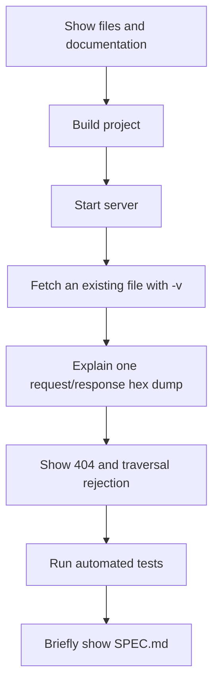

# Live Demonstration and Screen-Recording Guide

This guide gives you a simple, convincing way to demonstrate the project in a
screen recording. The goal is to prove that the protocol is binary, uses TCP,
keeps connections persistent, serves bytes safely, and handles bad input.

## Before recording

1. Use Ubuntu or WSL Ubuntu, not a native Windows terminal.
2. Open two terminal windows side by side. Name them mentally **Server** and
   **Client**.
3. Start from the project folder and make the terminal text large enough to be
   readable in the recording.
4. Make sure port 9000 is free. If it is not, substitute another port such as
   `9010` in every command below.

## Suggested recording order



## Part 1: Introduce the project

Show the top-level files:

```bash
ls
```

Say something like:

> This is a binary HTTP-inspired TCP file server. `bserve` is the server,
> `bcurl` is the custom client, `SPEC.md` is the shared protocol contract, and
> `tests` contains the integration tests.

Optionally open `README.md` and point out the architecture diagram and the
8-byte frame header.

## Part 2: Build from source

Run:

```bash
make clean
make
```

What to say:

> The build creates two programs. They share the same protocol and TCP I/O
> implementation, so both sides encode and decode the exact same binary format.

## Part 3: Start the server

In the **Server** terminal, run:

```bash
./bserve ./www 9000
```

What to say:

> The server now listens on TCP port 9000 and will serve only files below the
> `www` directory. It does not expose arbitrary files from the computer.

Leave this terminal running. A blank terminal is normal: the server waits
silently for clients. Do not type the client command into this busy terminal;
open the second terminal in the same project folder.

## Part 4: Demonstrate a successful binary request

In the **Client** terminal, run:

```bash
./bcurl -v localhost:9000/index.html
```

Point out:

1. `> REQUEST FRAME` is the exact binary request sent.
2. The first 8 bytes are the fixed frame header.
3. `01 01` means version 1 and REQUEST type 1.
4. `00 00 00 0B` means the path payload contains 11 bytes.
5. `< RESPONSE FRAME` is the binary server reply.
6. `00 C8` is decimal 200, meaning success.
7. The final visible HTML is the body decoded from the response and printed to
   standard output.

For a byte-by-byte explanation, open the examples in `SPEC.md` while recording.

## Part 5: Demonstrate error handling and safety

### Missing file

```bash
./bcurl -v localhost:9000/missing.html
echo $?
```

Explain that the server replies with 404 and the client exits non-zero.

### Traversal attempt

```bash
./bcurl -v 'localhost:9000/../etc/passwd'
echo $?
```

Explain that the server returns 400 because `..` is forbidden. The server maps
only safe paths under `./www` and cannot be used to read `/etc/passwd`.

## Part 6: Demonstrate binary-file support

Create a tiny binary file in the web root:

```bash
printf '\x00\x01\xFE\xFFbinary-data' > www/recording-sample.bin
./bcurl localhost:9000/recording-sample.bin > received-recording-sample.bin
cmp www/recording-sample.bin received-recording-sample.bin && echo 'Binary bytes match exactly'
rm -f www/recording-sample.bin received-recording-sample.bin
```

What to say:

> The client redirects the response body to a file. `cmp` proves that the bytes
> received are exactly the bytes stored on the server, including non-text bytes.

## Part 7: Demonstrate persistence and protocol robustness

The normal command-line client performs one request, but the server supports
multiple request/response pairs on one TCP connection. The integration test
deliberately verifies that behavior along with one-byte frame fragmentation and
an unknown frame followed by a valid request.

Run:

```bash
make test
```

Point out these test names when they pass:

- `test_persistent_unknown_and_fragmented_frames`
- `test_client_skips_unknown_frame_on_same_connection`
- `test_disconnect_and_oversized_header`
- `test_file_responses`
- `test_invalid_requests`

What to say:

> These are real socket tests. They prove the server is not relying on a single
> `recv()` call and remains synchronized after an unknown frame type.

## Part 8: Close with the specification

Show `SPEC.md`, especially these sections:

1. The 8-byte frame header.
2. The numeric binary header IDs, such as Content-Type = 1.
3. The complete annotated request and response hex dumps.
4. The unknown-frame rule.

Suggested closing sentence:

> The important deliverable is the written protocol contract. A separate client
> or server can implement NAFP/1 from the specification without copying this
> source code.

## Quick checklist

Before submitting the recording, make sure it visibly shows:

- [ ] A successful `-v` request and response.
- [ ] The hexadecimal request and response frames.
- [ ] A 404 response and non-zero client exit code.
- [ ] A rejected traversal attempt.
- [ ] A binary-file byte comparison.
- [ ] Passing automated tests.
- [ ] The protocol specification with annotated examples.

## Verified terminal runs

These screenshots were taken from actual clean-build terminal runs, not sample
output. The verbose success run is also saved as [raw text](docs/hexdump.txt).


