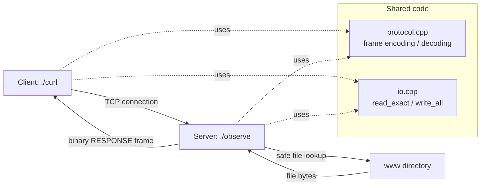
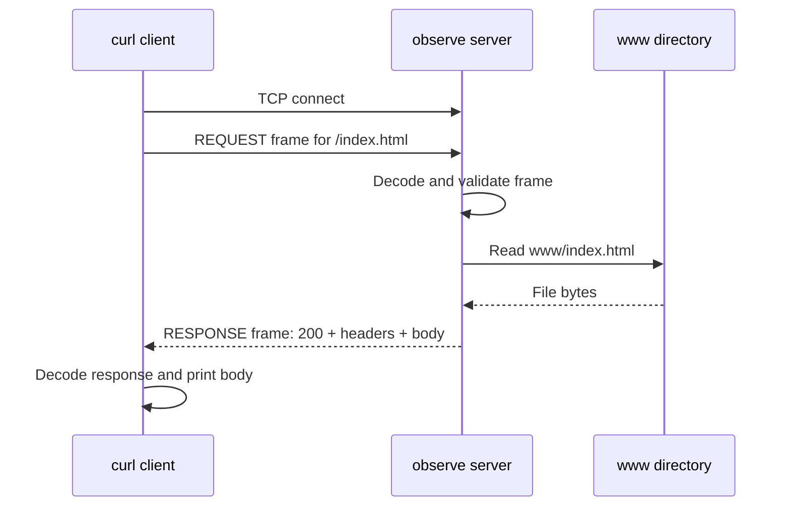
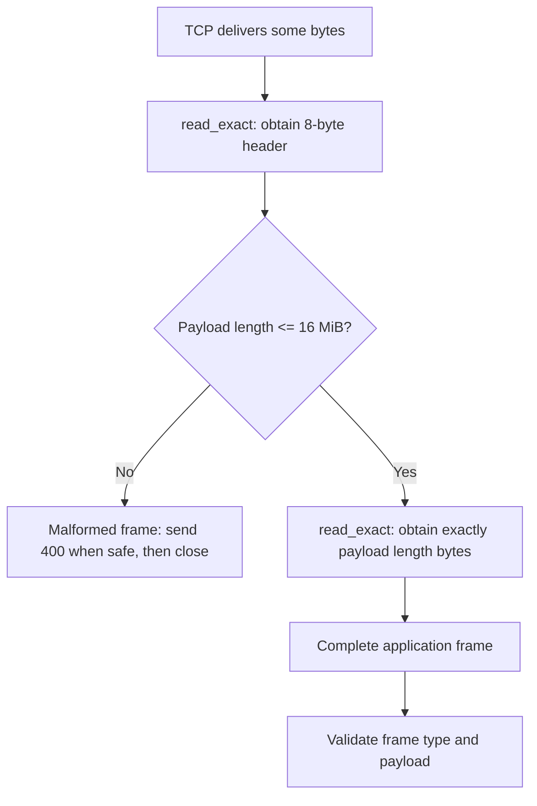
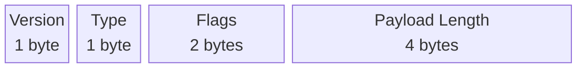
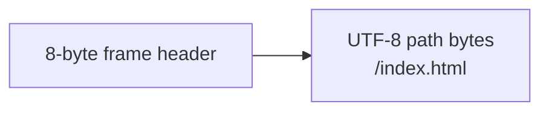
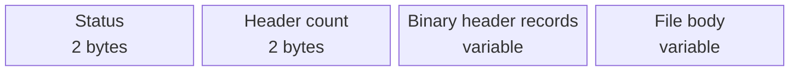
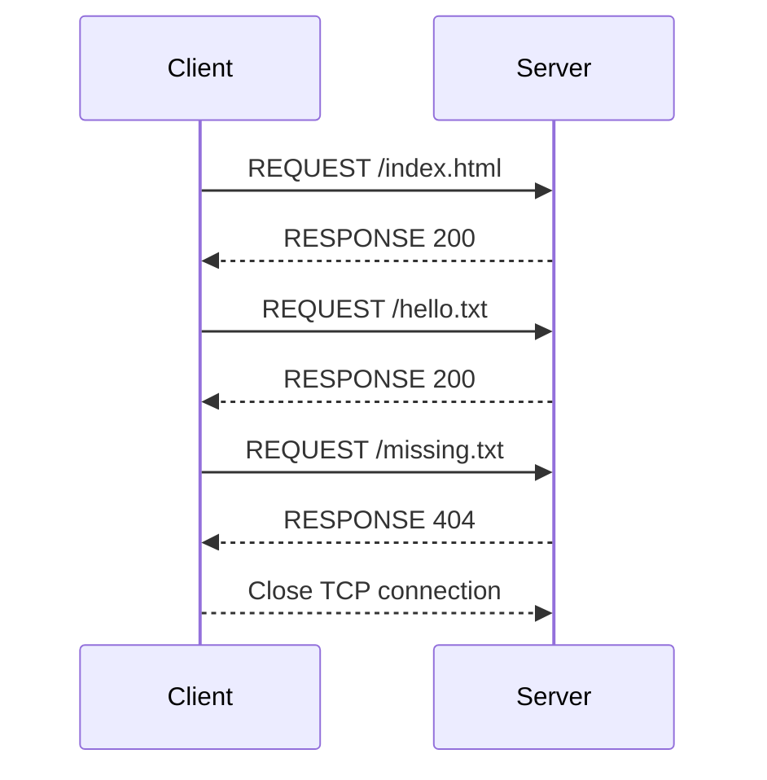
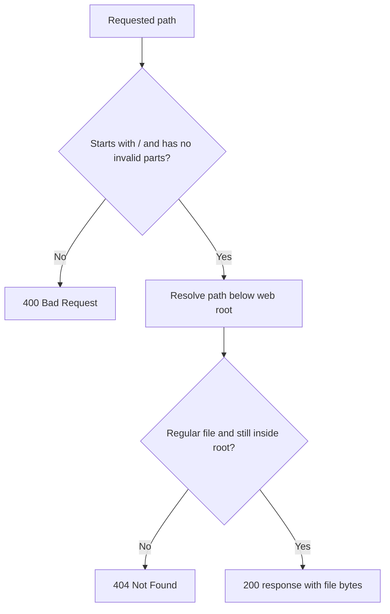

# Binary TCP File Server

This project is a small file server built for a Network Architecture course. It demonstrates how an application can define its **own binary protocol** on top of TCP. The server sends files from a configured `www` folder, and the client requests them using a URL such as `localhost:9000/index.html`.


## Project architecture



## Repository layout

| Location | Purpose |
|---|---|
| `client/main.cpp` | Parses the URL, connects to the server, sends one request, and prints the response body. |
| `server/main.cpp` | Listens for TCP clients, validates requests, and serves files safely. |
| `common/protocol.hpp/.cpp` | Defines and encodes/decodes the binary frame format. |
| `common/io.hpp/.cpp` | Contains robust TCP read/write helpers and hex-dump output. |
| `www/` | Example files served by the server. |
| `tests/test_protocol.py` | Black-box integration tests. |
| `SPEC.md` | Precise protocol specification and byte-level examples. |

## Requirements

The networking implementation targets **Linux/Ubuntu** and uses POSIX socket headers such as `arpa/inet.h`, `sys/socket.h`, and `unistd.h`.

Install the usual build and test tools on Ubuntu:

```bash
sudo apt update
sudo apt install build-essential python3
```

On Windows, use Ubuntu through WSL and open the project in VS Code using **Remote - WSL**. Building with a normal Windows C++ compiler will show missing POSIX header errors; that is expected because Windows does not provide these Linux socket headers.

## Build

From the project root:

```bash
make clean
make
```

This creates two executables:

| Executable | Meaning |
|---|---|
| `./observe` | The TCP file server. |
| `./curl` | The course-project client. It is not the operating system's `curl` utility. |

## Run the project

### 1. Start the server

```bash
./observe ./www 9000
```

Arguments:

| Argument | Example | Meaning |
|---|---|---|
| Web root | `./www` | The only directory from which files may be served. |
| TCP port | `9000` | The port on which the server waits for client connections. |

### 2. Request a file from another terminal

```bash
./curl -v localhost:9000/index.html
```

Expected response body:

```html
<!doctype html><html><body><h1>Network Architecture</h1></body></html>
```

Use `-v` to see the binary request and response frames as hexadecimal bytes. Without `-v`, only the file body is printed to standard output.

### 3. Try an error response

```bash
./curl -v localhost:9000/missing.html
```

The server returns status `404`, and the client exits with a non-zero exit code.

## How a request travels through the system



## TCP versus frames

TCP guarantees that bytes arrive reliably and in order. However, TCP does **not** preserve the boundaries between calls to `send()`.

For example, one request frame may arrive as several small pieces, or two frames may arrive together. The receiver therefore cannot assume one `recv()` call equals one request. This project solves that problem using a length-delimited frame format.



`read_exact()` repeats `recv()` until it has every required byte. `write_all()` repeats `send()` until it has sent every required byte. Both handle interrupted system calls (`EINTR`) and connection errors.

## Binary protocol summary

The protocol is named **NAFP/1** (Network Architecture File Protocol, version 1). Every message is a frame with an 8-byte header followed by a payload.



| Byte offset | Size | Field | Meaning |
|---:|---:|---|---|
| 0 | 1 byte | Version | Protocol version. Version `1` is currently supported. |
| 1 | 1 byte | Type | `1` is REQUEST; `2` is RESPONSE. |
| 2–3 | 2 bytes | Flags | Reserved for future use; must be zero in version 1. |
| 4–7 | 4 bytes | Payload length | Number of bytes after the header. Maximum: 16 MiB. |

All multi-byte integer fields use **network byte order**, also called **big-endian**. This avoids disagreement between computers with different native byte orders.

### Request payload

A request frame has type `1`. Its payload is the requested absolute path, for example `/index.html`. The path is not NUL-terminated because the frame header already says exactly how many bytes belong to the payload.



### Response payload

A response frame has type `2`. Its payload contains a status code, a count of
binary header records, the records themselves, and the file body. Common header
names are represented by a one-byte numeric ID; their values are length-prefixed.



| Status | Meaning |
|---:|---|
| 200 | File found and sent successfully. |
| 400 | Bad request, such as an invalid path or malformed frame. |
| 404 | Requested file does not exist under the web root. |
| 500 | The server could not read a valid requested file. |

For the full byte-level protocol definition and a hex example, read [SPEC.md](SPEC.md).

For a live screen-recording walkthrough, follow [DEMO.md](DEMO.md).

## Persistent connections

The server keeps a valid TCP connection open and can process multiple request/response pairs in sequence. The supplied command-line client uses one request per connection, but the protocol and server support persistent sessions.



Unknown frame types are safely ignored: the server first reads their declared payload length, skips that payload, and then continues with the next frame. This keeps the TCP stream synchronized.

## File safety

The client is allowed to request only files below the configured web root. The server rejects:

- Empty and non-absolute paths
- `.` and `..` path components
- Windows-style backslashes
- Paths containing NUL bytes
- Symbolic links that resolve outside the web root



This prevents a request such as `/../etc/passwd` from escaping `./www`.

## Debugging with hex output

Run the client with `-v`:

```bash
./curl -v localhost:9000/index.html
```

The request begins like this:

```text
01 01 00 00 00 00 00 0B 2F 69 6E 64 65 78 2E 68 74 6D 6C
```

| Hex bytes | Meaning |
|---|---|
| `01` | Version 1 |
| `01` | REQUEST frame type |
| `00 00` | Flags are zero |
| `00 00 00 0B` | Payload length is 11 bytes |
| remaining bytes | UTF-8 bytes for `/index.html` |

## Tests

Run the complete automated test suite:

```bash
make test
```

The tests start a real server and use real TCP sockets. They cover:

- Existing, missing, empty, nested, and large files
- Invalid and traversal paths
- Invalid protocol version and malformed request flags
- Oversized payload length and truncated client disconnects
- Unknown frame followed by a valid frame
- Deliberately fragmented frame delivery, one byte at a time
- Multiple requests on one persistent connection
- Client exit status, body output, and verbose hex output

## Clean generated binaries

```bash
make clean
```

## Further reading

- [SPEC.md](SPEC.md): full protocol specification.
- [server/main.cpp](server/main.cpp): server implementation.
- [client/main.cpp](client/main.cpp): client implementation.
- [tests/test_protocol.py](tests/test_protocol.py): executable examples of protocol behavior.
