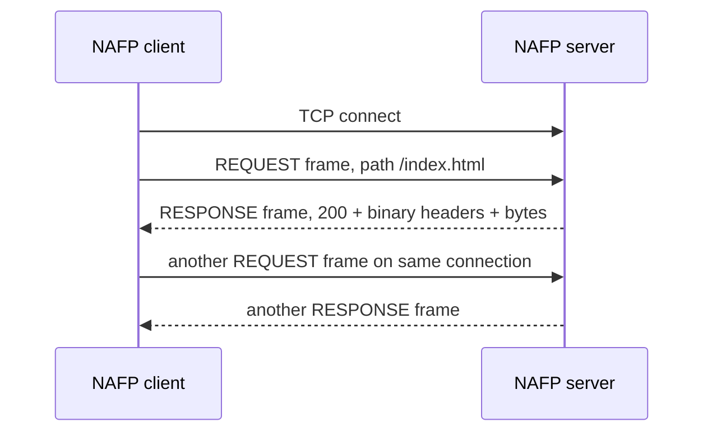
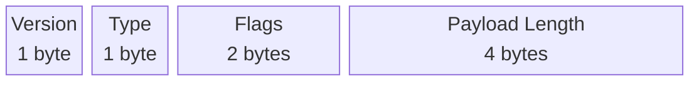
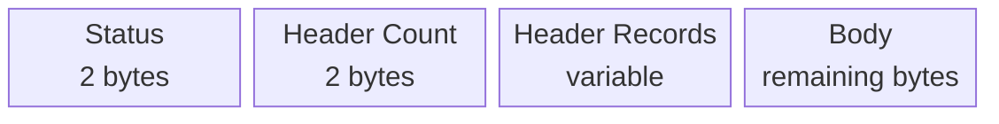
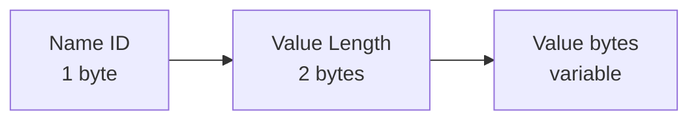

# NAFP/1: Network Architecture File Protocol

## 1. Purpose

NAFP/1 is a small binary, HTTP-inspired protocol over TCP. A client asks for a
path, and a server replies with a status, binary headers, and file bytes. It is
not HTTP and does not use HTTP text request lines. Its goal is to demonstrate
application-layer framing, serialization, persistent TCP connections, and safe
file serving.

The protocol is intentionally specified independently of the C++ implementation.
A different student can write a client or server from this document alone.



## 2. Transport and connection rules

- Transport is TCP.
- A client opens one TCP connection to one server host and port.
- Frames are sent in order. A valid connection may carry any number of request/
  response exchanges.
- TCP is a byte stream: a receiver **must** read exactly one 8-byte header, then
  read exactly the declared payload length. It must not assume one `recv()` call
  contains a whole frame.
- All multi-byte unsigned integers use network byte order (big-endian).
- Maximum payload length is 16 MiB (`16,777,216` bytes).

## 3. Frame format

Every frame is `Header || Payload`.



| Offset | Size | Field | Meaning |
|---:|---:|---|---|
| 0 | 1 byte | Version | Must be `1` for NAFP/1. |
| 1 | 1 byte | Type | `1` REQUEST, `2` RESPONSE; other values are extensions. |
| 2 | 2 bytes | Flags | Zero on REQUEST/RESPONSE; extension flags are ignored. |
| 4 | 4 bytes | Payload Length | Number of payload bytes immediately following the header. |

The fixed-size header is only 8 bytes, simple to parse, and lets the receiver
find the next frame even when frames arrive in pieces or back-to-back.

### Why these field widths?

- Version is 8 bits: 256 values are enough for this small protocol, and checking
  one byte makes incompatible versions easy to reject.
- Type is 8 bits: two values are used now, leaving room for extension frames.
- Flags are 16 bits: reserved switches can be added without growing the header.
  All flags must be zero on REQUEST and RESPONSE in version 1. Extension flags
  are ignored along with the extension payload.
- Payload length is 32 bits: a fixed unsigned field is easy to encode in network
  order and avoids variable-length parsing. Although it can describe nearly
  4 GiB, implementations enforce a 16 MiB cap to bound frame memory use.
- The 16 MiB cap is a practical limit for this file demo, not a TCP limitation.
  Large files would need chunking in a later protocol version.

## 4. Frame types and extensibility

| Type | Name | Sender | Payload |
|---:|---|---|---|
| 1 | REQUEST | Client | Requested path bytes |
| 2 | RESPONSE | Server | Status, binary headers, body bytes |
| 3–255 | Extension | Either | Defined by a later version |

An unknown type is not an error by itself. The receiver reads and discards
exactly its payload length, then continues reading the next frame. This is the
rule that allows a future version to add new frame types without desynchronizing
older receivers.

## 5. REQUEST payload

A request payload is a nonempty UTF-8 path beginning with `/`, at most 4096
bytes long. Paths outside that bound receive 400. There is no NUL
terminator and no separate path-length field because the frame payload length
already gives the exact number of bytes.

Examples: `/index.html`, `/images/logo.bin`.

The server rejects empty paths, paths not beginning with `/`, NUL bytes,
backslashes, `.` components, and `..` components.

## 6. RESPONSE payload

The response payload is:



| Field | Size | Description |
|---|---:|---|
| Status | 2 bytes | HTTP-like numeric status code. |
| Header Count | 2 bytes | Number of header records that follow. |
| Header Records | Variable | Exactly Header Count binary records. |
| Body | Variable | All remaining payload bytes; may be any binary file data. |

### 6.1 Header record format

Each header record begins with a one-byte name ID, followed by a two-byte value
length and exactly that many UTF-8 value bytes. This makes frequently used names
shorter than their text spelling while keeping values unambiguous.



Known IDs are:

| ID | Header name | Example value |
|---:|---|---|
| 1 | `Content-Type` | `application/octet-stream` |
| 2 | `Content-Length` | `67` |
| 3 | `Content-Encoding` | `identity` |
| 4 | `Cache-Control` | `no-cache` |
| 5 | `Last-Modified` | HTTP-date |
| 6 | `ETag` | entity tag |
| 7 | `Date` | HTTP-date |
| 8 | `Server` | `NAFP/1` |
| 9 | `Location` | `/index.html` |
| 10 | `Accept-Ranges` | `bytes` |
| 11 | `Message` (project extension) | `ok`, `not found`, `invalid request` |

For a custom future name, use ID `255`. Its record becomes:

`255 | Name Length (1 byte) | Name bytes | Value Length (2 bytes) | Value bytes`

Unknown header IDs are still parseable: a receiver reads the two-byte value
length, skips the value bytes, and may display the name as `Unknown-Header-N`.
This is the header-level equivalent of safely skipping an unknown frame type.

## 7. Status codes

| Code | Meaning |
|---:|---|
| 200 | The requested regular file was found and its bytes are in the body. |
| 400 | The frame or request path was malformed. |
| 404 | The requested file does not exist below the configured web root. |
| 500 | A valid file could not be read, or is too large for one NAFP/1 frame. |

## 8. Error handling and security

- Invalid version, truncated frame, or payload length above 16 MiB: the server
  returns a 400 response when safe and closes the connection instead of guessing
  where the next frame starts.
- Invalid request payload/path: the server returns 400 and may continue reading
  the connection.
- Unknown frame type: read its payload, skip it, and continue.
- Missing file: return 404.
- File paths are canonicalized and checked to remain within the configured root;
  this also prevents a symbolic link under the root from pointing outside it.

## 9. Complete annotated hexadecimal capture

This is an actual request for the repository's `www/index.html`, captured by
`./bcurl -v localhost:19339/index.html` after a clean build. Port 19339 was used
for the capture; it does not change any protocol bytes. Both complete frames are
below, without omitted bytes. The raw terminal output is in
[docs/hexdump.txt](docs/hexdump.txt).

### Request: 19 bytes total, 11-byte payload

```text
01 01 00 00 00 00 00 0B 2F 69 6E 64 65 78 2E 68
74 6D 6C
```

| Byte offset | Bytes | Meaning |
|---|---|---|
| 0 | `01` | Version 1 |
| 1 | `01` | REQUEST |
| 2-3 | `00 00` | Flags = 0 |
| 4-7 | `00 00 00 0B` | Payload length = 11 |
| 8-18 | `2F 69 6E 64 65 78 2E 68 74 6D 6C` | `/index.html` |

### Response: 115 bytes total, 107-byte payload

```text
01 02 00 00 00 00 00 6B 00 C8 00 02 01 00 18 61
70 70 6C 69 63 61 74 69 6F 6E 2F 6F 63 74 65 74
2D 73 74 72 65 61 6D 0B 00 02 6F 6B 3C 21 64 6F
63 74 79 70 65 20 68 74 6D 6C 3E 3C 68 74 6D 6C
3E 3C 62 6F 64 79 3E 3C 68 31 3E 4E 65 74 77 6F
72 6B 20 41 72 63 68 69 74 65 63 74 75 72 65 3C
2F 68 31 3E 3C 2F 62 6F 64 79 3E 3C 2F 68 74 6D
6C 3E 0A
```

| Byte offset | Bytes / decoded value | Meaning |
|---|---|---|
| 0 | `01` | Version 1 |
| 1 | `02` | RESPONSE |
| 2-3 | `00 00` | Flags = 0 |
| 4-7 | `00 00 00 6B` | Payload length = 107 |
| 8-9 | `00 C8` | Status = 200 |
| 10-11 | `00 02` | Two header records |
| 12 | `01` | Content-Type name ID |
| 13-14 | `00 18` | Value length = 24 |
| 15-38 | `application/octet-stream` | Content-Type value |
| 39 | `0B` | Message name ID 11 |
| 40-41 | `00 02` | Value length = 2 |
| 42-43 | `6F 6B` | Message value `ok` |
| 44-114 | HTML bytes ending in `0A` | 67-byte file body, including newline |

The body printed to stdout is:

```html
<!doctype html><html><body><h1>Network Architecture</h1></body></html>
```

Byte-count check: 4 bytes for status and header count, 27 for Content-Type,
5 for Message, and 67 for the body: `4 + 27 + 5 + 67 = 107`. Add the 8-byte
frame header for 115 bytes total. The capture script also checked both declared
payload lengths against the bytes actually emitted.


## 10. Interoperability agreement

Before integration, client and server authors should agree to this exact
NAFP/1 document: version 1, eight-byte big-endian framing, type values, binary
header records, status codes, path rules, maximum payload, and unknown-frame
handling. A client and server created independently should then interoperate
without sharing source code.

For a live demonstration plan, see [DEMO.md](DEMO.md).
