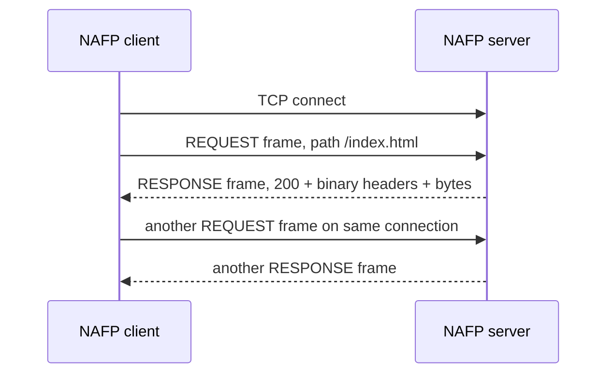
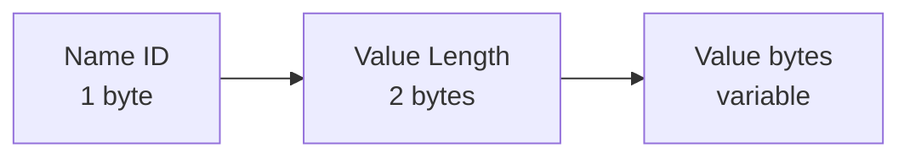

# NAFP/1: Network Architecture File Protocol

## 1. Purpose

NAFP/1 is a small binary, HTTP-inspired protocol over TCP. A client asks for a
path, and a server replies with a status, binary headers, and file bytes. It is
not HTTP and does not use HTTP text request lines. Its goal is to demonstrate
application-layer framing, serialization, persistent TCP connections, and safe
file serving.

The protocol is intentionally specified independently of the C++ implementation.
A different student can write a client or server from this document alone.



## 2. Transport and connection rules

- Transport is TCP.
- A client opens one TCP connection to one server host and port.
- Frames are sent in order. A valid connection may carry any number of request/
  response exchanges.
- TCP is a byte stream: a receiver **must** read exactly one 8-byte header, then
  read exactly the declared payload length. It must not assume one `recv()` call
  contains a whole frame.
- All multi-byte unsigned integers use network byte order (big-endian).
- Maximum payload length is 16 MiB (`16,777,216` bytes).

## 3. Frame format

Every frame is `Header || Payload`.


| Offset | Size | Field | Meaning |
|---:|---:|---|---|
| 0 | 1 byte | Version | Must be `1` for NAFP/1. |
| 1 | 1 byte | Type | `1` REQUEST, `2` RESPONSE; other values are extensions. |
| 2 | 2 bytes | Flags | Must be zero in NAFP/1. Reserved for future versions. |
| 4 | 4 bytes | Payload Length | Number of payload bytes immediately following the header. |

The fixed-size header is only 8 bytes, simple to parse, and lets the receiver
find the next frame even when frames arrive in pieces or back-to-back.

## 4. Frame types and extensibility

| Type | Name | Sender | Payload |
|---:|---|---|---|
| 1 | REQUEST | Client | Requested path bytes |
| 2 | RESPONSE | Server | Status, binary headers, body bytes |
| 3–255 | Extension | Either | Defined by a later version |

An unknown type is not an error by itself. The receiver reads and discards
exactly its payload length, then continues reading the next frame. This is the
rule that allows a future version to add new frame types without desynchronizing
older receivers.

## 5. REQUEST payload

A request payload is a nonempty UTF-8 path beginning with `/`. There is no NUL
terminator and no separate path-length field because the frame payload length
already gives the exact number of bytes.

Examples: `/index.html`, `/images/logo.bin`.

The server rejects empty paths, paths not beginning with `/`, NUL bytes,
backslashes, `.` components, and `..` components.

## 6. RESPONSE payload

The response payload is:


| Field | Size | Description |
|---|---:|---|
| Status | 2 bytes | HTTP-like numeric status code. |
| Header Count | 2 bytes | Number of header records that follow. |
| Header Records | Variable | Exactly Header Count binary records. |
| Body | Variable | All remaining payload bytes; may be any binary file data. |

### 6.1 Header record format

Each header record begins with a one-byte name ID, followed by a two-byte value
length and exactly that many UTF-8 value bytes. This makes frequently used names
shorter than their text spelling while keeping values unambiguous.



Known IDs are:

| ID | Header name | Example value |
|---:|---|---|
| 1 | `Content-Type` | `application/octet-stream` |
| 2 | `Message` | `ok`, `not found`, `invalid request` |

For a custom future name, use ID `255`. Its record becomes:

`255 | Name Length (1 byte) | Name bytes | Value Length (2 bytes) | Value bytes`

Unknown header IDs are still parseable: a receiver reads the two-byte value
length, skips the value bytes, and may display the name as `Unknown-Header-N`.
This is the header-level equivalent of safely skipping an unknown frame type.

## 7. Status codes

| Code | Meaning |
|---:|---|
| 200 | The requested regular file was found and its bytes are in the body. |
| 400 | The frame or request path was malformed. |
| 404 | The requested file does not exist below the configured web root. |
| 500 | A valid file could not be read, or is too large for one NAFP/1 frame. |

## 8. Error handling and security

- Invalid version, truncated frame, or payload length above 16 MiB: the server
  returns a 400 response when safe and closes the connection instead of guessing
  where the next frame starts.
- Invalid request payload/path: the server returns 400 and may continue reading
  the connection.
- Unknown frame type: read its payload, skip it, and continue.
- Missing file: return 404.
- File paths are canonicalized and checked to remain within the configured root;
  this also prevents a symbolic link under the root from pointing outside it.

## 9. Complete annotated hexadecimal examples

### Request: `GET /index.html` conceptually

The protocol has no text `GET`; type `01` means REQUEST.

```text
01 01 00 00 00 00 00 0B 2F 69 6E 64 65 78 2E 68 74 6D 6C
```

| Bytes | Meaning |
|---|---|
| `01` | Version 1 |
| `01` | Type 1: REQUEST |
| `00 00` | Flags = 0 |
| `00 00 00 0B` | Payload length = 11 bytes |
| `2F 69 6E 64 65 78 2E 68 74 6D 6C` | UTF-8 `/index.html` |

### Response: `200`, two headers, body `OK`

This short example uses `Content-Type: text/plain` and `Message: ok` so every
byte is visible. The actual server normally uses `application/octet-stream`.

```text
01 02 00 00 00 00 00 16
00 C8 00 02
01 00 0A 74 65 78 74 2F 70 6C 61 69 6E
02 00 02 6F 6B
4F 4B
```

| Bytes | Meaning |
|---|---|
| `01 02 00 00 00 00 00 16` | Version 1, RESPONSE, flags 0, payload length 22 |
| `00 C8` | Status 200 |
| `00 02` | Two header records |
| `01 00 0A 74 65 78 74 2F 70 6C 61 69 6E` | Header ID 1 Content-Type, length 10, `text/plain` |
| `02 00 02 6F 6B` | Header ID 2 Message, length 2, `ok` |
| `4F 4B` | Body bytes: `OK` |

## 10. Interoperability agreement

Before integration, client and server authors should agree to this exact
NAFP/1 document: version 1, eight-byte big-endian framing, type values, binary
header records, status codes, path rules, maximum payload, and unknown-frame
handling. A client and server created independently should then interoperate
without sharing source code.

For a live demonstration plan, see [DEMO.md](DEMO.md).
